### 一、六大提示词特征技巧

##### **1. 人物，描述人物特征**

- 性别：1girl,2boys,loli,cat girl,...
- 服饰：long sleeves,gloves,coat,bangle,armband,... 
- 发型：long hair,bangs,black hair,ponytail,twintails,... 
- 五官：cat ears,small eyes,big mouth,blue eyes,...
- 表情：smile,open mouth,tears,blush,tongue out,... 
- 动作：standing,lying,head tilt,spread arms,tying hair,...

##### **2. 场景，描述场景特征**

- 室内：indoor,...
- 室外：outdoor,...
- 大场景：forest,city,street,field,garden,village,... 
- 小细节：tree,bush,flower,tower,neon lights,fences,...

##### **3. 环境，描述环境光照**

- 白天：day,...
- 黑夜：night,...
- 时段：morning,sunset,...
- 光线：sunlight,bright,dark,moonlight,... 
- 天空：blue sky,starry sky,shooting star,full moon,...

##### **4. 视角，描述画面视角**

- 距离：close-up,distant,...
- 人物比例：full body,upper body,...
- 观察角度：from above,from below,view of back,from side,...
- 镜头类型：wide shot,Sony A7 Ill,fisheye,...

##### **5. 画质，描述画面质量**

- 正向高画质：highres,absurdres,official art,best quality,8k,masterpiece,game cg,original,...
- 负向低品质：lowres,parody,scan,parody,bad anatomy,bad hands,fewer digits,extra digit,missing arms,watermark,signature,text,...

##### **6. 画风，描述画面风格**

- 插画风：illustration,painting,paintbrush,...
- 二次元：anime,comic,game CG,... 
- 写实系：photorealistic,realistic,photograph,...
- 复古风：retro artstyle,...
- 手绘风：traditional media,...
- 赛博朋克：cyberpunk,...

### **二、提示词模板**

##### **基础起手式**

```
Best Prompt：
(masterpiece),(best details),(best quality),Sharp Focus,beautiful artwork,

negative_prompt：
((NSFW)),lowres,bad anatomy, bad hands, text, error, missing fingers, extra digit, fewer digits, cropped, worst quality, low quality, normal quality, JPEG artifacts, signature, watermark, iceman, blurry,
```
##### **二次元通用**

```sh
Best Prompt：
\(Makoto Shinkai style\),illustration(((flat))){prompt}Anime,(((bright color))),(high_contrast:1.5),(high-purity:1.5),(high brightness:1.5),flat color,outlines,

negative_prompt：
((NSFW)),photograph,deformed,glitch,noisy,realistic,stock photo,(3d model:1.3),(photo:1.3),(film:1.3)
```

##### 摄影

```sh
prompt：
professional photograph,masterpiece,best quality,ultra details,{prompt}(realistic),hdr,8k,natural light,color graded portra 400 film,sharp focus,film grain,photographed on a Sony A7R IV,18mm F/1.7 cine lens,soft positive_lighting,side light,RAW,

negative_prompt：
BadDream, (UnrealisticDream:1.3),lowres, bad anatomy,bad hands,text,error,missing fingers,extra digit,fewer digits,cropped,worst quality,low quality,normal quality,  watermark,username,bad proportions,bad anatomy,logo,text,blurry,low quality,lowres,normal quality,worst quality,signature,watermark,cropped,out of focus,username,outlines,lines,cartoon,flat,illustration,drawing,painting,crayon,sketch,graphite,impressionist,noisy,blurry,deformed,ugly,3D model
```

##### **动漫**

```
prompt：
anime artwork. anime style, key visual, vibrant, studio anime, highly detailed, intricate, elegant, highly detailed, digital painting, artstation, concept art, smooth, sharp focus, illustration, art by artgerm and greg rutkowski and alphonse mucha

negative_prompt：
photo, deformed, black and white, realism, disfigured, low contrast
```

##### **排版主义**

```sh
prompt：
typographic art. stylized, intricate, detailed, artistic, text-based, extremely higly detailed, style of Hajime Sorayama, trending on artstation

negative_prompt：
ugly, deformed, noisy, blurry, low contrast, realism, photorealistic
```

##### 线稿

```sh
prompt：
ashion design,minimalism,sketch,Line draft,hand drawn,smooth,monochromatic painting,outlines,{prompt},black lines,white background

negative_prompt：
color,grayscale,lowres,normal quality,worstquality,NSFW,signature,watermark,cropped,username,blurry,
```

##### **涂鸦风**

```sh
prompt：
graffiti style. street art, vibrant, urban, detailed, tag, mural, extremely hyper - detailed, intricate, highly detailed attributes

negative_prompt：
ugly, deformed, noisy, blurry, low contrast, realism, photorealistic
```

##### 极简主义

```sh
prompt：
minimalist style. simple, clean, uncluttered, modern, elegant, intricate, epic lighting, cinematic composition, hyper realistic, 8 k resolution, unreal engine 5, by artgerm, tooth wu, dan mumford, beeple, wlop, rossdraws, james jean, marc simonetti, artstation，

negative_prompt：
rnate, complicated, highly detailed, cluttered, disordered, messy, noisy，
```
##### **厚涂**

```sh
prompt：
(Oil painting art:1.3),painting traces texture,thick coating overlay,thickness,sharp focus,\(Krenz Cushart style\),

negative_prompt：
(brush:1.5),username,logo,blurry,out of focus,signature,watermark,blurry,low quality,bad anatomy,sketches,lowres,normal quality,username,out of focus,bad proportions,cropped,watermark,signature,worstquality,grayscale,monochrome,
```

------

#### **正面提示词**

##### **高质壁纸**

```sh
prompt：
masterpiece, best quality
```

##### **镜头虚化**

```sh
prompt：
depth of field, blurry background, blurry foreground, 
```

##### **画面增强**

```sh
prompt：
high resolution illustration, colorful, 8k wallpaper, highres
```

##### **光线增强**

```sh
prompt：
Cinematic light, ray tracing
```

##### **细节增强**

```sh
prompt：
hyper detailed,ultra-detailed
```
##### **超高细节**

```sh
prompt：
8k wallpaper,(best quality:1.12),(detailed:1.12),(intricate:1.12),(ultra-detailed:1.12),(highres:1.12)
```

------


#### **负面提示词**

```sh
((NSFW)),artist name, twisted torso, (((fusion), extra, bad, fewer, missing), fist,clenched hand)
```
##### **人物负面 1**

```sh
((NSFW)),extra fingers,fewer fingers,(low quality, worst quality:1.4), (bad anatomy), (inaccurate limb:1.2),bad composition, inaccurate eyes, extra digit,fewer digits,(extra arms:1.2),
```

##### **人物负面 2**

```sh
((NSFW)),(EasyNegative:1.1),ng_deepnegative_v1_75t,bad-hands-5,lowres, bad anatomy, bad hands, text, error, missing fingers, extra digit, fewer digits, cropped, worst quality, low quality, normal quality, jpeg artifacts, signature, watermark, username, blurry
```
##### **人物负面 3**

```sh
((NSFW)),paintings, sketches, (worst quality:2), (low quality:2), (normal quality:2), lowres, normal quality, ((monochrome)), ((grayscale)), skin blemishes, age spot, glans, extra fingers, fewer fingers, multiple hands, multiple heads, Multiple arms, disabled body, illustration, 3d, sepia, painting, cartoons, sketch, bad anatomy, bad hands, collapsed eyeshadow, multiple eyebrows, pink hair, holes on breasts, stretched nipples, analog, analogphoto, signature, logo, facing away, looking away,(fat:1.2), glans,((watermark:2)),((white letters:1)), age spot, multiple eyebrows, fleckles, stretched nipples, nipples on buttocks, analog, analog photo, 2 faces, hat, bad composition, error hands, error fingers, dark, (thick eyebrows:1.2), 2girls, (((duplicate))), mutated hands,(((((fused fingers))))), (((((too many fingers))))),signature, watermark, username, blurry, artist name, text, chromatic aberration, flat color, flat shading, retro style,, low res, bad face, missing fingers, extra digit, fewer digits, multiple legs, malformation 
```
##### **人物负面 4**

```sh
((NSFW)),EasyNegative,paintings,sketches,(worst quality:2),(low qualaity:2),(normal quality:2),((monochrome)),((grayscale)),skin spots,acnes,skin blemishes,age spot,glans,fewer fingers,((watermark:2)),((multi nipples),bad anatomy,bad hands,text,error,missing fingers,extra digit,fewer digits,cropped,jpeg artifacts,signature,username,bad feet,{Multiple people},bad anatomy,bad hands,cropped,blurry,poorly drawn hands,poorly drawn face,mutation,deformed,extra fingers,extra limbs,extra arms,extra legs,malformed limbs,fused fingers,too many fingers,long neck,cross-eyed,mutated hands,bad body,bad proportions,gross proportions,missing fingers,missing arms,missing legs,
```
##### **负面**

```sh
((NSFW)),bondary,thick line,lines,lineart,ng_deepnegative_v1_75t,(badhandv4:1.2),EasyNegative,(worst quality:2),easynegative,drawing,painting,crayon,sketch,graphite,impressionist,noisy,blurry,soft,deformed,ugly,(deformed iris,deformed pupils,semi-realistic,cgi,3d,render,sketch,cartoon,drawing,anime:1.4),text,close up,cropped,out of frame,worst quality,low quality jpeg artifacts,ugly,duplicate,morbid,mutilated,extra fingers,mutatedhands,poorly drawn hands,poorly drawn face,mutation,deformed,blurry,dehydrated,bad anatomy,bad proportions,extra limbs,cloned face,disfigured,gross proportions,malformed limbs,missing arms,missing legs,extra arms,extra legs,fused fingers,too many fingers,long neck,sketches,tattoo,(beard:1.3),(EasyNegative:1.3),badhandv4,(worst quality:2),(low quality:2),(normal quality:2),lowers,normal quality,facing away,looking away,text,error,extra digit,fewer digits,cropped,jpeg artifacts,signature,watermark,username,blurry,skin spots,acnes,skin blemishes,bad anatomy,fat,bad feet,cropped,poorly drawn hands,poorly drawn face,mutation,deformed,tilted head.bad anatomy.bad hands,extra fingers,fewer digits,extra limbs.extra arms,extra legs,malformed limbs.fused fingers,too many fingers,long neck,cross-eyed,mutated hands,bad body,bad proportions,gross proportions,text,error,missing fingers,missing arms,missing legs,extra digit,extra arms,extra leg,extra foot,missing fingers,(Worst quality,low quality,lowres:1.2),error,cropped jpeg artifacts,out of frame,watermark,signature,
```

##### **人物负面**

```sh
negative_prompt：
((NSFW)),Photo_Comparison, 1girl, breast, standing, white shirt, phone, cellphone, smartphone, holding, sex, vaginal, picture
```

##### **更强的负面tag**

```sh
negative_prompt：
((NSFW)),EasyNegative, bad-artist-anime, bad-artist, bad-hands-5, bad-image-v2-39000, bad_prompt_version2
```

------


#### **人物提示词**

##### **美女起手式：**

```
Best Prompt：
masterpiece,best details,best quality,{prompt},8K,Best resolution,

negative_prompt：
(((NSFW))),lowres, bad anatomy, bad hands, text, error, missing fingers, extra digit,fewer digits,cropped,worst quality,low quality,normal quality, watermark,username,bad proportions,bad anatomy,blurry,low quality,lowres,normal quality,worstquality,signature,watermark,cropped,out of focus,username,look back
```
##### **精致女孩**

```sh
prompt：
an extremely delicate and beautiful girl
```

##### **脸部增强**

```sh
prompt：
1girl face ,Curly blue hair，Delicate and perfect face, beautiful face,Happy smile,side face,Lateral face,(best aesthetic, best quality, masterpiece, extremely detailed:1.2,extremely detailed CG unity 8k wallpaper)
```

##### **真人照片**

```sh
prompt：
(8k, RAW photo, best quality, masterpiece, ultra highres, ultra detailed:1.2), (realistic, photo-realistic:)
```

##### **隐藏手掌**

```sh
negative_prompt：
lower arms,hands,palms
```

##### **崩坏修正**

```sh
negative_prompt：
easynegative, bad-hands-5
```

##### **修手**

```sh
prompt：
good hands,

negative_prompt：
bad-hands-5,bad hands, fewer digits, extra digit
```

##### **抽卡**

```markdown
prompt：
1girl, food, candy, solo, lollipop, animal ears, black hair, controller, sleeves past wrists, can, hair ornament, game controller, horns, ahoge, streaked hair, long sleeves, blue eyes, multicolored hair, stuffed toy, swirl lollipop, white hair, animal ear fluff, long hair, fang, :d, bangs, thighhighs, twintails, socks, stuffed animal, smile, holding, wooden floor, virtual youtuber, bandaid, looking at viewer, off shoulder, monster energy, knees up, blush, asymmetrical legwear, puffy long sleeves, open mouth, shirt, candy wrapper, low twintails, cat ears, feet out of frame, hairclip, energy drink, object hug, choker, mouse (computer), bandaid on face
```

------

### 三、Stable Diffusion 笔记

#### 1. **提示词写法**

```markdown
- 增加权重
():1.1倍；	(())：1.21;	((())):1.33
{}:1.05倍；	{{}{：1.1；	{{{}}}：1.16
(prompt:1.5):1.5倍

- 减少权重
[]:0.9倍；	[[]]：0.92≈0.8；	[[[]]]：0.93≈0.7

- 交替写法
[cat|dog] → 先画猫，再画狗，再画猫，再画狗交替出图
[cat;dog;0.7] → 前面70%画猫，后面30%画狗

- 组词
Prompt1_Prompt2:milk_tea(奶茶)

- 融合
Prompt1 and Prompt2: dog and man(狗拟人)

- 隔离
Prompt1 break Prompt2 	
	例如：1girl,Silver hair break Black blouses break Gray pants,
	Silver hair(银色头发)，Black blouses(黑色衬衫)，Gray pants(灰色裤子)颜色对应部分隔离，增强颜色准确性

- 介入写法
[Prompt::0.8]:从80%之后退出介入 → 前80%渲染，后20%不渲染
[Prompt:0.8]:从80%之后开始介入 → 前80%不渲染，后20%开始渲染

- 转义写法
\(prompt\) → 代指的是一种风格或概念，如\(极简主义\) ；\(canidae\)犬科；\(Fujifilm XF 16-55mm f/2.8\) 

```

------

#### **2. 采样器和ControlNet引导**

**Euler；Euler a；DPM++2M  Karras；DPM SDE ++；DPM++3M  Karras**

> 若想迭代步数对生成画面影响较小，选择不带 a 的采样器；
>
> 同理：如果选择带 a 的采样器，ControlNet终止引导不宜设置太早，但对于早期慢点引导影响有奇效
>
> 
>
> 稳定、快速选：**Euler**，步数在25-60；质量好的选：**DPM++2M  Karras**，步数在25-40；
>
> 写实选：**DPM SDE ++**，步数30-40；XL大模型步数10~15；

**ControlNet**

1、终止引导越早，提示词作用会变大，由于早期引导，构图基本不会大变。

2、当想要让AI自由发挥背景，可以设置**ControlNet**晚点介入，和设置退出介入。

**提示词和ControlNet搭配：**

例子：当想在沙漠画出若影若现的房子时，可以在提示词[house:0.7]：当画到70%提示词才起作用，并在控制房子外轮廓的ControlNet的介入时机设为0.7

------

#### **3. ControlNet_Brightness & lllumination**

> **Brightness Control(亮度)**：是修改被照明的物体亮度(**高光**)，它不需要高斯模糊，固定随机种子的情况下可以不改变原图的结构，一般不可以和其他的Controlnet模型一起使用


> **lllumination Control(照明)**：更倾向发光体，需要**高斯模糊**，一般不会轻易改变原图的结构，但是你可以通过线稿等模型去锁定结构，因为照明模型可以跟其他Controlnet共同使用。

------


#### 4. **局部重绘的方式**

- **文生图+高清修复：**就是将文生图发到图生图进行重绘

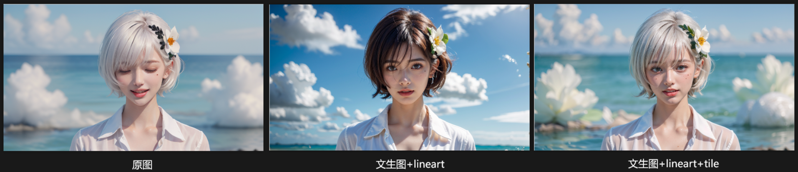

- **图生图+controlnet_inpoint**：
  
```markdown
重绘幅度0.5，加lineart，重绘幅度可以升到1
  
- controlnet_inpoint：
only：仅对蒙版生效(对应局部重绘的：原图)
only+lama：仅对蒙版生效+背景延伸(对应局部的：填充)
Global_harmonious：对全图影响
```

- **局部重绘+controlnet_lineart**：


```markdown
  - 绘制方式：
  全图：先画全图然后裁剪，整体性融合度强，速度慢，修人脸会容易崩
  仅蒙版：仅画蒙版区域，整体性融合度弱，提示词需要改为蒙版部分内容，速度快，建议蒙版处理方式：原版
```

------

4.

(人物原图vs重绘幅度0.65)
为了解决这个脏的问题，我们需要完成两个动作。
第一步，：提示词方面比较别除具体的对象，保留大师杰作，高品质等质量提示词
第二步：开启tiled diffusion,并且打开下面的噪声反转，反转步数25,
如此，一张拥有细节且画面干净整洁的高质量图片就生成了，但是这依然不够好。


1.4.3 噪声反转
可以看到噪声反转里面有三个比较关键的参数
反转步数、修复程度、重铺噪声强度
这三个参数几乎都是用来控制简洁的画面到丰富的细节之间的平衡
反转步数越低画面越干净整洁，越大就有越多的细节，同时也会越凌乱

1.4.3.1反转步数
-以下是反转步数的对比

1.4.3.2修复程度
修复程度默认是1，整体来看，修复越高越干净，也不能说越高画面越干净，大概是越高越往倾向于原图的内容，它在刚除一些由于重绘幅度过高，而产生的原图没有的东西。
以下是不同修复程度的对比

1.4.3.3重铺噪声强度
如果你还是认为画面比较凌乱，可以稍微降低一下重铺噪声强度。
-以下是不同重铺噪声强度的对比

但是千万不能设置过小，过小会导致画面过于简单，细节会被完全抹除。
除非你的CFG和重绘幅度都很高，当我cg设为14，重回幅度高达0.75，并且将重铺噪声设为0，却可以得到一张画面，
简洁，细节也丰富的图。

1.5 Tiled diffusion和controlnet的tile模型叠加使用
Tiled diffusion还可以和controlnet中的tile模型共同使用
Tiled模型的强大之处在于它能够识别每一个分块中的内容，并且与提示词产生关联，产生强大的细节，这么做的一个好处，即使你用0.75的重回幅度以及14的CFG,也不会出现这种妖魔鬼怪的图片。

这里面我认为CFG7重绘幅度0.75，重铺噪声强度0的这张图是最好的
另外大家应该发现了挂载tile会产生色差的问题，这个问题tiled diffusion的作者也无能为力，是这tile模型的特性。
以上就是图生图高质量放大的功能

1.6总结
所以我的结论是，
第一、sd upscale可以比较容易在低重绘幅度，大概是0.25~0.35之间，且较低CFG时，可以比较轻松得到一张比较
不错的高清图片，你只需要建立一个CFG重绘幅度的矩阵，就可以看的很清楚。


------

 #### 5. **视频转动画(Deforum)**

```markdown
- Max frames(最大帧数)

- Strength schedule(帧时间变化):
  0:(0.65) → → → 第0帧开始每一帧和上一帧相似度0.65
  50:(0.5) → → → 第50帧开始每一帧和上一帧相似度0.65
  
- Noise schedule(噪点时间变化):
  0:(-0.06*(cos(3.141*t/15)**100)+0.06)	//缓入缓出 15：每秒帧数

-  Depth Warping & FOV(视野范围)
   FOV schedule(视野时间变化)
```

------

#### **5.**  


------

### 四、实操案例

####  **⒈扩图**

**文生图** + ControlNet_inpaint（局部重绘）；**only+lama**；更偏向ControlNet；缩放后填充空白；提示词可不写

> 注意：图生图不适合扩图，因为没有随机种子，人物脸部也会容易改变，重绘幅度也难把控；需要加入controlnet控制，比较麻烦。

------

#### **⒉角色特征cos换装**

##### **M01.文生图+ 控制**
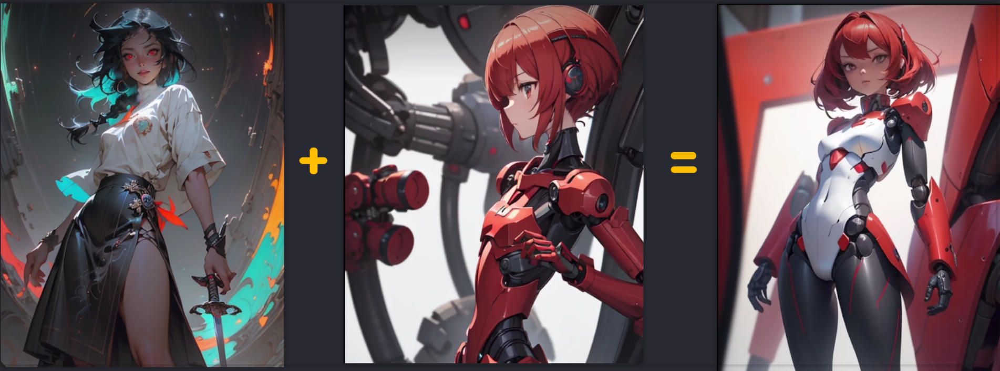
```markdown
- ControlNet模型 1/3 范围
  inpaint(局部重绘)：控制重绘区域(重绘蒙版与提示词无关，选择controlnet优先)
```
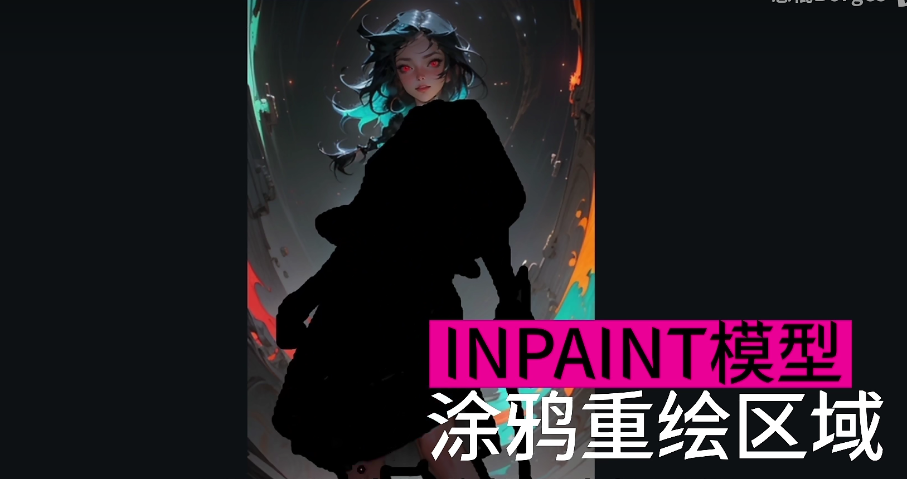
```markdown
- ControlNet模型 2/3 参考
  reference(参考)：控制参考风格
  lora：选定风格lora做参考
```
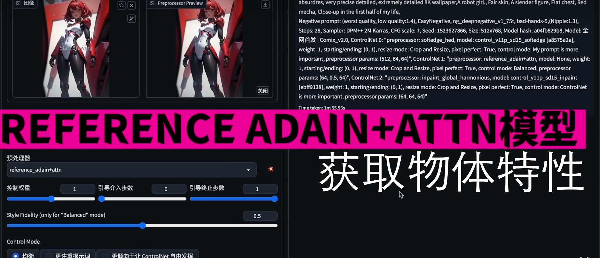
```markdown
- ControlNet模型 3/3 控形
   softedge(软边缘)：控制重绘的边缘外形 (不要控制太死，选择偏向提示词)	
   canny(硬边缘)：控制重绘的边缘外形 (把预处理结果放在PS调整再上传)
   lineart(线稿)：没有猜测模式，所以选更偏向提示词
```
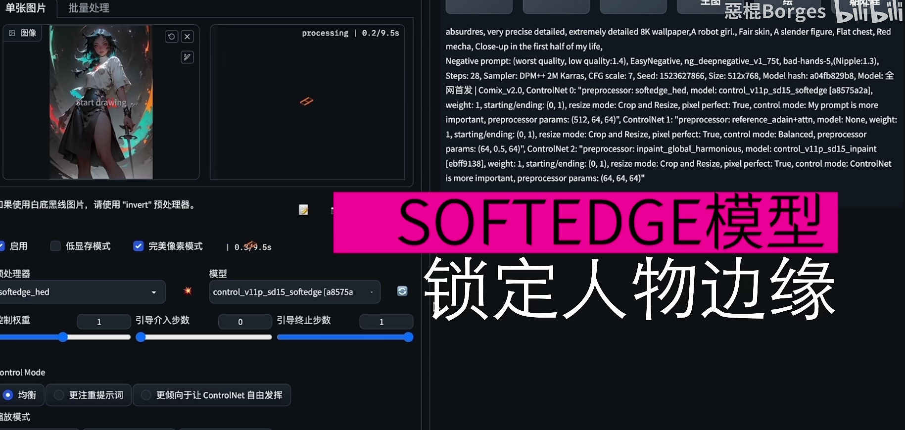
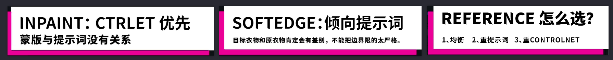

##### **M02.图生图 + 控制**

```markdown
- 其他步骤与M01一致
  重绘幅度0.5
```

##### **M03.局部重绘 + 控制**

```markdown
- 其他步骤与M01一致，去掉inpaint即可
- 蒙版处理方式：
  填充：蒙版内容先模糊再画，需将提示词改为重绘的内容
  原版：修脸时可用，无需修改提示词，重点：开启AD
  
- 绘制方式：
  全图：先画全图然后裁剪，整体性融合度强，速度慢，修人脸会容易崩
  仅蒙版：仅画蒙版区域，整体性融合度弱，提示词需要改为蒙版部分内容，速度快，建议蒙版处理方式：原版
```

------

#### **⒊动漫转真人的方式**

##### M01.文生图+tile+canny

##### M02.图生图+canny：

  **对比差别：**

------

#### **⒋模特换装**

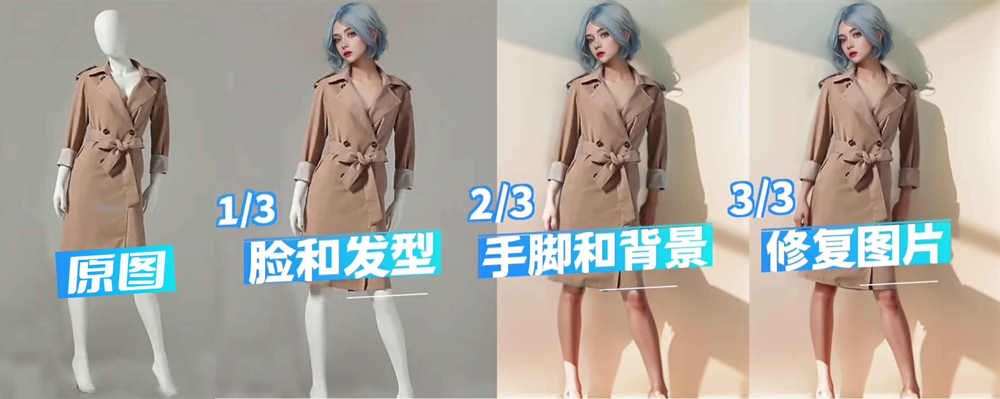

##### **M01. 脸和发型**

**局部重绘**

蒙版区域内容处理：**填充，将提示词修改成头部的特征描述**
重绘区域：**仅重绘蒙版区域**
重绘幅度：**0.5-0.8**

```markdown
- ControlNet模型 1/3 控形
lineart(线稿)：下载预处理图，将参考的发型用PS处理成预处理图
```
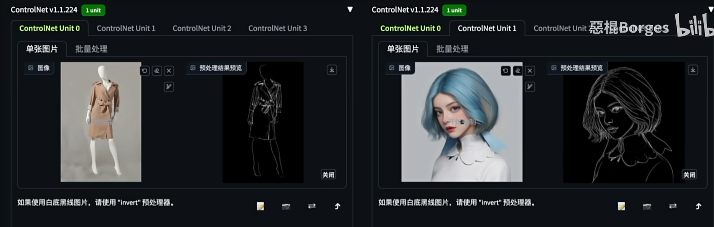

```markdown
- ControlNet模型 2/3 参考
reference(参考)：控制参考风格，参考真实的人脸
```
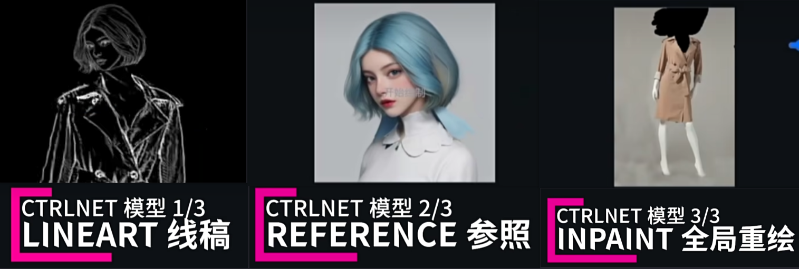

```markdown
- ControlNet模型 3/3 范围
inpaint(局部重绘)：控制重绘区域(选择ControlNet优先)，可以开启AD修复
预处理器：global harmornious(是整体更加协调)
```

------

##### **M02. 手/脚/背景处理**

**局部重绘**
提示词加入：特征描述，**shadow,Sunlight**（阳光，阴影）
蒙版区域内容处理：**填充**
重绘区域：**仅重绘蒙版区域** (手脚单独处理)；**全图** (手脚一起处理)
重绘幅度：**0.5-0.8**

```markdown
- ControlNet模型 1/3 范围
  Inpaint(局部重绘)：配合seg插件精准做出手部蒙版
```

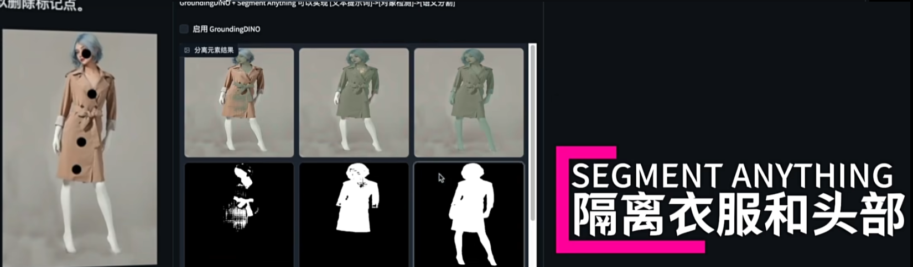

```markdown
- ControlNet模型 2/3 控形
  Pose(姿势)：确定手脚位置

- ControlNet模型 3/3 控形
  lineart(线稿)：确定手脚轮廓和比例
```

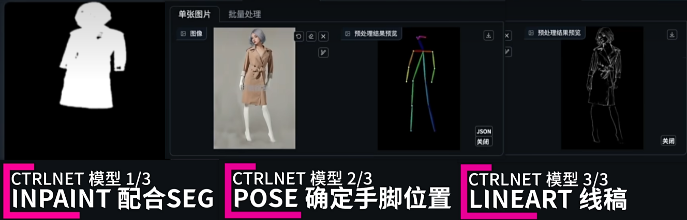


------

#### **⒌模特换脸**

##### **M01.图生图**

```markdown
- ControlNet模型 1/2 面部特征
  inatant_ID：预处理器:embedding(要换的脸)
	
- ControlNet模型 2/2 面部五官范围
  inatant_ID：预处理器:keypoints(参考图的脸部五官)
```
##### **M02.局部重绘**

```markdown
- ControlNet模型 3/4 控形
  Pose(姿势)：确定手脚位置
	
- ControlNet模型 4/4 参考
  lineart(线稿)：控制外部轮廓
```


------

#### **⒍真实照片换背景 换发型 换服装 换风格**


------

#### **⒎超级符号**


------

#### **⒏线稿上色+转3D+三视图**


------

#### **⒐角色多角度统一图**

**文生图 + lineart + openpose**

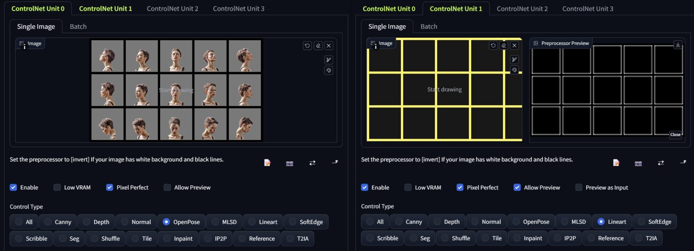
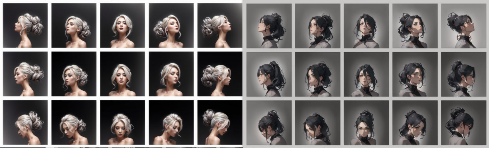

```markdown
- OpenPose和矩形的单独大小尺寸必须能被 8 整除。
建议单个为 256×256 图像。 然后开启高清修复放大到每个为 512，也可以加上tilediffusion放大
```

------

####  **⒑室内渲染**


------

#### **⒒AI造字**


------

#### **⒓.** **AI 放大**


------

#### **13.打光**

**M01. 文生图 + controlnet_照明**

权重0.4~0.6，退出介入0.6

**M02.图生图**

1. 上传灯光的光域网，
2.  在controlnet_lineart上传人物/打光物品图，
3. 设置重绘：0.5~0.8


------

