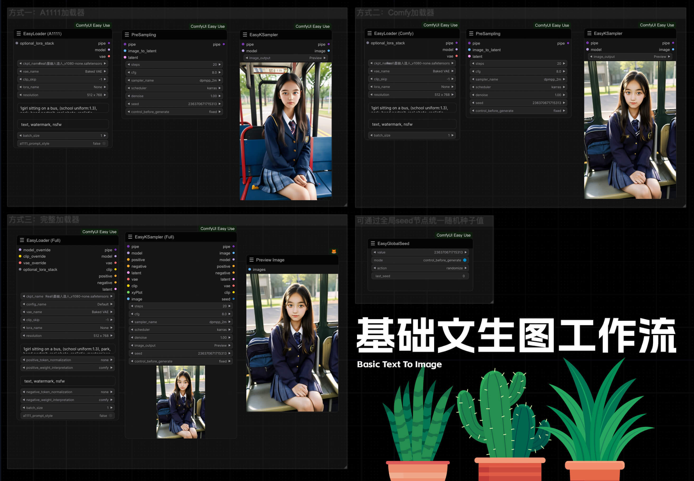
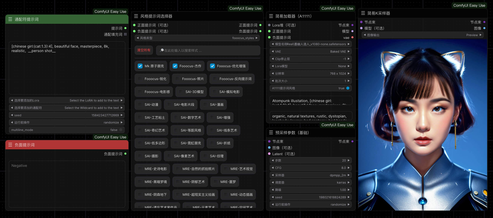
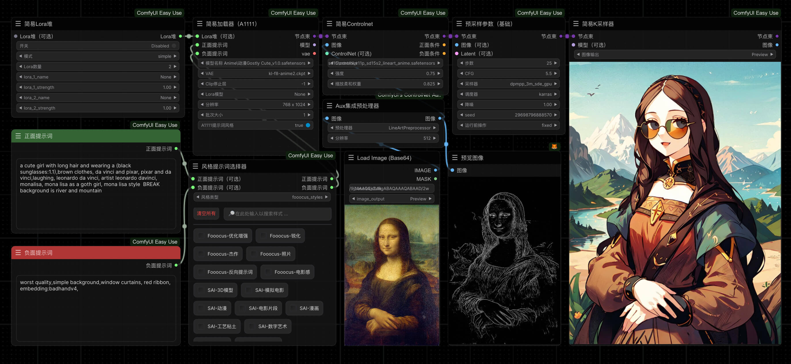
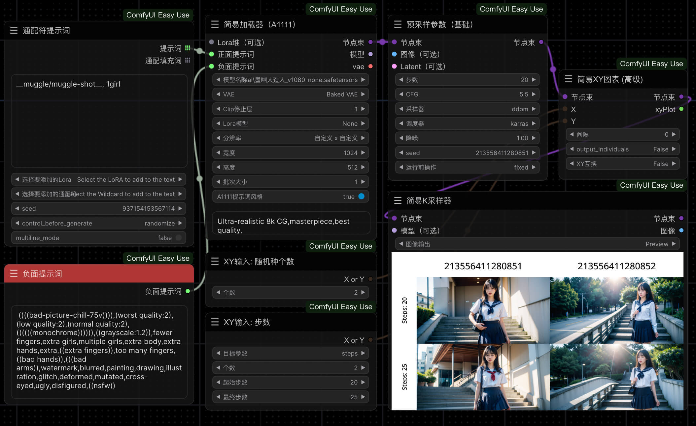
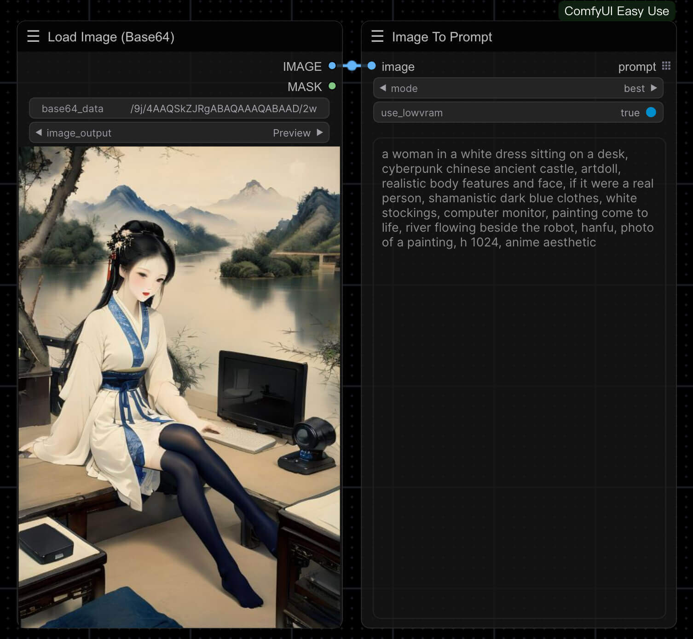
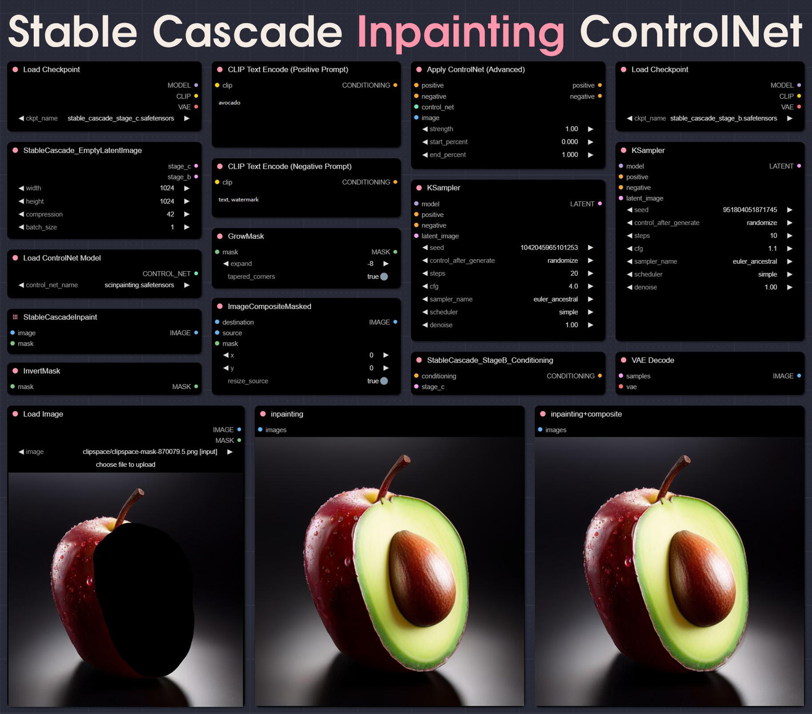

## 工作流合集

```markdown
文生图：Checkpoint → Lora  → CLIP  → ControlNet  → 采样器  → VAE解码  → 出图
                                                   ↑
图生图：                               加载图像 → vae编码      
```

## 1. 基础工作流

#### 1.1 文生图



#### 1.2 图生图


#### 1.3 节点束输入 输出 编辑


#### 1.4 通配符与风格提示词



#### 1.5 ControlNet



#### 1.6 细节修复


#### 1.7 XY对比



#### 1.8 单项对比


#### 1.9 图像反推提示词



#### 1.10 背景去除


#### 1.11 重绘扩图


#### 1.12 噪声注入


#### 1.13 稳定联接


#### 1.14 Stable Diffusion 3 API


#### 1.15 CosXL图像编辑


## 2. 进阶工作流

#### 2.1 ipadapter


#### 2.2 instantID


#### 2.3 LayerDiffusion


#### 2.4 局部重绘进阶


#### 2.5 IC-Light


## 3. 实用工作流

#### 3.1 角色一致性

#### 3.1.1 角色三视图与特写


#### 3.1.2 电商工作流


------

## 4. 稳定联接


------

#### 1 稳定联接 -标准


#### 2 硬边缘 Canny ControlNet


#### 3 重绘 Inpainting ControlNet



#### 4.4 图生图


#### 5 稳定联接 ImagePrompt Standard


#### 6 稳定联接 ImagePrompt Mix


------

## 5. 3D


#### 5.1 CRM Comfy 3D


#### 5.2 草图 3D


   【Sketch to 3D】使用说明：

   - 使用模型：
      - [Playground v2.5.jpg)
      - [ControlNet.jpg)

   - 使用插件：
      - 草图画板：[AlekPet.jpg)
      - 背景去除：[BRIA_AI-RMBG.jpg)
      - TripoSR 3D生成：[TripoSR-ZHO.jpg)

#### 5.3 LayerDIffusion + TripoSR V1.0


   - 使用插件：
      - [LayerDIffusion.jpg)
      - [TripoSR-ZHO.jpg)


 ###3️⃣ LLM + SD


------

## 6. 重绘

#### 6. 1 简单 DD 重绘


#### 6.2 文生图 + DD 重绘 


 ###5️⃣ [YoloWorld-EfficientSAM


## 7. 分割

#### 7.1 图片检测+分割


#### 7.2 视频检测+分割


------

## 8. InstantID

#### 8.1  InstantID_pose_ref + ArtGallery


#### 8.2 InstantID_locally_pose_ref


------

9️⃣ [PhotoMaker-ZHO


## 9. Disney-风格+蒙版 

#### 9.1 lora + batch


#### 9.2  portraitmaster + styler + lora


------

#### 9.3 TravelSuite


------

#### 9.4 Latent_travel_workflow


------

## 10. WordCloud


------

#### 10.1  WordCloud


