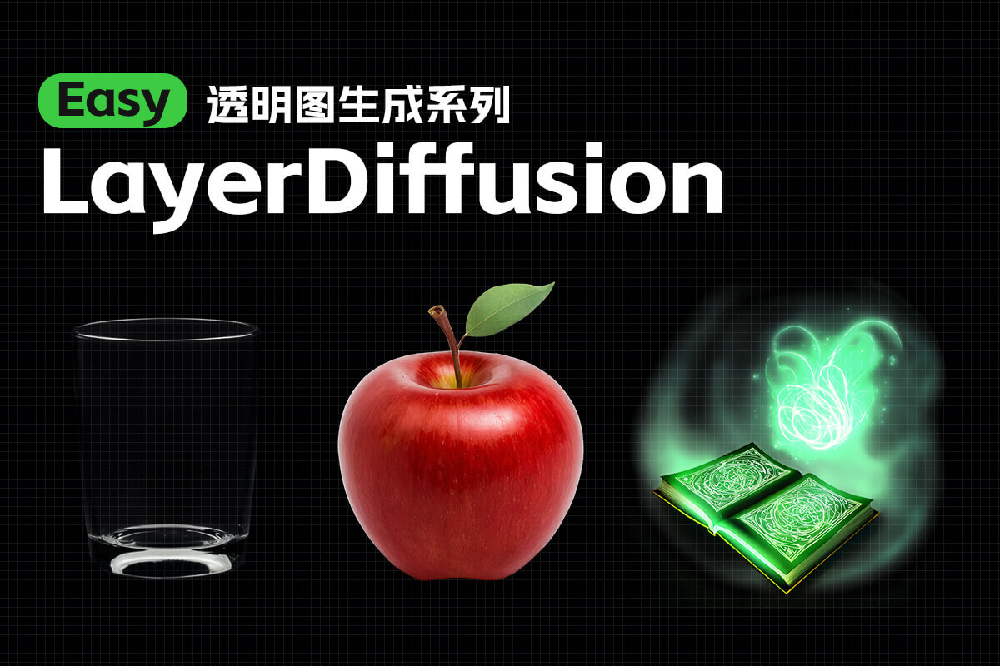

## 1. 快捷键

```markdown
【Ctrl+Enter】：将当前图形排队以供生成
【Ctrl+Shift+Enter】：将当前图作为第一个生成队列
【Ctrl+S】：保存工作流
【Ctrl+O】：加载工作流程
【Ctrl+A】：选择所有节点
【Alt+C】：折叠/取消折叠选中的节
【Ctrl+M】：禁用/启用所选节点
**【Ctrl+B】**：绕过选定的节点(就像从图中删除了节点，重新连接了导线一样)
【Delete/Backspace】：删除选中的节点
【Ctrl+Delete】：删除当前图
【空格】：当按住并移动光标时，移动画布
【Ctrl+鼠标左键】：将单击的节点添加到选择中（点选，框选都可以）
【Shift+拖动】：对齐网格/同时移动多个选中的节点
【Ctrl+C/Ctrl+V】：复制并粘贴选中的节点(不维持与未选中节点的输出的连接)
【Alt+拖动】：复制当前选择
【Ctrl+C/Ctrl+Shift+V】：复制并粘贴所选节点(维持从未选中节点的输出到粘贴节点的输入之间的连接)
【Ctrl+D】：加载默认工作流
【Q】：切换队列的显示已隐藏
【H】：切换历史显示与隐藏
【R】：刷新工作流
【双击鼠标左键(LMB)】：打开节点快速搜索面板
```


------

## 2. 基本设置

#### **2.1 插件**

```markdown
安装路径 .\custom_nodes
1. ComfyUI_IPAdapter_plus(风格参考)
2. ComfyUI-Manager
3. ComfyUI-Custom-Scripts(自定义节点)
4. rgthree-comfy(快捷节点)
5. ComfyUI-IC-Light(打光)
6. comfyui-workspace-manager(管理器)
7. Crystools(显示内存进度)
8. comfyui-mixlab-nodes(投屏节点)
9. ComfyUlCustom_Nodes_AlekPet(画板节点)
10. ComfyUI_smZNodes(A1111节点)
11. Easy-Use(简单使用)
12. blibla-comfyui-extensions(解除冻结)
13. segment_anything(语义分割)：多词组写法 face|boby
14. lmpact Pack
15. ComfyUI_frontend(修复文本溢出)
16. Comfyui-ergouzi-DGNJD(多功能节点)


```


------

#### **2.2 同步WebUI**

> 1. WebUI随机种子改成GPU
>
> 2. CLIP提示词节点选择高级**(BNK)**，权重差值方式：**A111**
>
> 

------

## 3. 遮罩

#### **3.1 手动遮罩：右键遮罩编辑器打开**


------

#### **3.2 SAM遮罩：右键在SAM检测中打开 (lmpact Pack节点)**

- 在需要抠像的部分打点，点击 `Detect`生成；

- **透明抠图**：图像 --- `透明图像裁剪`；


- **自定义设置SAM模型**

 ```JAVA
//首次运行Impact Pack后，将在Impact Pack目录中自动生成一个文件。您可以修改此配置文件以自定义默认行为；inpact-pack.ini
 
[default]
 dependency_version = 9
mmdet_skip = True
sam_editor_cpu = False //使用CPU代替GPU
 sam_editor_model = sam_vit_b_e1ec64.pth //指定SAM编辑器的SAM模型
 ```

------
#### **3.3 画板遮罩：可以自定义画布大小和图像位置(AlekPet节点)**
- 可以扩展图像


------
#### **3.4 RGBA 透明图像加载**
- 透明通道为遮罩

------

## 4. 语义分割/抠图

#### **4.1 segment_anything(语义分割)**

- 多词组写法 **face | boby** ，容易**有锯齿**


------

#### **4.2 CLIP 语义分割**

- 输入检测词进行分割，能调整**边缘模糊度**


------

#### **4.3 BiRefNet：自动抠图**	[Github](https://github.com/zhengpeng7/birefnet?tab=readme-ov-file)


------

## 5. 工作流合集
```markdown
文生图：Checkpoint → Lora  → CLIP  → ControlNet  → 采样器  → VAE解码  → 出图
                                                   ↑
图生图：                               加载图像 → vae编码      
```

### 基础工作流

#### 1-1 文生图
[](workflows/1_basic/1-1基础文生图.json)

#### 1-2 图生图
[](workflows/1_basic/1-2基础图生图.json)

#### 1-3 节点束输入 输出 编辑
[](workflows/1_basic/1-3节点束输入输出编辑.json)

#### 1-4 通配符与风格提示词
[](workflows/1_basic//1-4通配符与风格提示词.json)

#### 1-5 ControlNet
[](workflows/1_basic/1-5ControlNet.json)

#### 1-6 细节修复
[](workflows/1_basic/1-6细节修复.json)

#### 1-7 XY对比
[](workflows/1_basic/1-7XY对比.json)

#### 1-8 单项对比
[](workflows/1_basic/1-8单项对比.json)

#### 1-9 图像反推提示词
[](workflows/1_basic/1-9图像反推提示词.json)

#### 1-10 背景去除
[](workflows/1_basic/1-10背景去除.json)

#### 1-11 重绘扩图
[](workflows/1_basic/1-11重绘扩图.json)

#### 1-12 噪声注入
[](workflows/1_basic/1-12噪声注入.json)

#### 1-13 Stable Cascade
[](workflows/1_basic/1-13StableCascade.json)

#### 1-14 Stable Diffusion 3 API
[](workflows/1_basic/1-14StableDiffusion3API.json)

#### 1-15 CosXL图像编辑
[](workflows/1_basic/1-15CosXL图像编辑.json)

### 进阶工作流
#### 2-1 ipadapter


#### 2-2 instantID


#### 2-3 LayerDiffusion


#### 2-4 局部重绘进阶


#### 2-5 IC-Light


### 实用工作流

#### 3-1 角色一致性
##### 3-1-1 角色三视图与特写


##### 3-1-2 电商工作流
