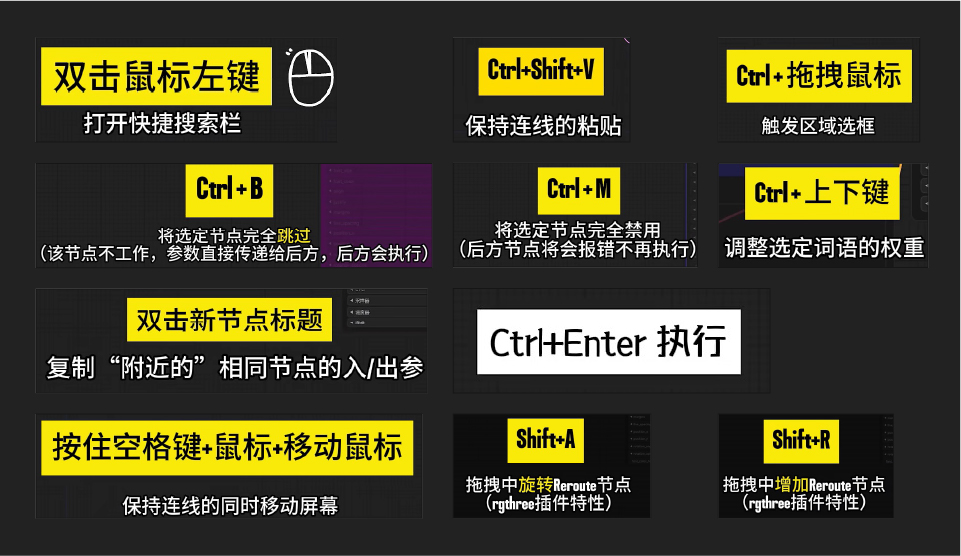
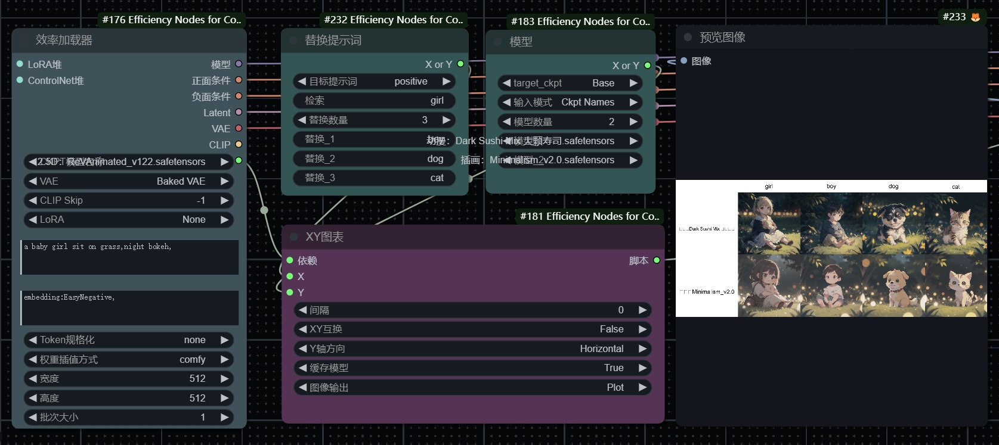

## 1. 快捷键

```markdown
【Ctrl+Enter】：将当前图形排队以供生成
【Ctrl+Shift+Enter】：将当前图作为第一个生成队列
【Ctrl+S】：保存工作流
【Ctrl+O】：加载工作流程
【Ctrl+A】：选择所有节点
【Alt+C】：折叠/取消折叠选中的节
【Ctrl+M】：禁用/启用所选节点
**【Ctrl+B】**：绕过选定的节点(就像从图中删除了节点，重新连接了导线一样)
【Delete/Backspace】：删除选中的节点
【Ctrl+Delete】：删除当前图
【空格】：当按住并移动光标时，移动画布
【Ctrl+鼠标左键】：将单击的节点添加到选择中（点选，框选都可以）
【Shift+拖动】：对齐网格/同时移动多个选中的节点
【Ctrl+C/Ctrl+V】：复制并粘贴选中的节点(不维持与未选中节点的输出的连接)
【Alt+拖动】：复制当前选择
【Ctrl+C/Ctrl+Shift+V】：复制并粘贴所选节点(维持从未选中节点的输出到粘贴节点的输入之间的连接)
【Ctrl+D】：加载默认工作流
【Q】：切换队列的显示已隐藏
【H】：切换历史显示与隐藏
【R】：刷新工作流
【双击鼠标左键(LMB)】：打开节点快速搜索面板
【连接点直接点击：中键】：生成转接点
```



------

## 2. 基本设置

#### **2.1 插件**

```markdown
安装路径 .\custom_nodes
1. ComfyUI_IPAdapter_plus(风格参考)
2. ComfyUI-Manager(管理器)
3. ComfyUI-Custom-Scripts(提示词自动补全)
4. rgthree-comfy(快捷节点)
5. ComfyUI-IC-Light(打光)
6. comfyui-workspace-manager(管理器)
7. Crystools(显示内存进度)
8. comfyui-mixlab-nodes(投屏节点)
9. ComfyUlCustom_Nodes_AlekPet(画板节点)
10. ComfyUI_smZNodes(A1111节点)
11. Easy-Use(简单使用)
12. blibla-comfyui-extensions(解除冻结)
13. segment_anything(语义分割)：多词组写法 face|boby
14. lmpact Pack
15. ComfyUI_frontend(修复文本溢出)
16. Comfyui-ergouzi-DGNJD(二狗多功能节点)
17. ComfyUI-N-Sidebar(侧边栏调出节点)
18. ComfyUI-BrushNet(局部重绘)
19. cg-use-everywhere(全局节点)
20. was-node-suite-comfyui(合成，调色)
21. ComfyUI-ResAdapter(协调尺寸对出图的权重)
22. ComfyUI_essentials(基本节点补充)

```

------

#### **2.2 输出文件夹命名**

> **%date:yyyy-MM-dd%/%date:MMddhhmm%_%随机种.seed%**
>
> `%date:yyyy-MM-dd%`	//日期:年-月-日
> `%date:hhmm%`		//时间:小时-分-秒
> `%KSampler.seed%`		//采样器:种子
>
> 可以自定义修改`标题`名加上`.节点变量`,**节点变量必须是英文原称**
>
> 

------

#### **2.3 同步WebUI**

1. WebUI随机种子改成GPU；
2. CLIP提示词节点选择: 高级 < **(BNK)**，权重差值方式：**A1111；**
3. SD里的A1111和Comfy的对比：Comfy可以更少的步数出到更精细的图；


------

#### **2.4 CLIP-ViT 模型**

```markdown
1.  CLIP-ViT-H-fp16.safetensors
显存需求: 较低，因为使用了 FP16（半精度浮点数），通常会比 FP32 版本占用更少的显存。
应用场景: 适合在显存较小的环境中运行，同时可以在一定程度上保留模型性能。

2. CLIP-ViT-bigG-14-laion2B-39B-b160k.safetensors
显存需求: 高，非常适合需要高精度和大数据处理的场景，但显存占用也会相应增加。
应用场景: 用于需要更高精度的任务，适合在显存充足的硬件环境下运行。

3. CLIP-ViT-H-14-laion2B-s32B-b79K.safetensors
显存需求: 较高，虽然没有 bigG 模型那么大，但由于数据规模和模型复杂度，仍然需要较多的显存。
应用场景: 适合高性能需求的任务，适合在显存资源丰富的环境中使用。
```

> **低显存推荐**：CLIP-ViT-H-fp16.safetensors

------

#### **2.5 SAM-ViT 模型对比及低显存推荐**

```markdown
 1. sam_vit_b_01ec64.pth
显存需求: 中等。属于基础版本的 ViT 模型，在显存占用和性能之间有较好的平衡。
应用场景: 适合在资源有限的环境中使用，同时能提供相对较好的性能。

 2. sam_vit_h_4b8939.pth
显存需求: 高。ViT-H 模型具有更大的网络结构和更多的参数，因此显存需求也较高。
应用场景: 用于需要高精度的任务，适合在显存充足的硬件环境下运行。

 3. sam_vit_l_0b3195.pth
显存需求: 较高。比 ViT-B 更大的模型架构，在性能上有所提升，但需要更多的显存资源。
应用场景: 适合在显存资源相对丰富的环境中使用，提供更好的精度和性能。

 4. sam_hq_vit_l.pth
显存需求: 较高。与标准的 ViT-L 相比，HQ 版本可能在数据处理或精度上有所优化，显存需求略高。
应用场景: 用于需要更高质量的图像处理任务，适合在显存资源较为充足的情况下使用。

 5. sam_hq_vit_h.pth
显存需求: 高。大规模的 HQ ViT-H 模型，显存占用最高，适合在顶级硬件环境下使用。
应用场景: 适合最复杂的图像处理任务，需要大量显存。

 6. sam_hq_vit_b.pth
显存需求: 中等。虽然是 HQ 版本，但基于 ViT-B 架构，显存需求相对较低。
应用场景: 适合在显存有限的环境中使用，同时提供更好的图像处理质量。
```

>  **低显存推荐**：**sam_vit_b_01ec64.pth** 和 **sam_hq_vit_b.pth** 也适合显存较少的情况下使用，能够在性能和显存之间取得较好的平衡。

------

#### **2.6 groundingdino 模型**

```markdown
1. groundingdino_swint_ogc.pth
性能: Swin-T 版本的模型通常比 Swin-B 版本的模型更轻量化，适合显存较少的设备。
应用场景: 适合资源有限的环境，适用于需要快速推理的任务，但在处理复杂任务时，性能可能不及 Swin-B 模型。

2. groundingdino_swinb_cogcoor.pth
性能: Swin-B 版本通常拥有更强的表现力和更高的精度，但代价是需要更多的显存和计算资源。
应用场景: 适合在显存和计算资源充足的环境下运行，适用于需要更高精度和复杂任务的应用。
```

> **低显存推荐**：**groundingdino_swint_ogc.pth**

------

#### **2.7 IP-Adapter 模型对比及低显存推荐**

```markdown
1. ip-adapter_sdxl_vit-h.safetensors
显存需求: 高。ViT-H 是较大模型架构，显存需求较高。
应用场景: 适合需要高精度的图像生成任务，适合在显存资源丰富的环境中使用。

2. ip-adapter_sdxl.safetensors
显存需求: 中等。相比 ViT-H 版本，这个模型的显存占用较少。
应用场景: 适合一般的图像生成任务，在显存和性能之间取得平衡。

3. ip-adapter-plus_sdxl_vit-h.safetensors
显存需求: 高。ViT-H 加上 Plus 版本优化，显存需求进一步增加。
应用场景: 用于需要最高精度和复杂处理任务的场景，适合在顶级硬件环境下使用。

4. ip-adapter-plus_sd15.safetensors
显存需求: 中等偏高。比基础版的 SD 1.5 模型要求更多显存。
应用场景: 用于需要较高精度的任务，同时显存要求适中。

5. ip-adapter_sd15.safetensors
显存需求: 中等。显存占用相对较小，适合较广泛的应用场景。
应用场景: 适合一般图像生成任务，在性能和显存占用之间取得较好的平衡。

6. ip-adapter-plus-face_sdxl_vit-h.safetensors
显存需求: 高。脸部识别优化需要更多显存，尤其是在 ViT-H 架构下。
应用场景: 适合高精度的脸部识别任务，在显存资源充足的硬件环境下使用。
```

> 低显存推荐：ip-adapter_sd15.safetensors

------

#### **2.8 Hyper 模型对比及低显存推荐**

##### SD 1.5 系列

```markdown
1. Hyper-SD15-12steps-CFG-lora.safetensors
显存需求: 高。由于采用了 12 个步骤和 CFG（Classifier-Free Guidance），显存占用较大。
应用场景: 适合需要高精度和复杂生成任务的场景。

2. Hyper-SD15-1step-lora.safetensors
显存需求: 低。只有 1 个步骤，显存占用最低。
应用场景: 适合资源受限的环境，快速生成任务。

3. Hyper-SD15-2steps-lora.safetensors
显存需求: 较低。比 1 步骤版本稍高，但仍保持较低显存占用。
应用场景: 适合需要稍高精度，但显存仍有限的场景。

4. Hyper-SD15-4steps-lora.safetensors
显存需求: 中等。步骤增加带来更好的生成效果，但显存需求也增加。
应用场景: 适合平衡显存和生成质量的任务。

5. Hyper-SD15-8steps-CFG-lora.safetensors
显存需求: 较高。增加了步骤和 CFG，显存占用相应提高。
应用场景: 适合需要高质量生成的任务，但显存需求较大。

6. Hyper-SD15-8steps-lora.safetensors
显存需求: 较高。比 CFG 版本显存稍低，但仍然较高。
应用场景: 适合需要更高生成质量但显存稍有限制的环境。
```

> 低显存推荐：Hyper-SD15-1step-lora.safetensors 

##### SDXL 系列

```markdown
1. Hyper-SDXL-12steps-CFG-lora.safetensors
显存需求: 高。最高精度的配置，显存需求最大。
应用场景: 适合顶级硬件环境和高质量生成任务。

2. Hyper-SDXL-1step-Unet-Comfyui.fp16.safetensors
显存需求: 低。使用 FP16 进一步减少显存占用。
应用场景: 适合显存极为有限的环境，特别是在需要兼容性或低精度的场景下。

3. Hyper-SDXL-1step-Unet.safetensors
显存需求: 低。仅使用 1 个步骤，显存占用较小。
应用场景: 适合快速推理和生成的场景。

4. Hyper-SDXL-1step-lora.safetensors
显存需求: 低。LoRA 结合 1 步骤，显存占用低。
应用场景: 适合显存有限的环境，能够快速生成。

5. Hyper-SDXL-2steps-lora.safetensors
显存需求: 较低。比 1 步骤版本稍高，但仍适合资源受限的环境。
应用场景: 适合平衡生成质量和显存需求的场景。

6. Hyper-SDXL-4steps-lora.safetensors
显存需求: 中等。比 2 步骤版本需求稍高，生成质量也有所提升。
应用场景: 适合需要稍高精度的任务，但显存仍有限制。

7. Hyper-SDXL-8steps-CFG-lora.safetensors
显存需求: 高。更高的步骤数和 CFG 带来了更高的显存占用。
应用场景: 适合显存资源充足的环境，提供高质量生成。

8. Hyper-SDXL-8steps-lora.safetensors
显存需求: 较高。步骤数高，显存需求增加。
应用场景: 适合对生成质量有较高要求的任务。
```

> **低显存推荐**：**Hyper-SDXL-1step-Unet-Comfyui.fp16**适合需要 FP16 低精度的场景。
>
> **Hyper-SDXL-1step-lora** 也是一个较低显存的选择，适合需要平衡性能和显存的任务。

------

**2.8 IP-Adapter-FaceID 模型对比及低显存推荐**

```markdown
1. ip-adapter-faceid-portrait_sdxl_unnorm.bin
显存需求: 中等。未归一化版本可能需要更多的计算资源，但显存占用中等。
应用场景: 适合脸部识别肖像任务，特别是在处理非标准化数据时。

2. ip-adapter-faceid-portrait_sdxl.bin
显存需求: 中等。标准 SDXL 架构，显存需求较为平衡。
应用场景: 适合一般的脸部识别任务，在显存和性能之间取得平衡。

3. ip-adapter-faceid-portrait-v11_sd15.bin
显存需求: 中等偏低。基于 SD 1.5 的优化版本，显存需求较小。
应用场景: 适合低显存环境下的脸部识别任务。

4. ip-adapter-faceid-plusv2_sdxl.bin
显存需求: 中等偏高。Plus V2 优化带来了更好的性能，但显存需求增加。
应用场景: 适合在显存资源较充足的环境下，执行高精度的脸部识别任务。

5. ip-adapter-faceid-plusv2_sd15.bin
显存需求: 中等。相比 SDXL 版本，显存占用较少。
应用场景: 适合一般的脸部识别任务，在显存资源有限的环境中使用。


```

> **低显存推荐：ip-adapter-faceid-portrait-v11_sd15.bin** 

------

## 3. 遮罩

#### **3.1 手动遮罩：右键遮罩编辑器打开**


------

#### **3.2 SAM遮罩：右键在SAM检测中打开 (lmpact Pack节点)**

- 在需要抠像的部分打点，点击 `Detect`生成；

- **透明抠图**：图像 --- `透明图像裁剪`；


- **自定义设置SAM模型**

 ```JAVA
//首次运行Impact Pack后，将在Impact Pack目录中自动生成一个文件。您可以修改此配置文件以自定义默认行为；inpact-pack.ini
 
[default]
 dependency_version = 9
mmdet_skip = True
sam_editor_cpu = False //使用CPU代替GPU
 sam_editor_model = sam_vit_b_e1ec64.pth //指定SAM编辑器的SAM模型
 ```

------
#### **3.3 画板遮罩：可以自定义画布大小和图像位置(AlekPet节点)**
- 可以扩展图像


------
#### **3.4 RGBA 透明图像加载**
- 透明通道为遮罩

------

## 4. 语义分割/抠图

#### **4.1 segment_anything(语义分割)**

- 多词组写法 **face | boby** ，容易**有锯齿**


------

#### **4.2 CLIP 语义分割**

- 输入检测词进行分割，能调整**边缘模糊度**


------

#### **4.3 BiRefNet：自动抠图**


------

## 5. 局部重绘

> 内补编码：会改变原图色调 (潜空间噪声)
>
> 噪波遮罩：原图
>
> Lama+噪波遮罩：原图+模糊


> Inpaint + 重绘
>


#### **5.1 局部重绘**（仅遮罩重绘）

> 适合局部**重绘幅度小**，要丰富重绘提示词的，创造力会更强；
>
> 适合扩图，**速度最快**；
>
> 适合重绘幅度 0.55 ，过高要加入 **ControlNet_Inpaint**；


> - `设置Latent噪波遮罩`再发送采样器，变化会更参考原图；
> - 这两种局部重绘方式的区别
> 
> 
> 

##### **补充知识点：无痕移除物体**

> `设置Latent噪波遮罩`：重绘受原图影响肯定不行；
>
> `VAE内补编码器`：边缘和原图很难融合；
>
> 添加 `lama内补`节点：可以通过附近区域推断来填补蒙版区域，**类似 PS 的智能识别填充**；
>
> 


------

#### **5.2 局部重绘 + ControlNet_Inpaint（仅遮罩重绘）**

> 适合局部重绘幅度大。
>
> 适合扩图，**速度中等，效果最好**；
>
> `0` 表示黑色 (`#000000`)；`16777215` 表示白色 (`#FFFFFF`)


------

#### **5.3 图生图+ ControlNet_Inpaint**（稍微影响原图）

> 适合重绘幅度小，调节全图画面。
>
> 因为重绘原图，**速度最慢**，不适合人物面部修复。
>
> 不适合扩图


------

#### **5.4 面部修复**


------

## 6. IpAdapter

#### 6.1 加载参考图

> - IPAdapter特征图在导入时，编码器会将图像的大小调整为 **224×224**，并将其**裁剪到中心**。
>
> - 镜头和特征提取总是聚焦在中间，可以通过  **CLIP视觉图像处理**  节点去控制镜头位置。


------

#### **6.2 条件缩放图形尺寸**

> 添加 **Easy Use** 的 **比较** 节点和 **Impact Pack** 的 **切换** 节点


------

#### **6.3  权重类型**


> 1. **IPAdapter** 加载模型 (预制参数)：**Plus > light > sd 1.5** （ 参考图 > 提示词，plus注重参考，sd1.5注重提示词 ）
>
> 2. **权重类型** 和 **权重数值** 都会影响出图效果，如果希望出图具有提示词特征，可适当调整权重为0.6-0.8；
>

------

#### **6.4 解决过拟合**


> 1. 增加 **条件** < **模型** < **缩放CFG** 节点


 > 2.  **降噪：**把噪点图连接 **负面图像**，把参考图连接 `IPAdapter噪波` 节点，再连接到负面图像上；


------

#### **6.5 合并嵌入组**

```markdown
当有多张参考图时，合并方式会影响画面的元素结果；

- concat(联结)：//常用
元素并列联结，过滤相同的元素；

- Add(相加)：
全部元素相加，若参考元素过于相似，会出现过拟合；

- subtract(相减)：
上面元素减少下面元素；

- average(平均)；//常用

- norm average(规格化平均)
```


------


------

#### 6.5.1 使用遮罩对IP-Adapter的作用范围进行精确控制

在应用IP-Adapter节点时，我们可以看到还有一个节点输入，那就是遮罩输入，利用这个节点我们可以精准控制多个特征在生成图片里的作用范围

如下图所示


这个工作流在一个宽图的左右半边各引入了一张提示图，可以看到整张图的效果非常自然。

注意：

1.  遮罩最好和图片大小等大

2.  最好在遮罩与非遮罩区域加入过渡层

#### 6.5.2 使用IP-Adapter可以用于放大图片或者模糊图片高清化

通常我们想要修复模糊的图片使用单纯的图生图效果不会很理想，在基础的图生图上增加`IP-Adapter`

可以对图片的修复起到较好的修复效果。

下面是对比效果：


------

**6.6 IPAdapter 新版本**

#### 6.6.1 核心应用节点调整（**IPAdapter Apply**）

本次更新废弃了以前的核心节点**IPAdapter Apply**节点，但是我们可以用**IPAdapter Advanced**节点进行替换。

可以看到新节点缺少了noise配置选项，调整了weight\_type选项的内容，增加了combind\_embeds和embeds\_scaling 配置选项，输入中增加了image\_negative。

如果我们想要尽可能接近上一版本节点的效果

1.  weight type使用linear

2.  combind\_embeds和embeds\_scaling 配置选项不用动

3.  noise可以使用以下单独的节点去配置，强度按照之前的设置，类型选择shuffle连接到image\_negative上


#### 6.6.2 批量[图片加载](https://so.csdn.net/so/search?q=%E5%9B%BE%E7%89%87%E5%8A%A0%E8%BD%BD&spm=1001.2101.3001.7020)调整（Emcode **IPAdapter Image**）

在以前我们想要批量加载图片并调整每个图片的权重需要使用如下节点完成


**这个老节点虽然还存在但已不能使用,添加多个图片不能修改权重！**

老版本工作流现状：


在新版本中没有直接的批量添加图片，而是拆分成了一个个单独的转换接口便于我们更细致的控制图片的识别内容和连接方式，

新版本使用此方式来转换：


**注意老版本节点上还可以添加噪音强度，我们可以用以下流程替代：** 


将图片批量合并后再制造噪声传到negative

最后我们也可获得和原来版本相似的结果：


------

#### 6.6.3 合并模型加载节点（IPAdapter Unified Loader）

新版本提供了统一的模型加载节点，也就是说我们以前需要IPAdapter模型加载器，clip\_version模型加载器，现在直接二合一了。（Face ID相关模型加载要安装insightface）


**注意点：** 

*   当需要多个不同的IPAdapter模型时，可以将不同的IPAdapter加载器首尾相连，这样重复的模型不会重复加载，但若是单独使用此节点或者是长链的第一个节点，则IPAdapter输入必须为空！


*   此加载器会自动加载所有模型，**前提是你的模型名字和官方名字一样，不然是找不到的！**

各个官方模型名称如下：

**clip\_vision模型：** 

*   CLIP-ViT-H-14-laion2B-s32B-b79K.safetensors

*   CLIP-ViT-bigG-14-laion2B-39B-b160k.safetensors

**ip-adapter模型：** 

```markdown
- ip-adapter\_sd15.safetensors，基本模型，平均强度
- ip-adapter\_sd15\_light\_v11.bin，轻型影响模型
- ip-adapter-plus\_sd15.safetensors，Plus 模型，非常强大
- ip-adapter-plus-face\_sd15.safetensors，脸部模型，肖像
- ip-adapter-full-face\_sd15.safetensors，更强的人脸模型，不一定更好
- ip-adapter\_sd15\_vit-G.safetensors，基础模型，需要 bigG 剪辑视觉编码器
- ip-adapter\_sdxl\_vit-h.safetensors，SDXL 模型
- ip-adapter-plus\_sdxl\_vit-h.safetensors，SDXL plus 型号
- ip-adapter-plus-face\_sdxl\_vit-h.safetensors，SDXL 人脸模型
- ip-adapter\_sdxl.safetensors，vit-G SDXL 模型，需要 bigG 剪辑视觉编码器
- 已弃用 ip-adapter\_sd15\_light.safetensors，v1.0 轻型影响模型
```

#### 6.6.4 IPadapter应用高级节点（**IPAdapter Advanced）**


##### **6.6.4.1 新输入**

*   **image\_negative**，非必填参数，用于生成负条件的图像。可以发送噪声或实际上任何图像来指示模型我们不希望在合成中看到什么。

前面提到过在新版本中添加噪声是通过image\_negative实现的，实际上正如名字一样，任何图片都可以作为反向提示使用，而不仅仅是添加了噪声的原图。如下图将普通的漫画图片作为反向提示输入后，生成图片会更偏向真人。


##### 6.6.4.2 新**配置参数**

*   **Weight**，IPAdapter 模型的权重。对于`linear` 类型（默认值，也是唯一老版本保留的类型），从 0.8开始一般效果比较好。如果使用其他类型，您可以尝试更高的值。

*   **Weight\_type**，这就是 IPAdapter 应用于 UNet 块的方式。例如`ease-in`，意味着输入块的权重高于输出块的权重。`week input`意味着整个输入块的权重较低。`style transfer (SDXL)`仅适用于 SDXL，它是一个非常强大的工具，只能传输图像的风格，但不能传输其内容。该参数可以提升文字提示的效果。

*   **merge\_embeds**，当发送多个参考图像时，提示图像可以一个接一个地发送 ( `concat`最接近旧版本效果) 或以各种方式组合。`average`类型可以减轻 GPU 压力。`subtract`将第二张图像的条件减去第一张图像的条件；如果有 3 个或更多图像，则对它们进行平均再减去第一个图像。

*   **embeds\_scaling**，IPAdapter 模型应用于 K,V 的方式。该参数对模型对文本提示的反应影响不大。`K+mean(V) w/ C penalty`在高权重 (>1.0) 下提供良好的质量，而不会烧坏图像。

#### 6.6.5 图片编码节点（**IPAdapter Encoder）**


这个图片编码节点新增了mask遮罩，我们可以避免图片不要的元素对图片造成影响

如图如果不使用mask进行涂抹，即使美女图我们针对性的使用了PLUS FACE模型，可是西方人的脸明显还是传递到了最后生成的图片上。


但当我加上遮罩后，效果明显好很多：


------

## 7. ControlNet工作流


------

## 8. 采样器进阶

#### **8.1 基础采样器**


> 降噪 1 完全重绘，降噪 0 原图。
>
> **原理：噪声退出的时间，0 即不添加噪声，1 即最后一步退出噪声；**

------

#### **8.2 高级采样器**


> - 开启噪声，开始步数指原图介入的时间，介入时间越早，重绘越大，介入时间越晚，重绘越小；
>
> - 默认按总步数添加噪声，当结束步数小于步数时，若开启返回噪波，则可将噪点融合图传递到下层采样器，并按总步数迭代。
> - 知识点：降噪 0.4  →→→→  **开始步数 = 总步数 * (1-0.4)**  
>   // 即如果总步数 30 ，开始步数 18，可以出到一样的效果；
>
> 
>
> - **高级采样器会比基本采样器出图速度更快！！！**
>
> 例如：总步数30；
> 第一个采样器，开始步数10，结束步数20，开启噪声，开启返回噪声；
> 第二个采样器，开始步数21，结束步数30，关闭噪声，关闭返回噪声；
>
> **这样第二步会优化上一张的图片进行细节优化，变化会小，更可控。**

------

#### **8.3 提高效率技巧**


------


## 7. 放大

#### 7.1 Tile分块放大


> VAE分块解码 --- 分块采样 --- K采样器 --- VAE分块编码
>
> - 数学表达式 `.height`获取latent的高度；`.width` 获取latent的宽度；

------

#### 7.2 潜空间 ：Latent直接放大+采样


> 直接放大图片尺寸，相当于SD里的`图生图`直接放大尺寸，缺点是画面**与原图会有差异**，可以调整采样的降噪重绘调整；

------

#### 7.3 像素空间：放大模型 (需解码，耗时长)


> nearest-exact(邻近-精确)；bilinear(双线性插值)；area(区域)；bicubic(双三次插值)；bislerp(双球面线性插值)

### 常用放大模型对比

| 模型名称                       | 放大倍数 | 特点                               | 适用场景  |
| ------------------------------ | -------- | ---------------------------------- | --------- |
| 4x-UltraSharp.pth              | 4x       | 可能提供更清晰的图像               | 通用      |
| 4x_NMKD-Siax_200k.pth          | 4x       | 增强纹理清晰优化                   | 通用/人像 |
| RealESRGAN_x4plus anime_6B.pth | 4x       | 针对动漫优化，可能提供更真实的图像 | 动漫      |
> **放大模型**为 **4** 倍模型，nearest-exact(邻近-精确) 按百分比放大，**50 为放大两倍**，100 为放大 4 倍；


------

## 8. 节点

#### 8.1 comfy节点


------
#### 8.2 Easy Use插件


------
#### 8.3 RGthree插件


------
#### 8.4 二狗插件


------

## 9.  XY图表

#### **9.1.1 脚本 --- XY输入**


------

#### **9.1.2 图像输出**

> **Plot：网格图表；Images：单张图片**


------

#### **9.1.3 多重Lora对比**


> 多重Lora测试叠加的lora权重对比时，要加一个Lora堆放置固定的Lora


------

#### **9.1.4 文本切换**

> **CR节点**(Comfyroll Studio) --- 实用工具 --- 逻辑 --- **文本切换(CR-4)**


------

#### **9.1.5 替换提示词对比**



------


------

## 6. 工作流合集

```markdown
文生图：Checkpoint → Lora  → CLIP  → ControlNet  → 采样器  → VAE解码  → 出图
                                                   ↑
图生图：                               加载图像 → vae编码      
```

### 基础工作流

#### 1-1 文生图
[](workflows/1_basic/1-1基础文生图.json)

#### 1-2 图生图
[](workflows/1_basic/1-2基础图生图.json)

#### 1-3 节点束输入 输出 编辑
[](workflows/1_basic/1-3节点束输入输出编辑.json)

#### 1-4 通配符与风格提示词
[](workflows/1_basic//1-4通配符与风格提示词.json)

#### 1-5 ControlNet
[](workflows/1_basic/1-5ControlNet.json)

#### 1-6 细节修复
[](workflows/1_basic/1-6细节修复.json)

#### 1-7 XY对比
[](workflows/1_basic/1-7XY对比.json)

#### 1-8 单项对比
[](workflows/1_basic/1-8单项对比.json)

#### 1-9 图像反推提示词
[](workflows/1_basic/1-9图像反推提示词.json)

#### 1-10 背景去除
[](workflows/1_basic/1-10背景去除.json)

#### 1-11 重绘扩图
[](workflows/1_basic/1-11重绘扩图.json)

#### 1-12 噪声注入
[](workflows/1_basic/1-12噪声注入.json)

