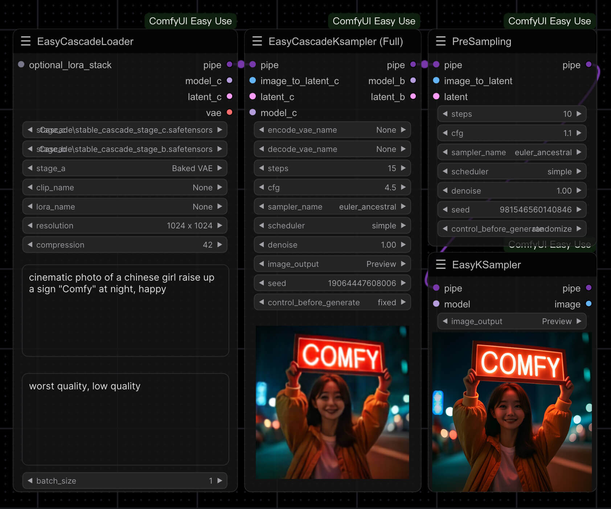
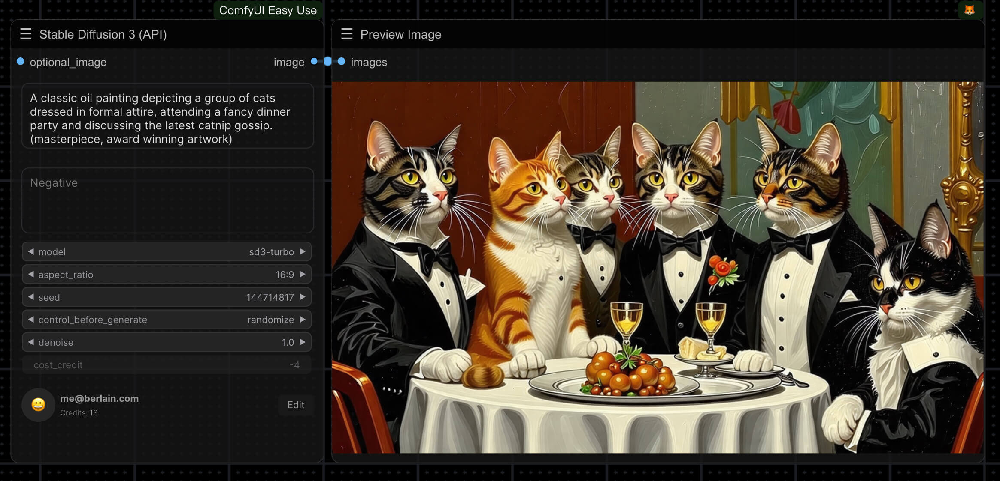
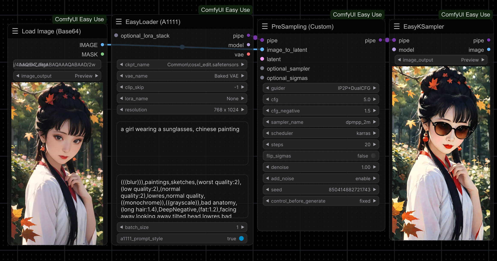
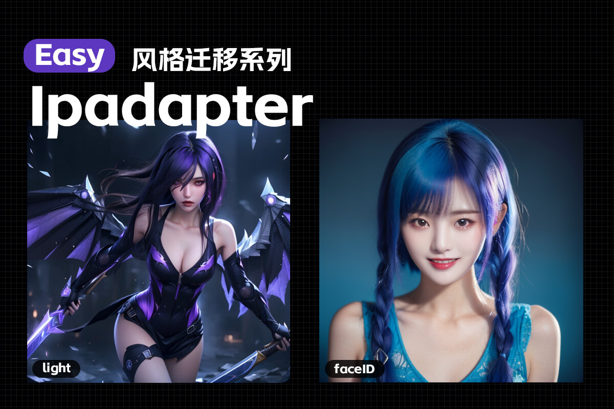
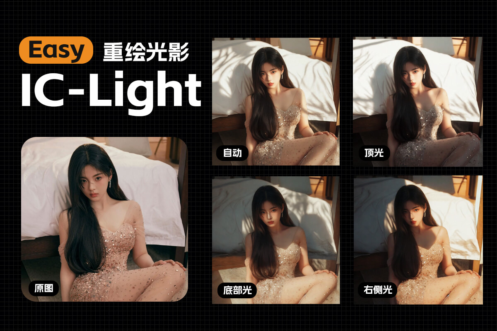
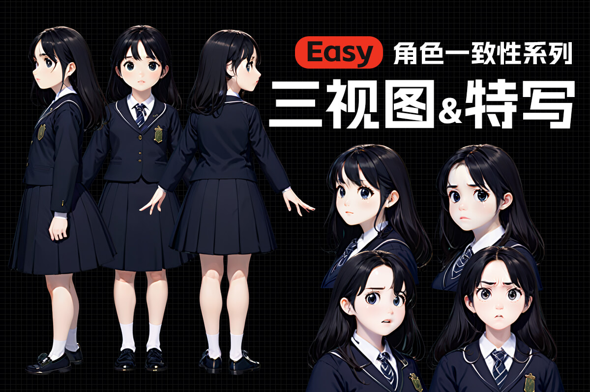
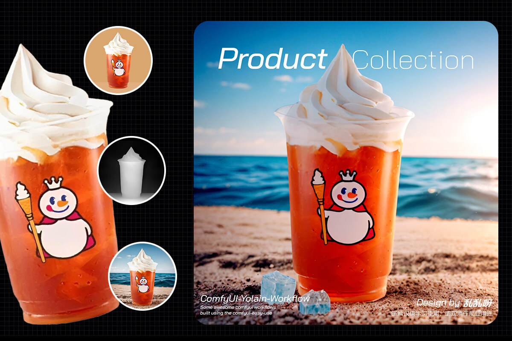

## 1. 快捷键

```markdown
【Ctrl+Enter】：将当前图形排队以供生成
【Ctrl+Shift+Enter】：将当前图作为第一个生成队列
【Ctrl+S】：保存工作流
【Ctrl+O】：加载工作流程
【Ctrl+A】：选择所有节点
【Alt+C】：折叠/取消折叠选中的节
【Ctrl+M】：禁用/启用所选节点
**【Ctrl+B】**：绕过选定的节点(就像从图中删除了节点，重新连接了导线一样)
【Delete/Backspace】：删除选中的节点
【Ctrl+Delete】：删除当前图
【空格】：当按住并移动光标时，移动画布
【Ctrl+鼠标左键】：将单击的节点添加到选择中（点选，框选都可以）
【Shift+拖动】：对齐网格/同时移动多个选中的节点
【Ctrl+C/Ctrl+V】：复制并粘贴选中的节点(不维持与未选中节点的输出的连接)
【Alt+拖动】：复制当前选择
【Ctrl+C/Ctrl+Shift+V】：复制并粘贴所选节点(维持从未选中节点的输出到粘贴节点的输入之间的连接)
【Ctrl+D】：加载默认工作流
【Q】：切换队列的显示已隐藏
【H】：切换历史显示与隐藏
【R】：刷新工作流
【双击鼠标左键(LMB)】：打开节点快速搜索面板
```


------

## 2. 基本设置

#### **2.1 插件**

```markdown
安装路径 .\custom_nodes
1. ComfyUI_IPAdapter_plus(风格参考)
2. ComfyUI-Manager
3. ComfyUI-Custom-Scripts(自定义节点)
4. rgthree-comfy(快捷节点)
5. ComfyUI-IC-Light(打光)
6. comfyui-workspace-manager(管理器)
7. Crystools(显示内存进度)
8. comfyui-mixlab-nodes(投屏节点)
9. ComfyUlCustom_Nodes_AlekPet(画板节点)
10. ComfyUI_smZNodes(A1111节点)
11. Easy-Use(简单使用)
12. blibla-comfyui-extensions(解除冻结)
13. segment_anything(语义分割)：多词组写法 face|boby
14. lmpact Pack
15. ComfyUI_frontend(修复文本溢出)
16. Comfyui-ergouzi-DGNJD(多功能节点)


```


------

#### **2.2 同步WebUI**

> 1. WebUI随机种子改成GPU
>
> 2. CLIP提示词节点选择高级**(BNK)**，权重差值方式：**A111**
>
> 

------

## 3. 遮罩

#### **3.1 手动遮罩：右键遮罩编辑器打开**


------

#### **3.2 SAM遮罩：右键在SAM检测中打开 (lmpact Pack节点)**

- 在需要抠像的部分打点，点击 `Detect`生成；

- **透明抠图**：图像 --- `透明图像裁剪`；


- **自定义设置SAM模型**

 ```JAVA
//首次运行Impact Pack后，将在Impact Pack目录中自动生成一个文件。您可以修改此配置文件以自定义默认行为；inpact-pack.ini
 
[default]
 dependency_version = 9
mmdet_skip = True
sam_editor_cpu = False //使用CPU代替GPU
 sam_editor_model = sam_vit_b_e1ec64.pth //指定SAM编辑器的SAM模型
 ```

------
#### **3.3 画板遮罩：可以自定义画布大小和图像位置(AlekPet节点)**
- 可以扩展图像


------
#### **3.4 RGBA 透明图像加载**
- 透明通道为遮罩

------

## 4. 语义分割/抠图

#### **4.1 segment_anything(语义分割)**

- 多词组写法 **face | boby** ，容易**有锯齿**


------

#### **4.2 CLIP 语义分割**

- 输入检测词进行分割，能调整**边缘模糊度**


------

#### **4.3 BiRefNet：自动抠图**	[Github](https://github.com/zhengpeng7/birefnet?tab=readme-ov-file)


------

## 5. 局部重绘

####  5.1 两种基础重绘使用

在lanten -> inpaint下有如下两个原生节点可以帮我们重绘

> 指定原图重绘区域只需要在[load](https://so.csdn.net/so/search?q=load&spm=1001.2101.3001.7020) image上右键选择“open in mask editor”

##### 5.1.1 [VAE](https://so.csdn.net/so/search?q=VAE&spm=1001.2101.3001.7020) Encode (for inpainting)


输入：pixels(图片)，vae(解码)，mask(遮罩)，grow\_mask\_by（遮罩延申）


##### 5.1.2 Set Latent Noise Mask


输入：samples(潜空间)，mask(遮罩)


**在采样器设置，正向和反向提示词都完全不变的情况下**，可以看到两种重绘都较好的完成图片下半部分的修改。

#### 5.2 两种方式的区别

可以看到这两种重绘方式在唯一的区别就在于中间这部分的使用


那让我们将这两部分的输出拉出来看看：


可以看到对于**VAE Encode (for inpainting)**给采样器的是去除掉蒙版区域的剩余图片，  
而**Set Latent Noise Mask** 给采样器的是完整的图片，但是他将蒙版的位置告诉了采样器。

接触过WebUI的同学是不是感觉有点熟悉？


实际上这就是webUI的Orginal和latent noise 模式。  
那么基于此我们就可以知道他们的的正确用法：  
**Set Latent Noise Mask：由于有原图作为底图，所以降噪强度越低，画面越接近原图，利用这一点，他适合我们降低降噪强度在原图基础上略微调整。** 


**VAE Encode (for inpainting) ：由于蒙版区域全是基于提示词生成的新噪声，他更适合我们对原图进行彻底的修改，而且在使用中降噪强度不能过低，否则就会全是噪声。**
 

#### 5.3 基础转绘更多技巧

##### **5.3.1 使用imageCompositeMasked根据蒙版融合图片**


输入：destination(目标图片) ，source(源图片【蒙版区域替换图片】)，mask蒙版区域，xy(源图片相对目标图片位置)，resize\_source(拉伸源图片以适应目标图片)  
前面我们已经知道了  
**Set Latent Noise Mask 是有原图作为基底的，同理，我们可以把其他的图片作为基底来生产我们想要的图像：**   
例如，我们想将旁边的这个小兔子换成一瓶花，我们可以任意找一个素材，在把蒙版拼接，配合合适的降噪程度，我们可以得到类似的花的替代：


##### **5.3.2** 使用imageBlur来在原图基础上做强化修改


输入：blur\_radius(模糊半径)，sigma(模糊密度)  
有时候我们觉得原图还可以但细节需要加强。或者有一些细节不想要，但大体还是可以的。我们可以使用此节点将原图模糊再融合到一起。这样模糊的部分会小幅度的重绘，并且由于是在原图模糊基础上，重绘后会和其他部分的边界融合的很好（对于原图是大面积色块是效果尤其好）。  
比如我想将左边的柜子重绘，但是保留原来柜子的主体造型，且不要影响窗帘和柜子的边界：


* * *

#### **5.4 图片元素无痕清除，[水印](https://so.csdn.net/so/search?q=%E6%B0%B4%E5%8D%B0&spm=1001.2101.3001.7020)去除**


这张图中间的小黑猫生成时候畸形了，现在如果想将这只黑猫去除，上篇文章说的comfyUI自带的两个图生图节点都不能很好的做到。

**Set Latent Noise Mask：重绘受原图影响肯定不行**

**VAE** **Encode (for inpainting) ：边缘和原图很难融合**

这时我们可以通过**lama**技术，它可以依据附近区域推断来填补蒙版区域,再使用低幅度的重绘来使图片更自然：


可以看到，经过lama初次处理过的区域效果已经很好，但会导致蒙版区域发灰，再低幅度的重绘后，就可以达到理想的状态：


我使用的lama插件是：**comfyui-mixlab-nodes**

节点是：**LamaInpainting**

注意初次使用需要下载模型，会比较久。


#### 5.5 完全不破坏原图的基础上再增加细节

在生成人物时，是不是常有人物好像磨皮美颜过，感觉有点假？

这是因为在生成图片时，达到指定的步骤后多余的噪声会被抛弃，一些细节就会丢失，自然就像开了磨皮美颜。

那么一个生成好的图片还能在**完全忠实于原图**的基础上再增加细节吗？


回顾上篇文章我们知道：

**Set Latent Noise Mask，**就是在原图基础上加上少量噪声来完成重绘，注意这些噪声是新的，随机的，虽然增加了细节，但是也实际上改变了原图的面貌，新的噪声产生的细节也很那说是好的还是坏的。

**如果我们添加的噪声是原图本来的噪声呢？**


使用Noise插件下的 Unsampler 节点就可以“时空逆转”将图片还原成噪声状态：


此节点的输入输出基本上是和普通的正向采样器是一致的，但有以下注意点和技巧：

1.  模型，提示词，步数等如果能找到原来效果更好

2.  cfg设置为1，能更好的还原原本的噪声

3.  end\_at\_step 结束的步数不要太低，原本的步数一半一般比较合适

4.  可以使用Noisy Latent Image 和 Inject Noise 加入一些额外噪声

5.  在后面重采样时，一定要将采样器的添加噪声选项关闭，CFG可以设置的高一些，步数开始和结束按照UUnsampler的设置来。


工作流全貌：


#### 5.6 更快更好，超大图片的局部修复

comfyUI自带的两个重绘节点**Set Latent Noise Mask，****VAE** **Encode (for inpainting)** 有一个很大的缺点就是

他们都会对全图进行重绘。无论蒙版多小，重绘时间和资源占用是根据整个图片的大小来重绘的。导致对高分辨率图片细节重绘时又慢又容易爆显存。

那么换个思路，我们可以将高分辨率图片的蒙版周围区域剪切一部分，比如剪切一个512\*512的区域来重绘，这样既快，而且图片和周围的区域融合的也比较自然。

比如这张图，鸟明显是有问题的，但是分辨率2k，直接重绘不太现实，毕竟不是所有人都有4090：


如果我们自己想搭一套剪切重绘流程，显然是非常复杂的，但使用这个插件节点：


他就可以帮我们做到基于蒙版截切区域去重绘。

我们使用的是Impact Pack 插件（这插件功能很多也很强大，后面会出个专栏介绍他的所有功能，有兴趣可以持续关注）


节点：MaskDetailer(pipe)


**输入讲解：** 

*   `guide_size`：蒙版方形框选后如果小于`guide_size`就会被处理器放大再处理，小于则直接跳过

*   `guide_size_for`：mask bbox 基于蒙版的矩形，crop region 在蒙版位于边界时会扩大裁剪区域

*   `max_size`：将截取的长边限制为小于`max_size`。

*   `feather`：将恢复的细节合成到原始图像上时，图像融合的渐变强度

*   `crop_factor`: 此参数确定要基于蒙版的裁剪区域扩大比例。

*   `drop_size`: 如果蒙版小于此大小的部分都将被丢弃。

*   `inpaint_model`：使用修复模型时，需要启用此选项以确保在降噪值低于 1.0 时正确修复。

*   `noise_mask_feather`：羽化蒙版。

*   `refiner_ratio`：使用 SDXL 时，此设置确定要应用的精炼步骤在总步骤中的比例，不是SDXL可以忽略。

*   `cycle`：此设置确定采样的迭代次数（一般来说低降噪多次循环效果会更好）。

全流程：


* * *

IpAdapter已经是基于stable diffusion的现象级应用模型，它可以将指定图的特征传递到生成图上。很多人对他的使用还只是停留在‘垫图’这一简单的应用，本文就来给大家讲解他的更多细节和使用技巧。

6. IpAdapter
--

使用controlnet:


使用蒙版：


### 6.1 注意点和节点细节

#### **6.1.1 iPAdapter的特征图像在导入时总是截取中间部分！**

**iPAdapter**编码器会将图像的大小调整为**224×224**，并将其裁剪到中心！


如上图所示，镜头和特征提取总是聚焦在中间位置，这种时候可以通过此【prepare image for clip [vision](https://so.csdn.net/so/search?q=vision&spm=1001.2101.3001.7020)】这个节点去控制镜头位置。


此节点三个输入分别是截图算法，截取位置，和图像锐化处理（锐化处理对出图的线条细节会有提升）


效果如图

#### **6.1.1 Apply IpAdapter（应用节点设置）**

**noise（噪声）最好设置成0以上，至少0.0.1**

虽然过多的噪声会导致图像有更多额外的细节出现，但是如果一点噪声都不给，会导致图像非常“干”如下图所示。


0噪声效果


0.0.1噪声效果

#### **6.1.2 三种（weight）权重的效果差别**

**据官网说法和我自己测试：** 

*   original: 效果较为均衡，在值大于1或者小于1时效果都还可以

*   linear: 在值大于一时效果较强

*   channel penalty: 测试类型（我实验效果相对在各方面都最好）图像会偏锐利一些。

送上官网对比图：


#### 6.1.3 影响时间控制

在“应用IPAdapter”节点中，可以设置起点和终点。IPAdapter将仅在该生成时间段内应用模型。用这个来控制特征图片的强度比noise好多了。

效果直接上官网图：


* * *

Ip-Adapter使用技巧第二弹！基础的IP-Adapter垫图使用和技巧在上一篇中已经介绍给大家：

**传送门：[（上、基础使用和细节）](https://blog.csdn.net/qazzsq2420/article/details/136578832 "（上、基础使用和细节）")**

本文就来给大家讲解他的更多注意点和进阶技巧。

### 6.2 如何解决IP-Adapter生成图片发黑发暗

如下图，根据提示图生成的图片就像被火烤过或者像被笔临摹了几百次，已经糊成一团。整个图片发黑发暗。

由于IP-Adapter是一种小型超[网络模型](https://so.csdn.net/so/search?q=%E7%BD%91%E7%BB%9C%E6%A8%A1%E5%9E%8B&spm=1001.2101.3001.7020)，它根据输入图像和中间输出生成嵌入(embeddings)，并将这些嵌入作为指令动态地影响大型扩散模型的生成过程。这就导致了过高的CFG，也就是提示关联会导致图像渲染过度，FaceID也有同样的问题。这时我们可以简单的选择降低CFG，正常降低到4/5即可大大改善状况。但是这么做同时会导致其他提示词也会一起弱化，并且所有用到IP-Adapter模型的地方都要调整。

如图，笑容变得很弱：

所以更好的方案是使用如下节点：


节点很简单，进model出model，将他放到IP-Adapter流程的末尾即可。可以理解为这是一个“退火”节点，可以将模型过高的“温度”降下来，正常设置为0.7就会有效果。同时也不会影响其他如提示词或者controlnet的提示由于调低CFG受到影响。

效果如图，笑容明显灿烂了一些

### 6.3 如何使用非正方形的提示图

在上一篇基础使用中我们介绍了IP-Adapter在识别提示图片时是一个244\*244的正方形区域。在遇到非正方形图片时可以通过预处理器处理图片（详见上篇文章）。

但是，如果我就是这么一身“反骨铮铮”，我就想要长条的图片做提示图片，或者我就想生成长条形的图片怎么办呢？

比如下图这个比例为1：2的图片，如果我们使用普通的应用处理器处理，不但图片被截掉，而且还被拉伸了：

这时我们可以使用新的处理器：


从名字大概就可以窥得这个节点的原理，如果图片不是正方形，那么把划分成一块块的正方形再解析。

可以看到这个节点比正常的节点多了两个参数一个是**短边的正方体划分数量`short_side_tiles`**，一个是每个正方体部分的识别权重**`tile_weight`**。


看看这个图是不是好理解了呢

**`tile_weight`**大家可以根据图片情况适当修改，大多时候0.6是个比较合适的值，如果使用的模型是SDXL那么可以适当将**`tile_weight`**调低到0.5。重点在于**`short_side_tiles`**的使用

还是这个美女，让我们使用新节点试试效果：


可以看到整个图片的特征都被捕捉到了

如果我们调大重点在于short\_side\_tiles的值，其他不变的情况下，让我们看看图片会有怎样的变化：


可以看到，**随着size的增长，图片的特征细节捕捉的更到位，和原图的差别越来越小。回想一下上文的方格图，当特征图像被划分的越细，特征自然捕捉的更具体，同样的执行时间也会更长**。

### **6.4 来个总结：** 

1. **当特征图片或者想要生成的图片是非正方形时，使用此节点可以完整捕捉特征。** 

2. **当short\_side\_tiles越大，特征捕捉越详细，生成的图片越相似度越好，但是时间也会翻倍延长。这意味着即使原图是正方形，也可以使用此节点提高IP-Adapter的识别精度！**

3. 图片即是lora?

在我们使用IP-Adapter时候，使用方式看起来很像是lora,因为他们都是基于模型去修正迁移图片的风格特征。

实际上插件作者也为我们提供了类似的固定图片特征模型的方法，生成的是embeds模型，如下图所示


三张图片的风格固化下来的模型直接导入就可以批量生产相同风格的图片了：


有人可能觉得直接保留着三张图片每次去生成不是更直观吗？直接保留确实可以，但是这也意味着每次加载你都要去重新识别加载所有的图片，占用资源且消耗时间。尤其使用上一节的节点在**`short_side_tiles`**很大时，消耗的时间更是成倍增加。

### 6.5 **注意点：** 

1. 虽然看起来很像，某些时候也能起到轻量的lora模型的作用。但是在使用IP-Adapter时，并不是给的图片越多越好，而是给的图片越精准越好。lora可能需要一定量的同类型的图片，训练后风格才越精准。但是对于IP-Adapter 你可以认为一张图片就是一段提示词，同类型的图片一张足够，更多图片并不会带来显著效果提升！
2. 生成的embeds模型在output文件夹下，把他放到input文件夹下就可以在加载器中找到他啦。

#### 6.5.1 使用遮罩对IP-Adapter的作用范围进行精确控制

在应用IP-Adapter节点时，我们可以看到还有一个节点输入，那就是遮罩输入，利用这个节点我们可以精准控制多个特征在生成图片里的作用范围

如下图所示


这个工作流在一个宽图的左右半边各引入了一张提示图，可以看到整张图的效果非常自然。

注意：

1.  遮罩最好和图片大小等大

2.  最好在遮罩与非遮罩区域加入过渡层

#### 6.5.2 使用IP-Adapter可以用于放大图片或者模糊图片高清化

通常我们想要修复模糊的图片使用单纯的图生图效果不会很理想，在基础的图生图上增加`IP-Adapter`

可以对图片的修复起到较好的修复效果。

下面是对比效果：


------

### 6.6 IPAdapter 新版本

#### 6.6.1 核心应用节点调整（**IPAdapter Apply**）

本次更新废弃了以前的核心节点**IPAdapter Apply**节点，但是我们可以用**IPAdapter Advanced**节点进行替换。

可以看到新节点缺少了noise配置选项，调整了weight\_type选项的内容，增加了combind\_embeds和embeds\_scaling 配置选项，输入中增加了image\_negative。

如果我们想要尽可能接近上一版本节点的效果

1.  weight type使用linear

2.  combind\_embeds和embeds\_scaling 配置选项不用动

3.  noise可以使用以下单独的节点去配置，强度按照之前的设置，类型选择shuffle连接到image\_negative上


#### 6.6.2 批量[图片加载](https://so.csdn.net/so/search?q=%E5%9B%BE%E7%89%87%E5%8A%A0%E8%BD%BD&spm=1001.2101.3001.7020)调整（Emcode **IPAdapter Image**）

在以前我们想要批量加载图片并调整每个图片的权重需要使用如下节点完成


**这个老节点虽然还存在但已不能使用,添加多个图片不能修改权重！**

老版本工作流现状：


在新版本中没有直接的批量添加图片，而是拆分成了一个个单独的转换接口便于我们更细致的控制图片的识别内容和连接方式，

新版本使用此方式来转换：


**注意老版本节点上还可以添加噪音强度，我们可以用以下流程替代：** 


将图片批量合并后再制造噪声传到negative

最后我们也可获得和原来版本相似的结果：


------

### 6.6.3 合并模型加载节点（IPAdapter Unified Loader）

新版本提供了统一的模型加载节点，也就是说我们以前需要IPAdapter模型加载器，clip\_version模型加载器，现在直接二合一了。（Face ID相关模型加载要安装insightface）


**注意点：** 

*   当需要多个不同的IPAdapter模型时，可以将不同的IPAdapter加载器首尾相连，这样重复的模型不会重复加载，但若是单独使用此节点或者是长链的第一个节点，则IPAdapter输入必须为空！


*   此加载器会自动加载所有模型，**前提是你的模型名字和官方名字一样，不然是找不到的！**

各个官方模型名称如下：

**clip\_vision模型：** 

*   CLIP-ViT-H-14-laion2B-s32B-b79K.safetensors

*   CLIP-ViT-bigG-14-laion2B-39B-b160k.safetensors

**ip-adapter模型：** 

```markdown
- ip-adapter\_sd15.safetensors，基本模型，平均强度
- ip-adapter\_sd15\_light\_v11.bin，轻型影响模型
- ip-adapter-plus\_sd15.safetensors，Plus 模型，非常强大
- ip-adapter-plus-face\_sd15.safetensors，脸部模型，肖像
- ip-adapter-full-face\_sd15.safetensors，更强的人脸模型，不一定更好
- ip-adapter\_sd15\_vit-G.safetensors，基础模型，需要 bigG 剪辑视觉编码器
- ip-adapter\_sdxl\_vit-h.safetensors，SDXL 模型
- ip-adapter-plus\_sdxl\_vit-h.safetensors，SDXL plus 型号
- ip-adapter-plus-face\_sdxl\_vit-h.safetensors，SDXL 人脸模型
- ip-adapter\_sdxl.safetensors，vit-G SDXL 模型，需要 bigG 剪辑视觉编码器
- 已弃用 ip-adapter\_sd15\_light.safetensors，v1.0 轻型影响模型
```

### 6.6.4 IPadapter应用高级节点（**IPAdapter Advanced）**


##### **6.6.4.1 新输入**

*   **image\_negative**，非必填参数，用于生成负条件的图像。可以发送噪声或实际上任何图像来指示模型我们不希望在合成中看到什么。

前面提到过在新版本中添加噪声是通过image\_negative实现的，实际上正如名字一样，任何图片都可以作为反向提示使用，而不仅仅是添加了噪声的原图。如下图将普通的漫画图片作为反向提示输入后，生成图片会更偏向真人。


##### 6.6.4.2 新**配置参数**

*   **Weight**，IPAdapter 模型的权重。对于`linear` 类型（默认值，也是唯一老版本保留的类型），从 0.8开始一般效果比较好。如果使用其他类型，您可以尝试更高的值。

*   **Weight\_type**，这就是 IPAdapter 应用于 UNet 块的方式。例如`ease-in`，意味着输入块的权重高于输出块的权重。`week input`意味着整个输入块的权重较低。`style transfer (SDXL)`仅适用于 SDXL，它是一个非常强大的工具，只能传输图像的风格，但不能传输其内容。该参数可以提升文字提示的效果。

*   **merge\_embeds**，当发送多个参考图像时，提示图像可以一个接一个地发送 ( `concat`最接近旧版本效果) 或以各种方式组合。`average`类型可以减轻 GPU 压力。`subtract`将第二张图像的条件减去第一张图像的条件；如果有 3 个或更多图像，则对它们进行平均再减去第一个图像。

*   **embeds\_scaling**，IPAdapter 模型应用于 K,V 的方式。该参数对模型对文本提示的反应影响不大。`K+mean(V) w/ C penalty`在高权重 (>1.0) 下提供良好的质量，而不会烧坏图像。

### 6.6.5 图片编码节点（**IPAdapter Encoder）**


这个图片编码节点新增了mask遮罩，我们可以避免图片不要的元素对图片造成影响

如图如果不使用mask进行涂抹，即使美女图我们针对性的使用了PLUS FACE模型，可是西方人的脸明显还是传递到了最后生成的图片上。


但当我加上遮罩后，效果明显好很多：


------

## 5. 工作流合集

```markdown
文生图：Checkpoint → Lora  → CLIP  → ControlNet  → 采样器  → VAE解码  → 出图
                                                   ↑
图生图：                               加载图像 → vae编码      
```

### 基础工作流

#### 1-1 文生图
[](workflows/1_basic/1-1基础文生图.json)

#### 1-2 图生图
[](workflows/1_basic/1-2基础图生图.json)

#### 1-3 节点束输入 输出 编辑
[](workflows/1_basic/1-3节点束输入输出编辑.json)

#### 1-4 通配符与风格提示词
[](workflows/1_basic//1-4通配符与风格提示词.json)

#### 1-5 ControlNet
[](workflows/1_basic/1-5ControlNet.json)

#### 1-6 细节修复
[](workflows/1_basic/1-6细节修复.json)

#### 1-7 XY对比
[](workflows/1_basic/1-7XY对比.json)

#### 1-8 单项对比
[](workflows/1_basic/1-8单项对比.json)

#### 1-9 图像反推提示词
[](workflows/1_basic/1-9图像反推提示词.json)

#### 1-10 背景去除
[](workflows/1_basic/1-10背景去除.json)

#### 1-11 重绘扩图
[](workflows/1_basic/1-11重绘扩图.json)

#### 1-12 噪声注入
[](workflows/1_basic/1-12噪声注入.json)

#### 1-13 Stable Cascade
[](workflows/1_basic/1-13StableCascade.json)

#### 1-14 Stable Diffusion 3 API
[](workflows/1_basic/1-14StableDiffusion3API.json)

#### 1-15 CosXL图像编辑
[](workflows/1_basic/1-15CosXL图像编辑.json)

### 进阶工作流
#### 2-1 ipadapter


#### 2-2 instantID


#### 2-3 LayerDiffusion


#### 2-4 局部重绘进阶


#### 2-5 IC-Light


### 实用工作流

#### 3-1 角色一致性
##### 3-1-1 角色三视图与特写


##### 3-1-2 电商工作流
