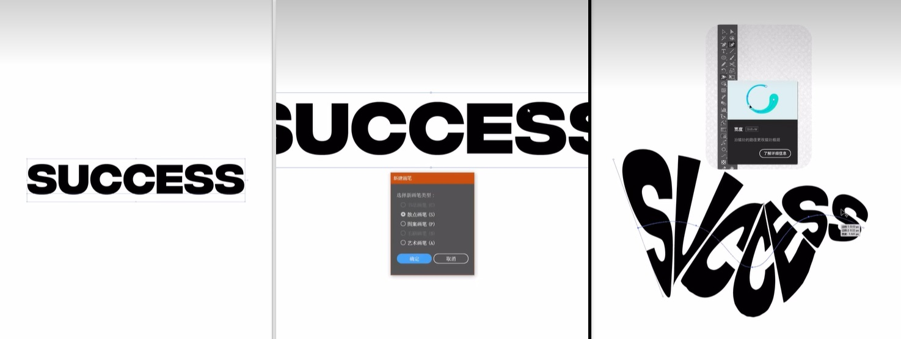

### 一、海报技巧


### 二、调色技巧

#### **2.1 128曲线--通透感调色**

```markdown
--新建曲线
--输入和输出值改为128
--混合模式：柔光
--观察明暗调整曲线，中间打点，上移调整中间调
```

#### **2.2 128曲线--分段饱和度调色**
```markdown
--新建曲线
--输入和输出值改为128
--混合模式：饱和度
--观察图像，阴影饱和度高，则提升中间调和高光，再减不透明度
```

#### **2.3 50曲线--通透感调色plus**


```markdown
--新建饱和度，将饱和度拉倒0
--混合模式：柔光
--新建曲线
--亮部和暗部，输入值改为100，输出值改为50，嵌入饱和度图层；
--混合模式：正常
--观察明暗调整曲线，中间打点，上移调整中间调
```

#### **2.4 差值矫正白平衡**

> **差值：**图层没有上下关系，大的数值减去小的数值；比如新建纯色中性灰图层，颜色改为差值，越黑，说明图像的饱和度越接近中性灰


```markdown
--新建纯色中性灰图层
--混合模式：差值
--新建阈值，滑动到颜色最少
--使用颜色吸管标记黑色区域（图像的中性灰区域）
--新建曲线，将白色的吸管取样在刚才标记点上，矫正白平衡
```

#### **2.5  可选颜色还原颜色**


```markdown
1.减色调整层（RGB三原色中选一种颜色，并把其补色拉到-100）。
红色R，把补色青色C拉到最低。
青色C，就把洋红M和黄色Y都拉到最低

2.加色调整层（CMY三种颜色选一种颜色后直接把其拉到100）
青色C，把C拉到最高。
红色R，就把洋红M和黄色Y都拉到最高（简单理解为：选中的原色保持不动，另外两种颜色拉到最高）。

3.因为是改颜色，所以把上面1和2的图层模式都改为颜色模式，并编组。
选出暗部区域（因为颜色加在暗调部分比较明显）给编组后的图层添加只影像暗部皮肤影像很小的蒙版。
```

#### **2.6 高质量的明暗对比--提升亮部/暗部中间调对比**


```markdown
- 亮部中间调
--使用计算，将照片的灰色通道与灰色通道进行 **滤色** 计算，创建选区，增强对比
--计算两次滤色，在计算中，勾选蒙版，勾选反向，将蒙版赋予曲线，中间打点，上移调整亮部中间调

- 暗部中间调
--使用计算，将照片的灰色通道与灰色通道进行 **正片叠底** 计算，创建选区，增强对比
--计算两次正片叠底，在计算中，勾选蒙版，勾选反向，将蒙版赋予曲线，中间打点，下移调整暗部中间调
```


### 三、创意海报

#### **3.1 融球效果**


```markdown
- 第一步：新建基础图形
使用图形工具新建任意形状复制一个出来，右键建立复合路径给他一个渐变色，看起来好看点。

- 第二步：添加特效
我们在这边的外观窗口下，找到路径-偏移路径，在弹出的窗口中，将位移改为40，连接改为圆角
继续执行这个操作，将这个位移改为-40，点击确认。

- 第三步：调整
```

#### 3.2 文字变形创意



```markdown
将文字制作成书法画笔，新建路径并调整，也可调整宽度工具
```

#### **3.3 像素风格**


```markdown
图像添加铜板雕刻 + 马赛克效果，新建阈值并调整
```
