## 一、提示词技巧

### 1.1 六大提示词特征技巧

##### **1.1 人物，描述人物特征**

- 性别：1girl,2boys,loli,cat girl,...
- 服饰：long sleeves,gloves,coat,bangle,armband,... 
- 发型：long hair,bangs,black hair,ponytail,twintails,... 
- 五官：cat ears,small eyes,big mouth,blue eyes,...
- 表情：smile,open mouth,tears,blush,tongue out,... 
- 动作：standing,lying,head tilt,spread arms,tying hair,...

##### **1.2 场景，描述场景特征**

- 室内：indoor,...
- 室外：outdoor,...
- 大场景：forest,city,street,field,garden,village,... 
- 小细节：tree,bush,flower,tower,neon lights,fences,...

##### **1.3 环境，描述环境光照**

- 白天：day,...
- 黑夜：night,...
- 时段：morning,sunset,...
- 光线：sunlight,bright,dark,moonlight,... 
- 天空：blue sky,starry sky,shooting star,full moon,...

##### **1.4 视角，描述画面视角**

- 距离：close-up,distant,...
- 人物比例：full body,upper body,...
- 观察角度：from above,from below,view of back,from side,...
- 镜头类型：wide shot,Sony A7 Ill,fisheye,...

##### **1.5 画质，描述画面质量**

- 正向高画质：highres,absurdres,official art,best quality,8k,masterpiece,game cg,original,...
- 负向低品质：lowres,parody,scan,parody,bad anatomy,bad hands,fewer digits,extra digit,missing arms,watermark,signature,text,...

##### **1.6 画风，描述画面风格**

- 插画风：illustration,painting,paintbrush,...
- 二次元：anime,comic,game CG,... 
- 写实系：photorealistic,realistic,photograph,...
- 复古风：retro artstyle,...
- 手绘风：traditional media,...
- 赛博朋克：cyberpunk,...

### **2.1 提示词模板**

##### **2.1.1 基础起手式**

```
(masterpiece),(best details),(best quality),Sharp Focus,beautiful artwork,

((NSFW)),lowres,bad anatomy, bad hands, text, error, missing fingers, extra digit, fewer digits, cropped, worst quality, low quality, normal quality, JPEG artifacts, signature, watermark, iceman, blurry,

(杰作),(最佳细节),(最佳质量),清晰聚焦,美丽的艺术品

((NSFW)),低分辨率,糟糕的解剖结构,糟糕的手,文本,错误,缺失手指,多余的手指,缺少的手指,裁剪,最差质量,低质量,正常质量,JPEG 瑕疵,签名,水印,冰人,模糊
```
##### **2.1.2 新海诚风格**

```sh
\(Makoto Shinkai style\),illustration(((flat))),Anime,(((bright color))),(high_contrast:1.5),(high-purity:1.5),(high brightness:1.5),flat color,outlines,

((NSFW)),photograph,deformed,glitch,noisy,realistic,stock photo,(3d model:1.3),(photo:1.3),(film:1.3)

(新海诚风格),插画((平面)),动漫,((明亮色彩)),(高对比度:1.5),(高纯度:1.5),(高亮度:1.5),平面色彩,轮廓

((NSFW)),照片,变形,故障,噪点,写实,库存照片,(3D 模型:1.3),(照片:1.3),(电影:1.3)
```

##### **2.1.3 摄影**

```sh
professional photograph,masterpiece,best quality,ultra details,{prompt}(realistic),hdr,8k,natural light,color graded portra 400 film,sharp focus,film grain,photographed on a Sony A7R IV,18mm F/1.7 cine lens,soft positive_lighting,side light,RAW,

BadDream, (UnrealisticDream:1.3),lowres, bad anatomy,bad hands,text,error,missing fingers,extra digit,fewer digits,cropped,worst quality,low quality,normal quality,  watermark,username,bad proportions,bad anatomy,logo,text,blurry,low quality,lowres,normal quality,worst quality,signature,watermark,cropped,out of focus,username,outlines,lines,cartoon,flat,illustration,drawing,painting,crayon,sketch,graphite,impressionist,noisy,blurry,deformed,ugly,3D model

专业摄影,杰作,最佳质量,超细节,{提示},(写实),高动态范围,8K,自然光,彩色分级的宝丽来 400 胶片,清晰聚焦,胶片颗粒,用索尼 A7R IV 拍摄,18mm F/1.7 电影镜头,柔和的正面照明,侧光,RAW

噩梦,(不现实的梦:1.3),低分辨率,糟糕的解剖结构,糟糕的手,文本,错误,缺失手指,多余的手指,缺少的手指,裁剪,最差质量,低质量,正常质量,水印,用户名,糟糕的比例,糟糕的解剖结构,标志,文本,模糊,低质量,低分辨率,正常质量,最差质量,签名,水印,裁剪,失焦,用户名,轮廓,线条,卡通,平面,插画,绘画,蜡笔,素描,石墨,印象派,噪点,模糊,变形,丑陋,3D 模型
```

##### 2.1.4 **动漫**

```
anime artwork. anime style, key visual, vibrant, studio anime, highly detailed, intricate, elegant, highly detailed, digital painting, artstation, concept art, smooth, sharp focus, illustration, art by artgerm and greg rutkowski and alphonse mucha

photo, deformed, black and white, realism, disfigured, low contrast

动漫作品,动漫风格,关键视觉,充满活力,工作室动漫,高度详细,复杂,优雅,高度详细,数字绘画,艺术站,概念艺术,平滑,清晰聚焦,插画,艺术风格源自 Artgerm、Greg Rutkowski 和 Alphonse Mucha

照片,变形,黑白,写实,毁容,低对比度
```

##### **2.1.5 排版主义**

```sh
typographic art. stylized, intricate, detailed, artistic, text-based, extremely higly detailed, style of Hajime Sorayama, trending on artstation

ugly, deformed, noisy, blurry, low contrast, realism, photorealistic

排版艺术,风格化,复杂,详细,艺术,基于文本,极其高度详细, Hajime Sorayama 的风格,在艺术站流行

丑陋,变形,噪点,模糊,低对比度,写实,照片写实
```

##### 2.1.6 线稿

```sh
ashion design,minimalism,sketch,Line draft,hand drawn,smooth,monochromatic painting,outlines,{prompt},black lines,white background

color,grayscale,lowres,normal quality,worstquality,NSFW,signature,watermark,cropped,username,blurry,

时尚设计,极简主义,素描,线稿,手绘,平滑,单色绘画,轮廓,{提示},黑线,白色背景

颜色,灰度,低分辨率,正常质量,最差质量,(NSFW),签名,水印,裁剪,用户名,模糊
```

##### **2.1.7 涂鸦风**

```sh
graffiti style. street art, vibrant, urban, detailed, tag, mural, extremely hyper - detailed, intricate, highly detailed attributes

ugly, deformed, noisy, blurry, low contrast, realism, photorealistic

涂鸦风格,街头艺术,充满活力,城市,详细,标签,壁画,极其高度详细,复杂,高度详细的属性

丑陋,变形,噪点,模糊,低对比度,写实,照片写实
```

##### 2.1.8 极简主义

```sh
minimalist style. simple, clean, uncluttered, modern, elegant, intricate, epic lighting, cinematic composition, hyper realistic, 8 k resolution, unreal engine 5, by artgerm, tooth wu, dan mumford, beeple, wlop, rossdraws, james jean, marc simonetti, artstation，

rnate, complicated, highly detailed, cluttered, disordered, messy, noisy，

极简主义风格。简单、干净、整洁、现代、优雅、复杂精细、史诗般的灯光、电影般的构图、超逼真、8K 分辨率、虚幻引擎 5，由 artgerm、tooth wu、dan mumford、beeple、wlop、rossdraws、james jean、marc simonetti、artstation 创作。

rnate、复杂、高度详细、杂乱、无序、凌乱、嘈杂, 
```
##### **2.1.9 厚涂**

```sh
(Oil painting art:1.3),painting traces texture,thick coating overlay,thickness,sharp focus,\(Krenz Cushart style\),

(brush:1.5),username,logo,blurry,out of focus,signature,watermark,blurry,low quality,bad anatomy,sketches,lowres,normal quality,username,out of focus,bad proportions,cropped,watermark,signature,worstquality,grayscale,monochrome,

(油画艺术:1.3),绘画痕迹纹理,厚涂覆盖,厚度,清晰聚焦,(Krenz Cuart 风格)

(刷子:1.5),用户名,标志,模糊,失焦,签名,水印,模糊,低质量,糟糕的解剖结构,素描,低分辨率,正常质量,用户名,失焦,糟糕的比例,裁剪,水印,签名,最差质量,灰度,单色
```

------

#### **2.2 正面提示词**

##### **2.2.1 高质量写实**

```sh
Hyper Real, Photorealistic, 16K, high detail, high resolution,(((masterpiece))),(((best quality))),((ultra-detailed))
超真实、逼真、16K、高细节、高分辨率、(((杰作)))、((((最佳质量)))、(((超细节)))
```

##### **2.2.2 镜头虚化**

```sh
depth of field, blurry background, blurry foreground, 
景深，模糊的背景，模糊的前景
```

##### **2.2.3 画面增强**

```sh
high resolution illustration, colorful, 8k wallpaper, highres
高分辨率插画，色彩丰富，8K 壁纸，高分辨率
```

##### **2.2.4 光线增强**

```sh
Cinematic light, ray tracing
电影光线，光线追踪
```

##### **2.2.5 超高细节**

```sh
8k wallpaper,(best quality:1.12),(detailed:1.12),(intricate:1.12),(ultra-detailed:1.12),(highres:1.12)
8K 壁纸，（最佳质量:1.12），（详细:1.12），（复杂:1.12），（超详细:1.12），（高分辨率:1.12） 
杰作，最佳质量
```

------


#### **2.2.6 负面：错误身体和结构**

```sh
((NSFW)),artist name, twisted torso, (((fusion), extra, bad, fewer, missing), fist,clenched hand),extra fingers,fewer fingers,(low quality, worst quality:1.4), (bad anatomy), (inaccurate limb:1.2),bad composition, inaccurate eyes, extra digit,fewer digits,(extra arms:1.2),

((NSFW)),艺术家姓名,扭曲的躯干,融合,(((额外),糟糕,较少,缺失),拳头,紧握的手),额外的手指,较少的手指,(低质量,最差质量:1.4),(糟糕的解剖),(不准确的肢体:1.2),糟糕的构图,不准确的眼睛,额外的数字,较少的数字,(额外的手臂:1.2),
```
##### **2.2.8 负面：低画质、错误身体和结构**

```sh
((NSFW)),(EasyNegative:1.1),ng_deepnegative_v1_75t,bad-hands-5,lowres, bad anatomy, bad hands, text, error, missing fingers, extra digit, fewer digits, cropped, worst quality, low quality, normal quality, jpeg artifacts, signature, watermark, username, blurry

((NSFW))，(容易负面：1.1)，ng_deepnegative_v1_75t，坏手 - 5，低分辨率，不良解剖结构，不良手部，文本，错误，缺失手指，多余数字，数字较少，裁剪，最差质量，低质量，正常质量，JPEG 伪影，签名，水印，用户名，模糊 
```
##### **2.2.9 负面：低画质、错误身体和结构、敏感部位、黑白图**

```sh
((NSFW)),paintings, sketches, (worst quality:2), (low quality:2), (normal quality:2), lowres, normal quality, ((monochrome)), ((grayscale)), skin blemishes, age spot, glans, extra fingers, fewer fingers, multiple hands, multiple heads, Multiple arms, disabled body, illustration, 3d, sepia, painting, cartoons, sketch, bad anatomy, bad hands, collapsed eyeshadow, multiple eyebrows, pink hair, holes on breasts, stretched nipples, analog, analogphoto, signature, logo, facing away, looking away,(fat:1.2), glans,((watermark:2)),((white letters:1)), age spot, multiple eyebrows, fleckles, stretched nipples, nipples on buttocks, analog, analog photo, 2 faces, hat, bad composition, error hands, error fingers, dark, (thick eyebrows:1.2), 2girls, (((duplicate))), mutated hands,(((((fused fingers))))), (((((too many fingers))))),signature, watermark, username, blurry, artist name, text, chromatic aberration, flat color, flat shading, retro style,, low res, bad face, missing fingers, extra digit, fewer digits, multiple legs, malformation 

((NSFW))，绘画，素描，(最差质量：2)，（低质量：2），（正常质量：2），低分辨率，正常质量，((单色))，((灰度))，皮肤瑕疵，老年斑，龟头，额外的手指，更少的手指，多只手，多个头，多只手臂，残疾身体，插图，3d，棕褐色，绘画，卡通，素描，糟糕的解剖，糟糕的手，塌陷的眼影，多根眉毛，粉红色的头发，乳房上的洞，拉伸的乳头，模拟，类比照片，签名，标志，背对着，看着别处，（脂肪：1.2），龟头，((水印：2))，((白色字母：1))，老年斑，多根眉毛，斑点，拉伸的乳头，臀部的乳头，模拟，模拟照片，2张脸，帽子，构图不好，错误的手，错误的手指，黑暗，（浓眉：1.2），2个女孩，(((重复)))，签名，水印，用户名，模糊，艺术家姓名，文本，色差，扁平颜色，扁平阴影，复古风格，低分辨率，糟糕的脸，缺少手指，额外的数字，更少的数字，多条腿，畸形 
```
##### **2.2.10 负面：错误结构、多人、多手指和四肢、敏感部位**

```sh
((NSFW)),lowres, bad anatomy, bad hand, paintings, sketches, (worst quality:2), (low quality: 2), (normal quality:2), lowres,((monochrome)),((grayscale)), skin spots, acnes, skin blemishes, age spot, glans, extra fingers, fewer fingers, ((watermark: 2)), (white letters: 1), (multi nipples), bad anatomy bad hands, text, error, missing fingers, missing arms, missing legs, extra digit, fewer digits, cropped, worst quality, jpeg artifacts, signature, watermark, username, bad feet, Multiple people, blurry, poorly drawn hands, poorly drawn face, mutation, deformed, extra limbs, extra arms, extra legs, malformed limbs, fused fingers, too many fingers, long neck, cross-eyed, mutated hands, polar lowres, bad body, bad proportions, gross proportions, wrong feet bottom render, abdominal stretch, Briefs, knickers, kecks, thong, fused fingers, bad body, bad proportion body to legs, wrong toes, extra toes, missing toes, weird toes, 2 body, 2 pussy, 2 upper, 2 lower, 2 head, 3 hand, 3 feet, extra long leg. super long leg. mirrored image, mirrored noise

((NSFW))，低分辨率、糟糕的解剖结构、糟糕的手、绘画、素描、(最差质量：2)、(低质量：2)、(正常质量：2)、低分辨率、((单色)),((灰度))、皮肤斑点、粉刺、皮肤瑕疵、老年斑、龟头、多指、少指、((水印：2))、(白色字母：1)、(多乳头)、不良解剖 不良手、文本、错误、缺手指、缺胳膊、缺腿、多指、少指、裁剪、质量最差、JPEG 伪影、签名、水印、用户名、不良脚、多人、模糊、手画得差、脸画得差、突变、变形、多肢、多胳膊、多腿、畸形肢体、融合手指、手指过多、脖子过长、对眼、变异手、极地低分辨率、身体不好、比例不好、比例粗糙、脚底渲染错误、腹部拉伸、内裤、短裤、短裤、丁字裤、手指融合、身体不好、身体与腿部比例不好、脚趾错误、脚趾多余、脚趾缺失、脚趾怪异、2 个身体、2 个阴部、2 个上部、2 个下部、2 个头、3 只手、3 只脚、超长的腿。镜像、镜像噪音 
```
##### **2.2.11 负面：低质量、简单线条、黑白、错误结构**

```sh
((NSFW)),bondary,thick line,lines,lineart,ng_deepnegative_v1_75t,(badhandv4:1.2),EasyNegative,(worst quality:2),easynegative,drawing,painting,crayon,sketch,graphite,impressionist,noisy,blurry,soft,deformed,ugly,(deformed iris,deformed pupils,semi-realistic,cgi,3d,render,sketch,cartoon,drawing,anime:1.4),text,close up,cropped,out of frame,worst quality,low quality jpeg artifacts,ugly,duplicate,morbid,mutilated,extra fingers,mutatedhands,poorly drawn hands,poorly drawn face,mutation,deformed,blurry,dehydrated,bad anatomy,bad proportions,extra limbs,cloned face,disfigured,gross proportions,malformed limbs,missing arms,missing legs,extra arms,extra legs,fused fingers,too many fingers,long neck,sketches,tattoo,(beard:1.3),(EasyNegative:1.3),badhandv4,(worst quality:2),(low quality:2),(normal quality:2),lowers,normal quality,facing away,looking away,text,error,extra digit,fewer digits,cropped,jpeg artifacts,signature,watermark,username,blurry,skin spots,acnes,skin blemishes,bad anatomy,fat,bad feet,cropped,poorly drawn hands,poorly drawn face,mutation,deformed,tilted head.bad anatomy.bad hands,extra fingers,fewer digits,extra limbs.extra arms,extra legs,malformed limbs.fused fingers,too many fingers,long neck,cross-eyed,mutated hands,bad body,bad proportions,gross proportions,text,error,missing fingers,missing arms,missing legs,extra digit,extra arms,extra leg,extra foot,missing fingers,(Worst quality,low quality,lowres:1.2),error,cropped jpeg artifacts,out of frame,watermark,signature,

((NSFW))、边界、粗线、线条、线条艺术、ng_deepnegative_v1_75t、(badhandv4:1.2)、EasyNegative、（最差质量:2）、容易负面、绘画、油画、蜡笔、素描、石墨、印象派、嘈杂、模糊、柔软、变形、丑陋、（变形的虹膜、变形的瞳孔、半写实、计算机生成图像、3D、渲染、素描、卡通、绘画、动漫:1.4）、文本、特写、裁剪、画面外、最差质量、低质量的 JPEG 伪像、丑陋、重复、病态、残缺、额外的手指、变异的手、画得不好的手、画得不好的脸、变异、变形、模糊、脱水、不良的解剖结构、不良的比例、额外的肢体、克隆的脸、毁容、严重的比例失调、畸形的肢体、缺失的手臂、缺失的腿、额外的手臂、额外的腿、融合的手指、过多的手指、长脖子、草图、纹身、（EasyNegative:1.3）、badhandv4、(低质量:2)、（正常质量:2）、较低、正常质量、背向、看向别处、文本、错误、额外的数字、较少的数字、裁剪、JPEG 伪像、签名、水印、用户名、模糊、皮肤斑点、痤疮、皮肤瑕疵、不良的解剖结构、肥胖、不好的脚、裁剪、画得不好的手、画得不好的脸、变异、变形、倾斜的头。不良的解剖结构。不好的手、额外的手指、较少的数字、额外的肢体。额外的手臂、额外的腿、畸形的肢体。融合的手指、过多的手指、长脖子、斗鸡眼、变异的手、不好的身体、不良的比例、严重的比例失调、文本、错误、缺失的手指、缺失的手臂、缺失的腿、额外的数字、额外的手臂、额外的腿、额外的脚、缺失的手指、(最差质量、低质量、低分辨率:1.2)、错误、裁剪的 JPEG 伪像、画面外、水印、签名 
```

##### **2.2.12 负面：tag提示词触发**

```sh
((NSFW)),EasyNegative, bad-artist-anime, bad-artist, bad-hands-5, bad-image-v2-39000, bad_prompt_version2
```

##### **2.2.13 负面：低画质，黑白**

```markdown
lowres, bad anatomy, bad hand, paintings, sketches, (worst quality:2), (low quality: 2), (normal quality:2), ((monochrome)),((grayscale)), ((watermark: 2)), (white letters: 1),text, error, cropped, worst quality, jpeg artifacts, signature, watermark, username, mirrored image, mirrored noise 

低分辨率、糟糕的解剖结构、糟糕的手、绘画、素描、(最差质量：2)、(低质量：2)、(正常质量：2)、((单色)),((灰度))、((水印：2))、(白色字母：1)、文本、错误、裁剪、质量最差、JPEG 伪影、签名、水印、用户名、镜像、镜像噪音
```


------


#### **2.3 人物提示词**

##### **2.3.1 美女起手式：**

```
masterpiece,best details,best quality,{prompt},8K,Best resolution,

(((NSFW))),lowres, bad anatomy, bad hands, text, error, missing fingers, extra digit,fewer digits,cropped,worst quality,low quality,normal quality, watermark,username,bad proportions,bad anatomy,blurry,low quality,lowres,normal quality,worstquality,signature,watermark,cropped,out of focus,username,look back

杰作，最佳细节，最佳质量，{提示}，8K，最佳分辨率

(((NSFW)))，低分辨率，糟糕的解剖结构，糟糕的手，文本，错误，缺失手指，多余的手指，缺少的手指，裁剪，最差质量，低质量，正常质量，水印，用户名，糟糕的比例，糟糕的解剖结构，模糊，低质量，低分辨率，正常质量，最差质量，签名，水印，裁剪，失焦，用户名，回头看
```
##### **2.3.2 精致女孩**

```sh
an extremely delicate and beautiful girl
一个极其精致美丽的女孩
```

##### **2.3.3 脸部增强**

```sh
1girl face ,Curly blue hair，Delicate and perfect face, beautiful face,Happy smile,side face,Lateral face,(best aesthetic, best quality, masterpiece, extremely detailed:1.2,extremely detailed CG unity 8k wallpaper)
1个女孩的脸，蓝色卷发，精致完美的脸，美丽的脸，开心的微笑，侧脸，侧面，(最佳美学，最佳质量，杰作，极其详细:1.2，极其详细的CG统一8K壁纸)
```

##### **2.3.4 真人照片**

```sh
(8k, RAW photo, best quality, masterpiece, ultra highres, ultra detailed:1.2), (realistic, photo-realistic:)
(8K，RAW 照片，最佳质量，杰作，超高分辨率，超详细:1.2)，(写实，照片写实)
```

##### **2.3.5 隐藏手掌**

```sh
lower arms,hands,palms
小臂，手，手掌
```

##### **2.3.6 崩坏修正**

```sh
easynegative, bad-hands-5
```

##### **2.3.7 修手**

```sh
good hands,

bad-hands-5,bad hands, fewer digits, extra digit

好手

糟糕的手 - 5，糟糕的手，缺少的手指，多余的手指
```

##### **2.3.8 抽卡**

```markdown
1girl, food, candy, solo, lollipop, animal ears, black hair, controller, sleeves past wrists, can, hair ornament, game controller, horns, ahoge, streaked hair, long sleeves, blue eyes, multicolored hair, stuffed toy, swirl lollipop, white hair, animal ear fluff, long hair, fang, :d, bangs, thighhighs, twintails, socks, stuffed animal, smile, holding, wooden floor, virtual youtuber, bandaid, looking at viewer, off shoulder, monster energy, knees up, blush, asymmetrical legwear, puffy long sleeves, open mouth, shirt, candy wrapper, low twintails, cat ears, feet out of frame, hairclip, energy drink, object hug, choker, mouse (computer), bandaid on face

1 个女孩，食物，糖果，单独，棒棒糖，动物耳朵，黑发，控制器，袖子超过手腕，罐头，头发饰品，游戏控制器，角，呆毛，条纹头发，长袖，蓝眼睛，多彩头发，毛绒玩具，漩涡棒棒糖，白发，动物耳毛，长发，尖牙，:d，刘海，过膝袜，双马尾，袜子，毛绒动物，微笑，抱着，木地板，虚拟主播，创可贴，看着观众，露肩，怪物能量，膝盖抬起，脸红，不对称的腿部穿戴，蓬松的长袖，张嘴，衬衫，糖果包装纸，低双马尾，猫耳，脚不在画面内，发卡，能量饮料，抱着物品，项圈，鼠标(电脑)，脸上的创可贴 
```

------

## 二、WebUI

#### **2.1 提示词写法**

```markdown
- 增加权重
():1.1倍；	(())：1.21;	((())):1.33
{}:1.05倍；	{{}{：1.1；	{{{}}}：1.16
(prompt:1.5):1.5倍

- 减少权重
[]:0.9倍；	[[]]：0.92≈0.8；	[[[]]]：0.93≈0.7

- 交替写法
[cat|dog] → 先画猫，再画狗，再画猫，再画狗交替出图
[cat;dog;0.7] → 前面70%画猫，后面30%画狗

- 组词
Prompt1_Prompt2:milk_tea(奶茶)

- 融合
Prompt1 and Prompt2: dog and man(狗拟人)

- 隔离
Prompt1 break Prompt2 	
	例如：1girl,Silver hair break Black blouses break Gray pants,
	Silver hair(银色头发)，Black blouses(黑色衬衫)，Gray pants(灰色裤子)颜色对应部分隔离，增强颜色准确性

- 介入写法
[Prompt::0.8]:从80%之后退出介入 → 前80%渲染，后20%不渲染
[Prompt:0.8]:从80%之后开始介入 → 前80%不渲染，后20%开始渲染

- 转义写法
\(prompt\) → 代指的是一种风格或概念，如\(极简主义\) ；\(canidae\)犬科；\(Fujifilm XF 16-55mm f/2.8\) 

```

------

#### **2.2 采样器**

**Euler；Euler a；DPM++2M  Karras；DPM SDE ++；DPM++3M  Karras**

> 若想迭代步数对生成画面影响较小，选择不带 a 的采样器；
>
> 同理：如果选择带 a 的采样器，ControlNet终止引导不宜设置太早，但对于早期慢点引导影响有奇效
>
> 
>
> 稳定、快速选：**Euler**，步数在25-60；质量好的选：**DPM++2M  Karras**，步数在25-40；
>
> 写实选：**DPM SDE ++**，步数30-40；XL大模型步数10~15；

------

## 三、文生图

**文生图+高清修复：**就是将文生图发到图生图进行重绘

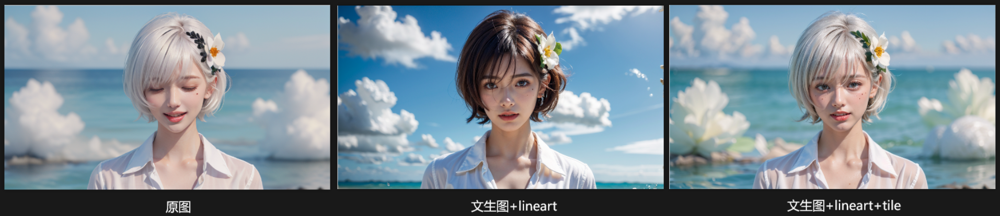

------

## **四、图生图**  

### **4.1 放大**

#### **4.1.1  SD Upscale**

SD Upscale可以比较容易在**低重绘幅度**放大，大概是**0.25~0.35**之间，且**较低CFG**时，可以比较轻松得到一张比较
不错的高清图片，你只需要建立一个CFG重绘幅度的矩阵，就可以看的很清楚。


------

#### **4.1.2 Tiled Diffusion**


CFG (提示词引导系数) 可以**增加画面细节**，单纯放大建议**CFG：7** ；**重绘幅度：0.35**

> 如果追求更丰富的细节，图片可以设置**重绘幅度：0.65、0.7；CFG： 14**
> 
> 但细节太多会生成混乱的图
> 
> 

为了解决这个脏的问题，我们需要完成两个动作。

1. 提示词方面比较别除具体的对象，保留**大师杰作，高品质**等质量提示词
2. 开启 **Tiled diffusion**，并且打开下面的 **噪声反转**，**反转步数 25**，
   如此，一张拥有细节且画面干净整洁的高质量图片就生成了，但是这依然不够好。


------

#### **4.1.3 平铺算法**

**Mixture of Diffusers** (适合制作简单的大图)

- 扩散过程的混合以协调生成过程的方式完成，防止生成图像中的“接缝”效应。
- 在生成非常大的图像时，并行使用多个扩散过程也具有实际优势，因为GPU内存要求类似于生成单个图块大小的图像

**MultiDiffusion** (适合重绘和增加内容细节)

- 将不一致的元素融合到全局去噪步骤中，从而产生高质量的无缝图像
- 文本到全景生成
- 使用严格、准确的分割掩模
- 基于区域的粗略生成
- 粗略的场景布局指导。所有图像都描绘了合理的构图、场景效果和物体的相对大小

------

#### **4.1.4 噪声反转**

   可以看到噪声反转里面有三个比较关键的参数

>    **反转步数、修复程度、重铺噪声强度**

   这三个参数几乎都是用来控制简洁的画面到丰富的细节之间的平衡

------

##### **4.1.4.1 反转步数**

>    **反转步数越低画面越干净整洁，越大就有越多的细节，同时也会越凌乱**

- 以下是反转步数的对比


------

##### **4.1.4.2 修复程度**

> 修复程度默认是 1，**修复越高越趋向原图内容**，越高画面越干净，它在擦除一些由于重绘幅度过高，而产生的原图没有的东西。

- 以下是不同修复程度的对比


------

##### **4.1.4.3 重铺噪声强度**

> 如果你还是认为画面比较凌乱，可以稍微降低一下重铺噪声强度。
>

- 以下是不同重铺噪声强度的对比


> 但是千万不能设置过小，过小会导致画面过于简单，细节会被完全抹除。
>
> 除非你的CFG和重绘幅度都很高，当我**CFG设为14**，**重回幅度高达0.75**，**并且将重铺噪声设为0**，却可以得到一张画面简洁，细节也丰富的图。
>
> 


------

#### 4.1.5 **总结**

> 高CFG，高重绘幅度放大，要**开启噪声反转**；
>
> **反转步数高，细节高**；
>
> **修复程度高，越接近原图(干净)；**
>
> **重铺噪声高，细节高；**

------

#### **4.1.6 Tiled diffusion + Tile**

Tiled模型的强大之处在于它能够**识别每一个分块中的内容，并且与提示词产生关联**，产生强大的细节，这么做的一个好处，即使你用 0.75 的重回幅度以及 14 的 CFG,也不会出现这种妖魔鬼怪的图片。


但是颜色会严重色差，可以设置CFG：7；重绘幅度：0.75，反转步数：25；重铺噪声强度：0 ，如下图


------

### **4.2 修复**


------

### **4.3 改变风格**


------

## 五、 **局部重绘**

### **5.1 图生图+controlnet_inpoint**

```markdown
重绘幅度0.5，加lineart，重绘幅度可以升到1
  
- controlnet_inpoint：
only：仅对蒙版生效(对应局部重绘的：原图)
only+lama：仅对蒙版生效+背景延伸(对应局部的：填充)
Global_harmonious：对全图影响
```

------

### **5.2 局部重绘+controlnet_lineart**


```markdown
  - 绘制方式：
  全图：先画全图然后裁剪，整体性融合度强，速度慢，修人脸会容易崩
  仅蒙版：仅画蒙版区域，整体性融合度弱，提示词需要改为蒙版部分内容，速度快，建议蒙版处理方式：原版
```

------

## 六、ControlNet参数

ControlNet 是 Stable Diffusion 最重要的插件，种类繁多，功能复杂，但是真正得其要领的人其实很少。尤其是 ControlNet 主面板的五个参数：权重、引导时机、预处理器分辨率、控制模式、缩放模式。

### 6.1 控制模式

控制模式是 ControlNet 最重要的一个参数，用来平衡提示词和 ControlNet 之间的矛盾，同时也是最影响出图质量以及准确度的参数之一。控制模式有以下三种：

- **均衡模式**：默认的控制模式，在提示词和 ControlNet 不一致时，平衡两者。
- **偏向提示词模式**：在提示词和 ControlNet 不一致时，提示词优先。
- **偏向 ControlNet 模式**：旧版本中的猜测模式，通过线稿等预处理图去猜测参考图的内容，猜测内容和提示词不一致时，忽略提示词，更看重 ControlNet 的猜测。

这三种模式用起来有质的区别。均衡模式非常好理解，重点在于另外的两种，偏向提示词和偏向 ControlNet 究竟是怎么个偏向法？

总的来说，主要是有两个方面，一个是生成内容的偏向，一个是生成风格的偏向。

**a.  内容上的偏向**

如参考图和 canny 预处理图，笔者不想要警告框和香烟，所以提示词没写香烟和警告框，而 canny 预处理图是有的。另外参考图的佛头顶部缺失了一块，生成的结果如图所示。

- 偏向提示词模式下警告框和香烟都被删除。
- 均衡模式下只留下警告框。
- 偏向 ControlNet 模式下香烟和警告框都被尽量保留。

另外在偏向提示词模式下，连佛头顶部缺失的内容被自动补充完整了，这是此模式很重要的一个作用。这意味着只要完整写好提示词，我们不必提供非常精准的参考图，就可以推动 AI 结合提示词准确地生成图像。


**b. 风格上的偏向**

在不考虑图像内容差异的情况下，我们发现偏向提示词模式下的图像质量最好，均衡模式次之，偏向 ControlNet 最差，这并不是一个偶然的情况，而是风格的偏向造成的差距。

我们可以做一个对比：用一张动漫的参考图，分别生成动漫、真人、迪士尼动画三种风格的图像，观察不同控制模式在不同风格转换的差异。


- 生成图也是动漫时，除了偏向 ControlNet 质量差了一点，三种模式都没有出现问题。
- 生成图是真人写实风格时，可以明显看到，均衡模式和偏向 ControlNet 模式下，图中的女生的头发依然保持动漫的线条风格，只有偏向提示词模式的头发线条才是真正的真人模型的线条。
- 生成图是迪士尼风格时，同样均衡模式和偏向 ControlNet 模式下，线条还是保持了动漫特点的线条，只有偏向提示词模式的线条比较正确。


以上就是偏向提示词模式真正的作用。这也是很多人用 Canny、Softedge 等线稿模型怎么弄，都没有真人质感的原因所在，就是因为在参考图和生成图风格不同的时候，没有选择正确的控制模式。甚至有一些控制模型，比如 Lineart anime，由于缺少猜测模式，基本只能使用偏向提示词模式。

我们可以看下图，在其他参数完全一致的情况下，Lineart anime 在均衡和偏向 ControlNet 时出现了很多伪影和质量不佳的情况，只有偏向提示词模式没有问题。作为对比的 Lineart 模型三个控制模式都表现良好。

总结一下，ControlNet 的控制模式有三种：均衡、偏向提示词、偏向 ControlNet。当提示词和 ControlNet 有矛盾时，偏向提示词和偏向 ControlNet 会在内容和画风两个方面表现出差异性。结论如下：


- 相同画风、相同内容：均衡或偏向提示词都可以，尽量**不用偏向 ControlNet**。
- 不同画风、相同内容：**偏向提示词**。
- 相同画风、不同内容：**偏向提示词**。

------

### 6.2 引导时机

1、终止引导越早，提示词作用会变大，由于早期引导，构图基本不会大变。

2、当想要让AI自由发挥背景，可以设置**ControlNet**晚点介入，和设置退出介入。


**提示词和ControlNet搭配：**

例子：当想在沙漠画出若影若现的房子时，可以在提示词[house:0.7]：当画到70%提示词才起作用，并在控制房子外轮廓的ControlNet的介入时机设为0.7

有的时候我们想要人为定一下整个画面的构图，但不想介入过多生成的过程。可以通过以下流程完成。下面，笔者通过几笔线稿完成一个画面的构图操作：


1. 拖进 ControlNet。


2. 选择涂鸦模型，设置退出引导步数 0.3。


如此，前 30% 的采样会根据线稿定下大框架，后面 70% 则会在大框架之下，让 AI 自行发挥生成。


假设你对这个星球的亮度不满意，其他的地方保持不变，那么你可以通过以下流程改变星球的亮度：

1. 锁定种子。
2. 用 Photoshop 把想要变量的地方涂上白色，换成黑白图像，拖进新的 ControlNet 窗口。


4. 采用亮度模型（brightness），设置权重 0.6，介入引导步数 0.4。


> **技巧提示**：
>
> Brightness 模型非 ControlNet 官方模型，需前往 huggingface 搜索下载。下载后放入 ControlNet 的 models 文件夹，点击模型选择右边的刷新按钮就可以找到该模型。另外，该模型不需要预处理器，预处理器选择无，把图像做成黑白，白的是亮部，黑的是暗部。

如此，既不会影响前期的采样，结构依然保留，只会根据我们的提示调整亮度。

------

另外，稍微改变一下开始引导时机，对采样的就会发生巨大的影响，当介入引导步数大于0.2，整个构图就
会发生非常大的变化；反观退出引导步数，即使退出的时间很早，其控制程度也不会受到非常大的影响。


> 这也反应了 Stable difusion 在采样的过程中，**前面几步的重要性要远远高于后面的采样。**
>

------


### 6.3 预处理图分辨率

预处理图是指我们将参考图拖进ControlNet之后，让预处理器处理之后，出来的那张照底白线的线稿图就叫预处理图。预处理图分辨率就是指处理后的线稿图的尺寸大小。
一般情况下，通常我们会勾选完美像素模式，勾选之后预处理图分辨率会跟目标图像尺寸一致，基本不会有什么问题。预处理图分辨率太低或者太高都不好。

1. **预处理图分辨率太低**
   - 理论上，如果低分辨案预处理图生成高分辨率图片会降低生成的质量。

   - 当像素差达到两倍，比如说256预处理生成512图像，会导致图片锯齿、模糊，但是仍然可以保持结构(图1-18)。

   - 像素差三倍及以上，比如说128、170的预处理生成512的图像，就会开始变得像素化，甚至结构都发生变化。


2. **预处理图分辨率太高**

- 从图不难看出，分辨率生成低分辨率影响就小很多，它最多只是会让一些细节上的东西消失不见，但我们从生成的图里看不出来。但是从同一张参考图的不同分辨率的预处理图就非常明显，最右边这张2048的预处理图，明显就是线条少了很多，但是单单通过修改预处理图分辨率并不会很大程度影响生成的效果，它只会对细节方面产生影响。


- 但是，你可以根据自己的意愿，通过提示词、调整控制模式和引导时机等等组合操作，修改它的背景。

------

### 6.4 缩放模式
ControlNet这里的缩放模式跟图生图的缩放模式是一模一样的，主要是处理参考图的比例跟输出图像的不一致的情况的，总共有三种方式：仅调整大小、裁剪后缩放、缩放后填充空白。

   那如果用 768x1024 (3:4) 的图引导生成一张 768x1536 (1:2) 的图，三种模式有什么区别？

- **仅调整大小：**将3:4的比例强行压扁成1:2，内容不会增加也不会减少，仅改变比例;
- **裁剪后缩放：**openpose图会被裁剪成1:2的比例，再引导生成768x1536的图像，内容会有所缺失，图中间的图手掌被裁剪掉了;
- **缩放后填充空白：**AI会在768x1024的图像的两端填充到768x1536,内容不仅不会缺失，还会增加新的内容，右边的图像项部填充了月亮，底部填充了路面;


------

### 6.5 控制权重

控制权重就是ControlNet的引导强度，这个参数并不复杂。参考图用canny模型引导生成，权重 0.2 和 0.4 的时候鞋子和丝袜都没有被引导出来，0.6 和 0.8 的权重鞋子被引导了出来，权重 6.0 的时候鞋子和丝袜都被引导出来了。


------

### 6.6 **案例**

#### **M01：用参考图生成一张机甲少女图，要求黑色头发，场景为教室。**


1. 提示词中加入教室、黑色头发等提示词。将参考图导入ControlNet，选择canny模型，偏向提示词模式，把Canny的阈值调高，阈值越高，线稿就越简洁，再把预处理图分辨率调高，调到背景的线不怎么明显就可以了，如此就可以得到所示的效果。


2. 新开一个ControlNet，将图导入新的ControlNet，选择局部重绘，给红圈范围涂上涂鸦。


3. 回到Canny窗口，将引导终止时机调整到 **0.3**。如此，就可以将背景彻底换成教室背景。


总的来说，上面我们就是用了两个办法消除背景线条的影响：

- **第一步**：通过调整分辨率和阈值，在保持人物线条的基础上，消除大部分的背景。
- **第二步**：通过减少引导步数，消除第一步遗留下来的局部的顽固的背景线条的影响。

为什么不直接一步到位，这是因为ControlNet一个非常灵活的处理方式：**局部参数**。

> **知识课堂：局部参数**
>
> 我们通过调整预处理图分辨率还有canny的阈值，已经消除了大部分的背景，只剩下局部比较顽固的线条，强行减少整个引导步数，会直接导致其他的地方失去引导能力。
>
> 这种情况下，我们先让整体先去掉大部分背景，再用局部重绘在比较顽固的线条的位置涂鸦一个局部的窗口，再把canny的引导终止时机提前，就可以在保持其他位置有足够强的引导的情况下，削弱局部的引导。
>
> 这种操作造成的直接结果，就是一张图上面可以同时存在几种不同的参数 。
>
> 
>
> Inpaint 不仅仅是一个重绘的功能，它更是一个修改局部参数的窗口。它可以让一张图包含不同的参数，也可以让所有的 ControINet 模型串联起来，当他和其他模型串联起来的时候，与其叫他局部重绘，不如叫做局部参数

------

#### **M02. 给女生带上一顶帽子，且手臂抬起。**

(注意是给该女生带上帽子，不是作为参考图，要求人物不能改变。)

1. 将图导入ControlNet,选择IP-Adapter,预处理器Ip_adapter_clip sdl5,模型Ip_adapter_clip_sdl5plus,控制权重取0.5~0.7，如图所示。

> **疑难问答：为什么IP-Adapter权重取那么小？**
> IP_Adapter是很强势的图像提示词，也就是纯用图像提示词来引导生成，没有任何文字提示词的时候，权重可以取1：如果IP_Adapter和提示词均要发挥作用的时候，权重取0.5~0.8，太高的权重会导致文字提示词几乎发挥不了作用。

2.  将图导入ControlNet，选用 openpose，点击编辑按钮；

3. 在ControlNet里面拖动节点就可以编辑姿势，我们把她的左手抬起来，点击发送到ControlNet；

4. 回到openpose主板，选择dw-openpose-full,这里的控制模式都可以用，如果生成出来的图有明显的不受openpose控制的话，应该选择均衡或者偏向ControlNet模式，这里用偏向提示词模式并没有问题。

5. 将图导入第三个ControlNet,选用局部重绘，模型选择Inpaint,.因为出来左手抬起和加帽子之外，其他身体部位都不能动，所以我们需要在左手和头顶涂上涂鸦，并且顶处理器选择Inpaint olny。

> **疑难问答：局部重绘的预处理器为什么一定是Inpaint only才行，Inpaint global harmonious不行吗？**
> Inpaint only会保证除了涂鸦的部位之外其他位置不发生任何改变，Inpaint global harmonious是全局融合算法，他除了会修改涂鸦的内容之外，还会协调其他部位，令其他位置也放生发生改变，显然不符合 M03 不改变人物的要求。

6. 在提示词中补充太阳帽、举起手等提示词，由于P-Adapter不是一个十分稳定的模型，所以每当用到IP-Adapter都会比较考验手气，一般进行个三五次，基本就可以得到一个比较准确的图。

------

## 七、 ControlNet预处理器和模型

### 7.1 线稿相关 ( 控制：Canny>Lineart>Softedge>Scribble )

#### 7.1.1 **Lineart 线稿**

> Lineart控制性介于Canny与SoftEdge，是最好用的线稿类模型


##### **7.1.1.1 预处理器**

**通用线稿预处理器：**Lineart realistici和Lineart coarse，两者区别就是Lineart coarse比较粗糙，更像手绘的线稿，但两者对于不同类型的图像都能有不错的处理，因此都是通用的预处理器。


**动漫线稿预处理器：**Lineart anime和lLineart anime denoise，Lineart anime denoise的线稿更干净，也让提示词有更多的发挥空间。这两个预处理器虽然也可以处理其他风格的参考图，但是会导致信息缺失


**标准处理器：**Lineart standard适合用来处理白底黑线的手绘线稿，处理图像能力比较一般

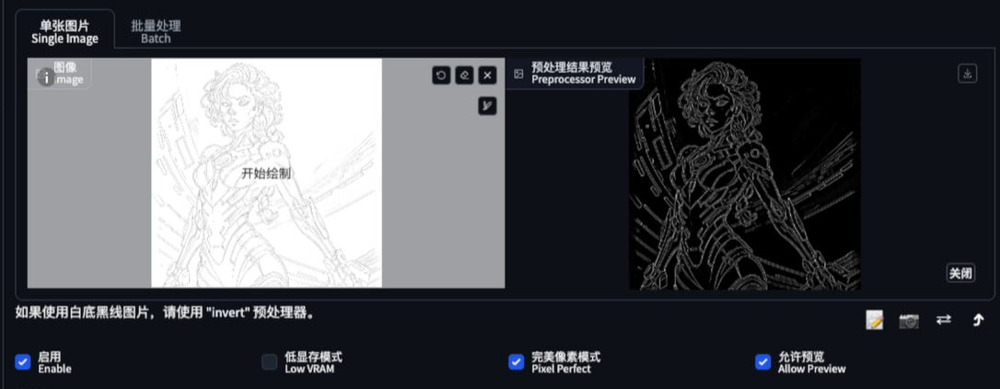


------

##### **7.1.1.2 模型**

- **Lineart.pth（通用线稿模型）：**
**a.** 匹配所有风格的checkpoint模型
**b.** 不匹配动漫线稿预处理器(Lineart aniem和Lineart annime denoise),因为动漫预处理器(Lineart anime和Lineart anime denoise)处理图片会产生一些一个一个的小方格， 这些小方格会被通用线稿模型(Lineart.pth)还原出来，这些是错误的。


以下列出了在采用lineart anime预处理器时，lineart anime.pth和lineart..pth的不同表现，lineart anime.pth正确识别方格为暗处，而ilineart.pth引导生成出来的小方格，显然是错误的。


- **Lineart anime.pth（动漫专用）**：
  专门用于动漫风格，动漫预处理器对非动漫参考图处理会缺失细节，如图，线稿细节损失比较大。


再去掉一条预处理器和参考图不匹配的，剩下7条


> 注意：**动漫线稿模型没有猜测模式**，只能选择**偏向提示词模式**，但也会因此削弱ControlNet的控制程度，所以同时，使用动漫线稿模型需要非常详细的提示词。

------

#####  **7.1.1.3 特殊用法**

- 假设我们的参考图跟我们要的图内容上并不一致，只想用来固定一下框架，然后通过修改提示词生成你想要的东西。
- 这时可以用这个特殊的流程：**非动漫参考图+动漫预处理器+动漫线稿模型+非动漫大模型**
- 选择偏向提示词模式，只要在提示词中写清楚人物和环境的描述，比如这里加一个裙子的提示词，把退出引导步数往前提一点，他就会给你生成你需要的图。


> **其原因如下**：
>
> 1. 偏向提示词模式削弱了ControlNet的关注度，导致机甲的内容被削弱。
> 2. Lineart anime是专门用来服务动漫风格大模型，与写实风格的大模型配合比较差。
> 3. Lineart anime没有猜测模式，所以不会识别出参考图的机甲的内容。
> 4. Lineart anime预处理器对非二次元参考图的识别缺失信息。

更多的实验结果如下：


------

#### 7.1.2 **Scribble/sketch 涂鸦/草图**

> Scribble 涂鸦功能是比较开放的线稿控制类型，控制性最弱的线条，能有更大的想象空间；

- **Scribble hed和Scribble pidi：**是比较粗略的涂鸦，通过控制预处理图分辨率控制涂鸦的精细程度。


- **scribble xdog：**拖动阈值就可以控制涂鸦的精细程度，使用比前面两个方便一点。

	控制模式偏向提示词，这个可以用来生成一些脑洞大开的图像。


插入参考图并不是涂鸦的主要方式，更加常用的用法是直接徒手涂鸦。画一个造型，发送到文生图controlnet,提示词改为建筑，他就会按照此轮廓去生成建筑。


------

#### 7.1.3 **Softedge 软边缘模型**

> 相比于Cannny整体的细节把控，HED更侧重于把图形大致轮廓保存下来，整体的**融合性**在相对于Canny要**柔和**。

Softedge模式有四个预处理器：SoftEdge HED、SoftEdge PIDI、SoftEdge HED safe、SoftEdge PIDI safe，没有白底黑线反色的选项。

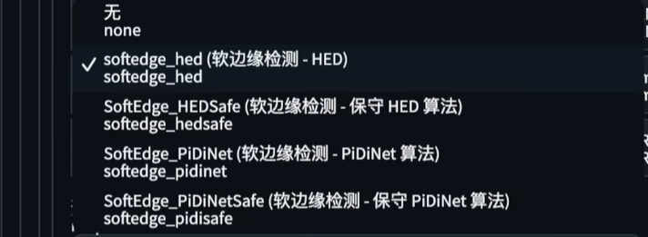

他们最大的差别是稳定性以及质量的差距，当然对于一般的图像，结果差距很小。


------

#### **7.1.4 Canny 硬边缘模型**

Canny模型只有一个预处理器。调整阈值可以控制线稿的细节程度：
- 阈值越低，被识别的边缘越多，细节越多，但错误也越多
- 一般保持默认的 **100~200** 即可

> Canny 适合产品图等精确的外轮廓，来约束AI

------

#### **7.1.5 MLSD 直线**模型

MLSD只能处理直线，无法处理曲线。适合用于生成建筑外立面图等直线较多的场景。

------

### 7.2 Openpose 姿态检测

Openpose是姿态检测模型，通过识别参考图中人体的各个部位来控制图像中人物的肢体动作。

**6. 预处理器种类**

```markdown
- OpenPose：眼睛、鼻子、眼睛、脖子、肩膀、肘部、手腕、膝盖和脚踝。
- OpenPose_face：OpenPose + 面部细节
- OpenPose_hand：OpenPose + 手和手指
- OpenPose_faceonly：仅面部细节
- OpenPose_full：以上所有
- DW_openPose_full：二阶蒸馏算法，OpenPose full增强版
```

目前最新和最好的预处理器是**DW_openPose_full**。


#### **7.2.1 修改局部动作**

但是按该方法生成人物就发生了变化，如何保证除了修改的部分其他部位不动？

- 把需要重绘的图拖进来，Inpaint/局部重绘制，在重绘的位置涂上蒙版，选择Inpaint only


除此之外，openpose也可以用来制作角色设计图，就是单人物多角度设计图。

#### **7.7.2 制作人物多角度立绘**

首先导入多角度的openpose图，放进ControlNet，预处理器选择无。


然后导入参考，以及人物描述，如此可以生成出来这张多视角的人物设计图


------

### 7.3 重绘、修复相关

#### **7.3.1 Tile 模型**

Tile模型是Stable Diffusion中最强大的模型之一，可以将参考图分成多个小块并识别每个小块的内容。

**主要功能**

1. 辅助高清修复
2. 添加、替换或重新生成图像内容或细节
3. 修复其他超分辨率方法生成的图像
4. **将不同风格素材转换成统一风格**

------

**预处理器选项**

```markdown
  - Blur gaussian(模糊)
  用于调整景深，调整参数sigma控制模糊程度，值越高，图片越模糊。
  
  - Tile colorfix(固色+布局)
  保持图片布局和颜色，保持原图页面布局和补充原图细节。
  
  - Tile resample(仅布局)
  保持图片布局，对原图进行重采样，但会对颜色进行变化，适用于内容丰富的图片。
```

------

##### **7.3.1.1 辅助高清修复**

Tile模型的特点就是他会将图片切分成一个一个的小块，然后将每个小块的内容跟提示词做匹配，如此，即使重绘幅度很高的情况下，整体的结构内容也会被牢牢锁定，避免产生很多不必要的东西。

而Tile模型还可以结合Tiled Diffusion生成超高分辨率图片，并且补充了必要的细节。

```markdown
- 生成一张多视角人物多角度立绘效果图
6.开启ControlNet，模型选择 openpose + Tile 模型
7.打开Tiled_diffusion，勾选保持输入图片尺寸，选择R-ESRGAN 4x+ Anime6B 放大算法，填入放大倍数，打开Tiled_vae，点击即可生成一张高清的多视角人物设计图。
```

------

##### **7.3.1.2 修复损坏图像**

Tile控制类型其中一个功能是修复损坏的图像，一张压缩成64x64的柴犬的图片用Tile进行了修复，导入这张损坏的图之后，选择Tile模型，提示词写上dog,即可修复这张损坏的图像，但并不能100%还原。


------

##### **7.3.1.3 转换风格**

**图生图 + ControlNet_Tile**，更偏向ControlNet模式，重绘幅度：**0.6** (转化效果比较好)，切换大模型和lora


如果有局部没有照顾到的，比如说头发的颜色不对，Tile暂时无法控制，可以提示词追加头发的颜色即可。

> 那么由此衍生出来的另一个用法，就是将一张集合各种风格元素的图像，放进Tile模型，选择偏向提示词模式，就可以转换成一个统一风格的图像。
> 

##### **7.3.1.4 修改细节**

Tile模型的替换内容或者修改细节的功能是Tile模型的真正强大之处。
最左边是原图，重绘幅度调到 6.0，开启Tile。

可以看到经历过Tile引导的图，身上的盔甲在细节上发生了肉眼可见的改变，由之前光滑的质感变成了比较有颗粒感的质感，肩膀这里变成了比较透明的材质。


并且，在不同down samplerate下，会有不同程度的细节变化，downsamplerate越高细节变化越明显。


down sample rate解释过来大概就是**参考图缩小倍数**。

> 假设参考图分辨率为768
> down sample rate为1，那么预处理图分辨率则为768
> down sample rate为2，那么预处理图分辨率则为768的一半，也就是384
> down sample rate为8，那么预处理图分辨率则为768的1/8，也就是96


把预处理图分辨率调低是为了让给tl有足够多的发挥空间，将低分辨率就是消除参考图的细节，重构新图像的细节，以此达到修改细节的目标，**所以down sample ratei越大，被修改的细节就越多**。

**同时偏向提示词模式下的细节变化幅度要比另外两个控制模式要明显很多。**


------

#### **7.3.2 Inpaint 局部重绘**

Inpaint模型用于局部重绘，可以修改局部内容、扩展画幅，并在一张图像中设置多种参数。

##### 7.3.2.1 **预处理器类型**

- **Inpaint_global_harmonious(改变全图)：**这种预处理器可以提高图像修复或填充的全局一致性，也就是让生成的区域和原始图像的风格、色彩、细节等更加协调。
- **Inpaint_only(仅蒙版)：**这种预处理器只会对用户遮罩或指示的区域进行图像修复或填充。
- **Inpaint_only+lama(先填充,再处理蒙版)：**这种预处理器在进行图像修复或填充之前，会先使用lama模型对图像进行处理。

> Inpaint only+lama导入需要扩展的图像，缩放模式选择**「缩放后填充空白」**即可用于**「扩展画幅」**。(图3.7.9-4~图3.7.9-6)

##### 7.3.2.2 **把黑色盔甲修改成旗袍**

1. 局部重绘，提示词加上：旗袍，把脸涂上蒙版，保证脸部不变，你也可以把头发也涂上


2. 选择重绘非蒙版区域，重绘幅度改为 1 。


3. 加载一个Tile模型，选择偏向提示词模式。


4. 如此，就可以如愿将原图的盔甲换成了旗袍。


------

#### **7.3.3 Instruct P2P 图片指令**

Instruct P2P是一种通过自然语言指令来编辑图像的技术。

使用方法：上传图片；选择Instruct P2P模型；使用"Make it xxx"格式的提示词来指导图像编辑

- "**Make it fire**"：让图像元素着火


- **"Make it winter**"：变成冬天


- "**Make it on fire**"：将背景变成火焰


------

### 7.4 Seg 语义分割


------

### 7.5 色彩相关

#### **7.5.1 Shuffle 随机洗牌**


#### **7.5.2 Color 色彩继承**


------

### 7.6 风格相关

#### **7.6.1 IP-Adapter**

IP-Adapter 可以用于复制参考图像的风格、构图或人物特征，也可以通过指令修改参考图的局部。

##### **7.6.6.1 预处理器和模型**


**SD6.5 的 IP-Adapter**

```markdown
6. ip-adapter_SD15：
它大致遵循参考图像的内容，能够捕捉图像整体宏观特征。包括颜色特征、纹理特征和形状特征，整体亮度、对比度等。

7. ip-adapter_SD15_light：
更适用于文本提示，它对于使用文本作为提示的创作任务更加灵活。

3. ip-adapter-plus_SD15：
生成的图像更接近原始参考，但通常无法复刻参考图细节，例如脸部特征。

4. ip-adapter-plus-face_SD15：
模型的权重经过微调，以使用裁剪后的脸部作为参考，因此生成的人物脸部会更像参考图。
```

**SDXL6.0 的 IP-Adapter**

```markdown
6. ip-adapter_SDxl.bin：
  使用来自 OpenCLIP-ViT-bigG-14 的全局图像嵌入作为条件。
  它大致遵循参考图像的内容，能够捕捉图像整体宏观特征。包括颜色、纹理和形状特征，整体亮度、对比度等。

7. ip-adapter_SDxl_vit-h.bin：
  使用来自 OpenCLIP-ViT-H-14 的全局图像嵌入作为条件。
  与 ip-adapter_SDxl.bin 相同，它大致遵循参考图像的内容，能够捕捉到图像整体的宏观特征。

3. ip-adapter-plus_SDxl_vit-h.bin：
  SD6.5 使用来自 OpenCLIP-ViT-H-14 的图像块嵌入作为条件
  比 ip-adapter_xl 和 ip-adapter_SDxl_vit-h 更接近参考图像。

4. ip-adapter-plus-face_SDxl_vit-h.bin：
  架构与 ip-adapter-plus_SDxl_vit-h 相同
  以使用裁剪后的脸部作为参考，因此生成的人物脸部会更像参考图。
```

**Face ID**

```markdown
6. IP-Adapter Face ID：
  IP-Adapter Face ID 是一个实验性的模型，它使用人脸识别模型中的人脸 ID 嵌入，而不是 CLIP 图像嵌入。
  使用 LoRA (ip-adapter-faceid_SD15_lora.safetensors) 来提高 ID 的一致性。IP-Adapter Face ID  可以根据仅有的文本提示生成与人脸相关的不同风格的图像。

7. IP-Adapter Face ID Plus：
  IP-Adapter Face ID Plus 是 IP-Adapter Face ID 的升级版，它更好地保持人物面部的一致性，并能实现与 Reactor 相似的人物换脸效果。
  这个模型使用了 face ID 嵌入（用于人脸 ID）以及 CLIP 图像嵌入（用于人脸结构）。
使用了 LoRA (ip-adapter-faceid-plus_SD15_lora.safetensors) 来提高 ID 的一致性。

3. IP-Adapter Face ID Plus v2：
  IP-Adapter Face ID Plus 的改进版，除了改进的模型检查点和 LoRA，还允许设置 CLIP 图像嵌入的权重。

4. IP-Adapter Face ID SDXL：
  跟 IP-Adapter Face ID 一样使用人脸识别模型中的人脸 ID 嵌入，同样需要使用 lora (ip-adapter-faceid_SDxl_lora.safetensors)，但使用与 SDXL 的 checkpoint 模型。

5. IP-Adapter Face ID Plus v2 SDXL
  是 Face ID Plus v2 的 SDXL 版本，它进一步提高了人物面部的一致性，并具备可控的人物换脸效果。
  FaceID 嵌入（用于人脸 ID）：从人脸识别模型中提取的面部特征。
  可控的 CLIP 图像嵌入（用于人脸结构）：用户可以通过权重来调节脸部结构对图像生成的影响程度。
  LoRA 技术：用于提高 ID 的一致性。
```

------

**如何选择适配器**

首先 IP-Adapter 作为一种图像提示，是为了弥补文字提示的不足，或者取代文字提示，也就是说图像提示和文字提示之间既有合作关系，也有对抗关系。

所谓合作关系就是文字提示和图像提示匹配，对抗关系就是文字提示和图像提示不匹配。

SD6.5 的适配器分成三种，

第一种：**sd 6.5、Plus、Light**，都是 OpenClip VīT H14 图形编码器全图图像嵌入，区别就在于

> **SD 6.5**：它大致遵循**参考图像**的内容，能够捕捉到图像整体的宏观特征。

当提示词匹配的时候，表现良好，除了手的动作和脸部不像之外，其他都没有什么问题；

但是提示词跟图像不一致的时候，比如我这里蓝色头发，跑步，那么，权重过低的时候，图像提示词的特征就会被忽略，生成的图就会变成蓝色的头发，但仍然没有看到跑步的动作，所以整体结构还是保留了参考图的结构。


> **SD 6.5 light** 更适用于**文本提示**，它对于使用文本作为提示的创作任务更加灵活

我们从这二个图就可以看出，图像提示甚至对整体结构都没有做固定，只有人像的大特征做保留了下来，换到蓝色头发和跑步的提示词，权重低的几乎是倾向提示词了，参考图的特征几乎没有了~


> **SD 6.5 plus** 生成的图像更**接近原始参考**，但通常无法复刻参考图细节，例如脸部特征。

采用 plus 的时候，权重稍高一点，除了脸部不太像，人物大特征、结构动作动几乎一致，换到蓝色头发和跑步，结构依然稳固，动作也追随参考图，仅仅在权重比较低的时候，出现了一些蓝色的头发~


> 总结下来就是：**对于图像提示的强度：plus  > SD6.5  > light**，
>
> **plus** 适合偏向参考图的需求，**light** 适合偏向提示词的需求，而 **SD6.5** 适合在偏向参考图的基础上，做一些细小的变化。
> 

------

**第二种：SD6.5 plus face，SD6.5 full face**，模型的权重经过微调，以使用裁剪后的脸部作为参考，因此生成的**人物脸部会更像参考图**。从效果上来说 PLUS FACE 和 full face 可以说是难分伯仲，但是都不算特别好。所以在 FACE ID 面世之后，这两个模型变得非常鸡肋。


------

**第三种：face id，IP-Adapter Face ID** 使用人脸识别模型中的人脸 ID 嵌入，并且使用 **LoRA** (ip-adapter-faceid_SD15_lora.safetensors) 来提高脸部的一致性，lora 的权重 0.5~6.0 都可以。


Face ID 的效果是可以的，但是总体来说不算特别稳定，因为 face id 缺少脸部结构的支持。

**IP-Adapter Face ID Plus** 是 IP-Adapter Face ID 的升级版，plus 模型除了使用了 face ID 嵌入（用于人脸 ID）以及 **CLIP 图像嵌入**（用于人脸结构）。使用了 LoRA (ip-adapter-faceid-plus_sd15_lora.safetensors)来提高ID的一致性。


**Plus V2 是 plus 的进化版**，除了改进的模型检查点和 LORA 还允许调整 CLIP 图像权重，也就是脸部结构的权重，但只能在 comfyui 用。

**IP-Adapter-FaceID-Portrait**：与 IP-Adapter-FaceID 相同，但它不需要 lora，它接受多个面部图像以增强相似性。你可以在 ControlNet 里面的多张上传这里上传五张图像，进行生成。


事实上 faceid、faceid plus 等等都可以不用 lora，只不过使用 lora 效果会更好。

------

##### **7.6.6.2 权重的影响**

- **无提示词，权重取 1**

不同的权重将引导至不同的结果，在没有其他提示词的情况下，权重可以直接取 1，权重越大，越倾向于参考图片。


- **有提示词，权重取 0.5~0.8**

我们可以通过补充提示词，在图像提示词的基础上，增加元素或者替换元素，比如说这里给他戴个帽子，补充提示词：wearing a hat，当然如果你要提示词发挥作用，权重就变得尤为重要，0.5 的权重是比较理想的选择，权重大了没有帽子，权重小了跟参考图不像。


- **与其他 ControlNet 模型一起使用**

IP-Adapter 通常不会单独使用，一般都跟其他的 ControlNet 共同引导。


**4. 人物一致性动画**

那么，既然图片可以将参考图绑定到 openpose 上面，那视频也必然是可以，操作十分简单，我们不过就是将预处理图的序列帧做成视频，导入到 animatediff 中，ControlNet 采用 openpose，预处理器选择无。再开启一个 ControlNet，选择 ip-adapter plus，就可以制作一致性人物动画。

------

#### **7.6.2 Reference**

Reference 是 Stability AI 公司发布的官方模型

- **Reference** 是一种基本的方法，用于将参考图像的风格或内容迁移到生成的图像中。
- 它可以用于传输颜色、风格或其他特征，但通常不如其他方法（如 IP-Adapter）强大。
- 适用于简单的风格迁移或颜色转移。


同样，正常情况下 reference 不会单独使用，而是结合其他 ControlNet 模型共同引导。


##### **7.6.2.1 预处理器种类**

`reference` 不使用控制模型，在选择了参考预处理器后，模型下拉菜单将被隐藏。`reference` 有三个预处理器，分别是：

```markdown
- Reference adain: 
  这个预处理器用于风格迁移，通过自适应实例标准化（Adaptive Instance Normalization，AdaIN）来实现。可以将图像的风格从参考图像传递到生成的图像中。

- Reference only:
  用于直接生成与参考图像相似的图像，将参考图像直接链接到注意力层。
  
- Reference adain+attn:
  结合了 AdaIN 和注意力机制（Attention）。可以更精细地控制生成图像的风格和细节。
```

从结果上看，`reference only` 最接近参考图，`reference adain+attn` 次之，`reference adain` 跟参考图最不相符。


##### **7.6.2.2 控制模式的影响**

对于 `reference` 模型来说，只有在偏向 `ControlNet` 和均衡模式下，生成图才有几分参考图的特性，从头发的线条就可以判断个大概。


##### **7.6.2.3 风格忠诚度的作用**

风格忠诚度是 `reference` 可调节的唯一一个阈值，均衡模式下风格忠诚度才会起作用，其他两个模式即使可以调节，也不起作用。风格忠诚度越高，越接近参考图。


------

### **7.7 空间类的模型**

##### **7.7.1 Depth 深度检测**


------

##### **7.7.2 Normalmap 法线贴图**


------

### 7.8 光线相关

#### **7.8.1 Brightness  亮度**

是修改被照明的物体亮度(**高光**)，它不需要高斯模糊，固定随机种子的情况下可以不改变原图的结构，一般不可以和其他的Controlnet模型一起使用


#### **7.8.2 lllumination  照明**

更倾向发光体，需要**高斯模糊**，一般不会轻易改变原图的结构，但是你可以通过线稿等模型去锁定结构，因为照明模型可以跟其他Controlnet共同使用。


------

## 八、实操案例

####  **8.⒈扩图**

**文生图** + ControlNet_inpaint（局部重绘）；**only+lama**；更偏向ControlNet；缩放后填充空白；提示词可不写

> 注意：图生图不适合扩图，因为没有随机种子，人物脸部也会容易改变，重绘幅度也难把控；需要加入controlnet控制，比较麻烦。

------

#### **8.2 超尺寸大分辨率长图**


1. PS制作一张长图画布，发到ControlNet并同步尺寸；
2. 开启Tile Diffusion (**Mixture of diffusion**)+ Tile VAE，关闭 ControlNet，输入提示词，调整步数生成；

```markdown
bird's-eye view, trees, stones, farms, 16K, high detail, best quality, high, resolution, Masterpiece, Hyper Real, Photorealistic, ultra-detailed 8k unity wallpaper.
鸟瞰、树木、石头、农场、16K、高细节、最佳质量、高分辨率、杰作、超真实、逼真、超精细 8K Unity 壁纸。
```


------


------

#### **8.3 动漫角色特征换装**

##### **8.3.1 文生图+ 控制**
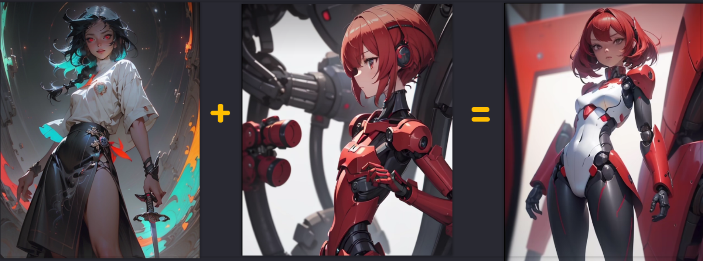
```markdown
- ControlNet模型 1/3 范围
  inpaint(局部重绘)：控制重绘区域(重绘蒙版与提示词无关，选择controlnet优先)
```
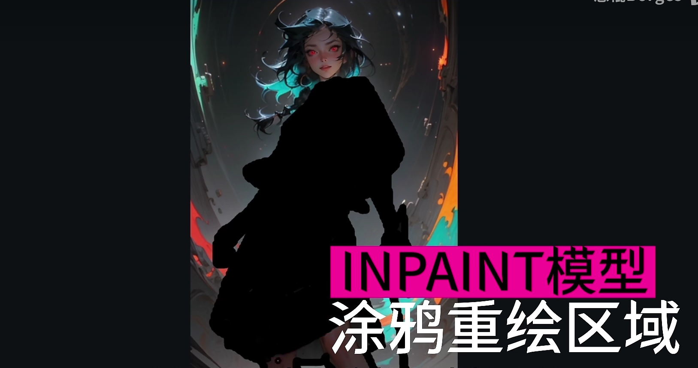
```markdown
- ControlNet模型 2/3 参考
  reference(参考)：控制参考风格
  lora：选定风格lora做参考
```

```markdown
- ControlNet模型 3/3 控形
   softedge(软边缘)：控制重绘的边缘外形 (不要控制太死，选择偏向提示词)	
   canny(硬边缘)：控制重绘的边缘外形 (把预处理结果放在PS调整再上传)
   lineart(线稿)：没有猜测模式，所以选更偏向提示词
```
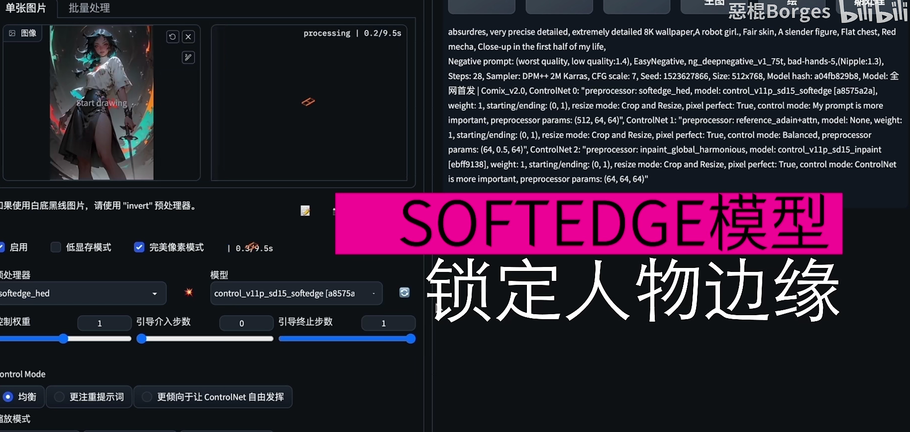


##### **8.3.2 图生图 + 控制**

```markdown
- 其他步骤与M01一致
  重绘幅度0.5
```

##### **8.3.3 局部重绘 + 控制**

```markdown
- 其他步骤与M01一致，去掉inpaint即可
- 蒙版处理方式：
  填充：蒙版内容先模糊再画，需将提示词改为重绘的内容
  原版：修脸时可用，无需修改提示词，重点：开启AD
  
- 绘制方式：
  全图：先画全图然后裁剪，整体性融合度强，速度慢，修人脸会容易崩
  仅蒙版：仅画蒙版区域，整体性融合度弱，提示词需要改为蒙版部分内容，速度快，建议蒙版处理方式：原版
```

------

#### **8.4 风格转换，动漫真人互转**

##### 8.3.1 风格转换

M01. **文生图+tile+canny**，输入提示词，选择不同的大模型


M02. **图生图 + canny**，直接切换**大模型** + **Lora** + **低重绘幅度**


------

##### 8.3.2 穿越次元壁

**图生图-局部重绘 + After Detailer + 动漫大模型**，重绘幅度：**0.1**


> **After Detailer** 技巧 + 原理
> 单元一：精细人物，重绘0.5，单独宽高原图*2；
> 单元二：精细脸部；
> 单元三：精细手部；
>
> 

------

##### 8.3.3 服装换色

**图生图-局部重绘 + Deth + Lineart**，提示词修改颜色，重绘幅度：**0.75**


------

#### 8.5 简单修手：

**M01. 图生图 - 涂鸦**


------

**M02. PS处理 + 图生图拟合**

1. 在PS处理手部，放到**图生图-局部重绘**中进行重绘拟合


2. **原图**，**仅蒙版**，重绘幅度：**0.45**，启用 **OpenPose + Deth + Softedge**；


------

#### **8.6 假人变真人**

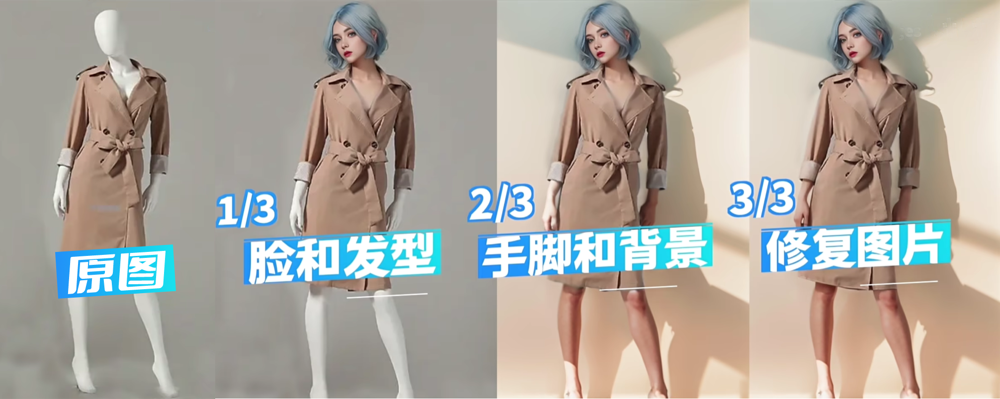

##### **8.6.1 脸和发型**

**局部重绘**

蒙版区域内容处理：**填充，将提示词修改成头部的特征描述**
重绘区域：**仅重绘蒙版区域**
重绘幅度：**0.5-0.8**

```markdown
- ControlNet模型 1/3 控形
lineart(线稿)：下载预处理图，将参考的发型用PS处理成预处理图
```
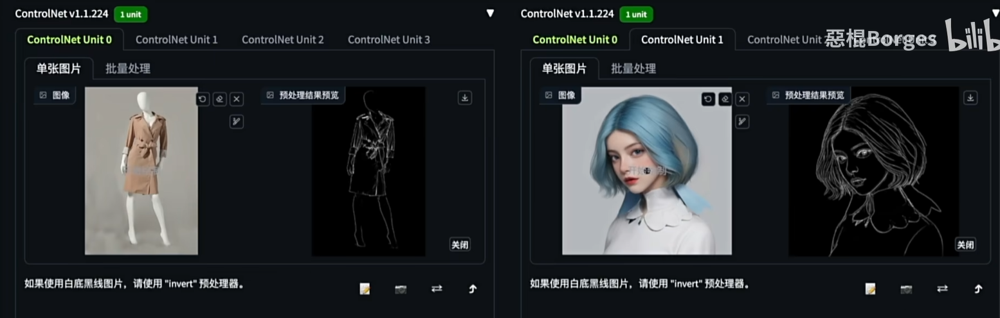

```markdown
- ControlNet模型 2/3 参考
reference(参考)：控制参考风格，参考真实的人脸
```
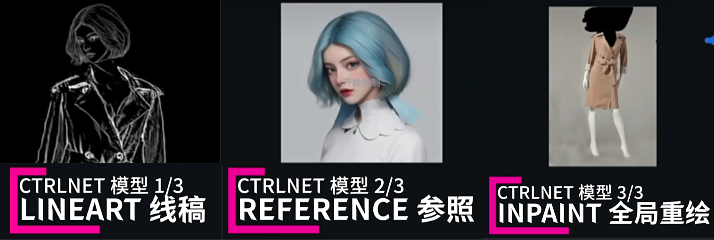

```markdown
- ControlNet模型 3/3 范围
inpaint(局部重绘)：控制重绘区域(选择ControlNet优先)，可以开启AD修复
预处理器：global harmornious(是整体更加协调)
```

------

##### **8.6.2 手/脚/背景处理**

**局部重绘**
提示词加入：特征描述，**shadow,Sunlight**（阳光，阴影）
蒙版区域内容处理：**填充**
重绘区域：**仅重绘蒙版区域** (手脚单独处理)；**全图** (手脚一起处理)
重绘幅度：**0.5-0.8**

```markdown
- ControlNet模型 1/3 范围
  Inpaint(局部重绘)：配合seg插件精准做出手部蒙版
```


```markdown
- ControlNet模型 2/3 控形
  Pose(姿势)：确定手脚位置

- ControlNet模型 3/3 控形
  lineart(线稿)：确定手脚轮廓和比例
```

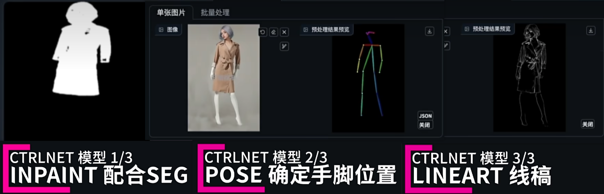

------

#### **8.7 写真换脸**

##### **8.7.1 图生图**

```markdown
- ControlNet模型 1/2 面部特征
  inatant_ID：预处理器:embedding(要换的脸)
	
- ControlNet模型 2/2 面部五官范围
  inatant_ID：预处理器:keypoints(参考图的脸部五官)
```
##### **8.7.2 局部重绘**

```markdown
- ControlNet模型 3/4 控形
  Pose(姿势)：确定手脚位置
	
- ControlNet模型 4/4 参考
  lineart(线稿)：控制外部轮廓
```


------

#### **8.8 照片换背景 换发型 换风格 校色**

##### 8.8.1 换背景

1. **图生图-局部重绘**画出主体；
2. 提示词必须包含**主体对象** + **更换的背景**描述；

```markdown
portrait of a young woman, white hair, flower hair accessory, smiling, closed eyes, beautiful, soft lighting, natural light, outdoors, beach, sea, sky, clouds, peaceful, serene, realistic photography, soft colors, middle shot, centered composition, HD
```
3. **重绘非蒙版区域**；蒙版内容处理：**原图**；重绘幅度：**1**；
4. 开启**Controlnet-inpaint**(局部重绘)：**only+lama**；


> 让背景更加具有视觉冲击性，可以加入摄影类/光影类的lora，如(极光)
> 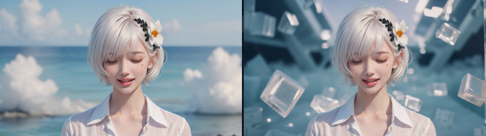

> 对人物进行微调，如改成长发；将蒙版主体边缘缩小，提示词加上长发
> 

------

##### **8.8.2 解决图像扩散污染**

```markdown
文生图 + 启用Tile-resample(分块采样)模型，退出介入：0.5，Sampling-Rate：8；
	Sampling-Rate 向下采样率，理解为将参考图转为马赛克，数值越大格子越多，AI绘画就会更多想象力
```


> 人物脸部和颜色和原图有差异，需要调整。

1. **修正脸部轮廓：**PS进行脸部替换；


2. **校色：**将参考图处理成模糊，并上传到**图生图**，输入提示词，**重绘幅度：1**；
3. 在 **Tile-resample** 添加PS修正的图片；
4. 开启**Tile Difffusion + Tile VAE**，放大倍数：**1**；


------

##### **8.8.3 换风格**

1. **文生图**输入提示词；
2. 启用**Tile-resample(分块采样)**模型，介入：0.2，退出介入：0.4，Sampling-Rate：1；
3. 启用**Depth(深度)**模型，介入：0，退出介入：0.1；   *-- 固定轮廓*
4. 启用**Open Pose(姿势)**模型，介入：0，退出介入：0.1；   *--固定姿势*
5. 开启**Tile Difffusion + Tile VAE** 放大倍数：1 ；  *--增加细节*


------

##### **8.8.4 解决图像Lora污染**


1. **校色：**将参考图处理成模糊，并上传到**图生图**，输入提示词，**重绘幅度：1**；
2. 在 **Tile-resample** 添加需修复的图像，若图像差异太大，可调整退出介入，多次修复；
3. 开启**Tile Difffusion +Tile VAE**，放大倍数：**1**；


------

#### **8.9 电商海报融图**


1. 将产品放进PS制作底图，上传到 **文生图 + canny**，


2. 选择相对的大模型和lora进行抽卡，测试风格，再启用ControlNet，模式均衡；

3. 将生成图放进PS与原产品融合；


4. 将调整图放入**图生图**，局部重绘**0.45**，开启**ControlNet_canny**，开启**Tile_diffusion**，放大倍数 **1** (增噪拟合)，对结果二次处理；


> **制作艺术字**：将文字图片放进 **文生图 + Scribble**，加入提示词，抽卡，并将合适的字体图像放进PS三次处理；
>
> 
>
> 6. 截取带背景的图放进**图生图 - 局部重绘**，蒙版画出文字部分，预留点部分与背景融合，重绘区域：仅蒙版，重绘幅度：1；开启**ControlNet_lineart**(约束大体轮廓)，
>
> 
> 
> 

------

#### **8.10 线稿上色+转3D+三视图**


------

#### **8.11 角色多角度统一图**

**文生图 + lineart + openpose**


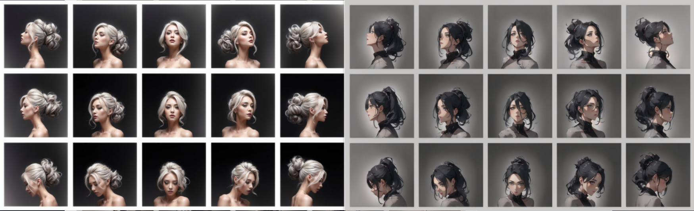

```markdown
- OpenPose和矩形的单独大小尺寸必须能被 8 整除。
建议单个为 256×256 图像。 然后开启高清修复放大到每个为 512，也可以加上tilediffusion放大
```

------

####  **8.12 室内渲染**


------

#### **8.13 AI造字**


------

#### **8.14 AI 放大**


------

#### **8.13 打光**

**M01. 文生图 + controlnet_照明**

权重0.4~0.6，退出介入0.6

**M02.图生图**

1. 上传灯光的光域网，
2.  在controlnet_lineart上传人物/打光物品图，
3. 设置重绘：0.5~0.8


------

 ####  **8.14 视频转动画(Deforum)**

```markdown
- Max frames(最大帧数)

- Strength schedule(帧时间变化):
  0:(0.65) → → → 第0帧开始每一帧和上一帧相似度0.65
  50:(0.5) → → → 第50帧开始每一帧和上一帧相似度0.65
  
- Noise schedule(噪点时间变化):
  0:(-0.06*(cos(3.141*t/15)**100)+0.06)	//缓入缓出 15：每秒帧数

-  Depth Warping & FOV(视野范围)
   FOV schedule(视野时间变化)
```

------

