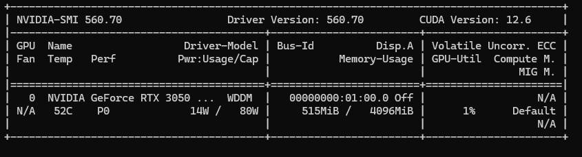

## 1. 禁止剪映更新并解决更新提示

##### **1.1 禁止剪映自动更新**

找到剪映安装目录重命名或删除更新程序：

在剪映的安装目录中，查找名为 update.exe 或类似名称的文件。

将该文件重命名为 update.exe.bak 或删除该文件。

------

##### **1.2 修改系统设置阻止更新**

- 修改hosts文件：打开 C:\Windows\System32\drivers\etc\hosts 文件。

  ```
  //添加阻止剪映连接到其更新服务器（具体地址需确认）：
  
  127.0.0.1 update.jianyingapp.com
  127.0.0.1 www.update.jianyingapp.com
  ```
- 修改系统文件权限：

  - 找到剪映软件的安装目录，通常在 C:\Program Files 或 C:\Program Files (x86) 中。

  - 找到更新相关的文件或文件夹（例如 update.exe 或类似文件），右键点击选择属性。

  - 在“安全”选项卡中，编辑权限，删除所有用户对该文件的写入权限。

------


##### **1.3 解决剪映的更新提示**

- 禁用更新提示：

有时候更新提示会通过剪映的设置界面关闭。在剪映的设置或偏好设置中查找是否有关闭自动更新或通知的选项。

- 自动化脚本：

编写一个批处理脚本，每次启动剪映时自动删除或覆盖更新文件。

例如，创建一个名为 `start_jianying.bat` 的批处理文件，内容如下：
```batch
@echo off
del "C:\Program Files\剪映\update.exe"
start "" "C:\Program Files\剪映\jianying.exe"
```

每次启动剪映时，通过运行这个批处理文件来确保更新程序被删除。

------

## 2. 清理Win SxS冗余的缓存文件

##### **2.1 使用“磁盘清理”工具**

Windows 提供了一个内置的“磁盘清理”工具，可以安全地删除不需要的系统文件。

1. 按下 `Win + R`，输入 `cleanmgr`，然后按下 Enter。
2. 选择系统驱动器（通常是C盘），点击“确定”。
3. 在“磁盘清理”窗口中，点击“清理系统文件”按钮。
4. 再次选择系统驱动器，点击“确定”。
5. 勾选“Windows 更新清理”以及其他不需要的项目。
6. 点击“确定”并确认删除。

##### **2.2 使用 DISM 命令**

部署映像服务和管理（DISM）工具可以用于清理 `WinSxS` 文件夹中的组件存储。

1. 以管理员身份打开命令提示符（按下 `Win + X`，选择“命令提示符（管理员）”）。
2. 运行以下命令：
   ```cmd
   DISM.exe /online /Cleanup-Image /StartComponentCleanup

3. 如果需要更彻底的清理，可以使用以下命令：
   ```cmd
   DISM.exe /online /Cleanup-Image /StartComponentCleanup /ResetBase
   ```
   > 注意：使用 `/ResetBase` 参数会删除所有旧的组件和更新备份，因此无法卸载已安装的更新。

##### **2.3 使用 Storage Sense**

Windows 10 及以上版本提供了“存储感知”功能，可以自动清理不需要的文件。

1. 按下 `Win + I` 打开“设置”。
2. 选择“系统” > “存储”。
3. 在“存储感知”下，点击“配置存储感知或立即运行”。
4. 配置清理设置，确保启用清理临时文件和Windows更新文件。

**4. 删除临时文件和旧版本备份**

有些临时文件和旧版本的Windows备份也可以安全删除。

1. 按下 `Win + R`，输入 `%temp%` 并按下 Enter，删除文件夹中的所有内容。
2. 按下 `Win + R`，输入 `temp` 并按下 Enter，删除文件夹中的所有内容。
3. 如果已经升级到新版本的Windows，可以删除旧版本备份：
   - 按下 `Win + I` 打开“设置”。
   - 选择“系统” > “存储”。
   - 在“本地磁盘 (C:)”下，点击“临时文件”。
   - 勾选“以前的 Windows 安装”并点击“删除文件”。

------

## 3. 覆盖已删数据，使其无法恢复

以管理员身份打开命令提示符（按 `Win + X`，选择 `命令提示符（管理员）`）。

```sh
cipher /w:C:\path\to\folder
```

#####  **3.1 CCleaner磁盘擦除**

- 打开 CCleaner，选择“工具” -> “驱动器擦除”。
- 选择要擦除的驱动器（通常是 `C:` 驱动器）。
- 选择擦除方法（推荐使用“DoD 5220.22-M”标准，以确保文件无法恢复）。
- 点击“擦除”来永久删除驱动器上的所有已删除文件。

------

## 4. 修复任何损坏问题

##### **4.1 运行 DISM 工具并使用 Cleanup-Image 选项**: 

尝试运行 DISM 工具并使用 `/Cleanup-Image` 选项来修复任何损坏问题。 以管理员身份打开命令提示符，并运行以下命令：

```cmd
dism /online /cleanup-image /scanhealth
dism /online /cleanup-image /restorehealth
```

##### **4.2 系统文件检查器 (SFC)**:

运行系统文件检查器以修复可能导致问题的任何损坏的系统文件。

```cmd
sfc /scannow
```

##### **4.3 检查磁盘错误:**

```cmd
chkdsk /f /r
```

------

## 5. Adobe Premiere 默认语音包路径

```markdown
C:\Program Files\Common Files\Adobe\Premiere Pro\2x.0(版本号)\SpeechESL
```

------

## 6. 比特率对应CRF值

| 比特率 (Mbps) | CRF 值范围 (估计) | 视频质量描述               |
| ------------- | ----------------- | -------------------------- |
| 0.5 - 1       | 30 - 36           | 非常低质量，可能不适合观看 |
| 1 - 2         | 28 - 34           | 低质量，细节丢失严重       |
| 2 - 4         | 24 - 30           | 中等质量，适合网络视频     |
| 4 - 6         | 20 - 26           | 高于中等质量，细节较好     |
| 6 - 10        | 18 - 22           | 高质量，适合DVD视频        |
| 10 - 20       | 14 - 18           | 接近高清质量，细节丰富     |
| 20 - 50       | 10 - 14           | 高清质量，适合蓝光视频     |
| 50+           | 8 - 10            | 超高清质量，适合专业用途   |

------

## 7. Pytorch安装教程

#### 7.1 安装Anaconda

Anaconda可以让用户更好地管理`python`包，配置`pytorch`需要先安装Anaconda。我说不出它的优点，反正大家都在用，我也一直在用。

[https://www.anaconda.com/products/individual#Downloads](https://www.anaconda.com/products/individual#Downloads) 这里可以下载Anaconda

如果使用的是Windows，安装以后，点击任务栏中的搜索框，搜索Anaconda，打开`Anaconda Powershell Prompt (Anaconda)`或者`Anaconda Prompt (Anaconda)`。Ubuntu貌似进入命令行进入了Anaconda。

> 在conda命令行中输入`conda create --name env_name python=3.7`
>

`env_name`是虚拟环境的名字。装Python库，就好像在一个新房子里放家具一样，时间久了东西越来越乱。Anaconda给了你无限创造新房子的机会。你可以在一个完全没有“家具”，甚至连Python都没有的虚拟环境里，重新配置库文件。`env_name`就是虚拟环境的名字，我一般命名为`pt`，这样输入起来很快。后面的`python=3.7`是可选的，python版本可选，这句话加不加也可选。没加的话晚点安装python也行。

创建完环境之后，输入`conda activate pt`就可以进入新的虚拟环境。前面的`(base)`应该会变为`(pt)`


搞成上图那样就算配得差不多了。

------

#### 7.2 CPU版本的Pytorch

Pytorch等深度学习框架分CPU版和GPU版。GPU版速度快，但装起来有点复杂。如果只想稍微学习一下编程框架，以后用GPU服务器跑正式代码，可以只装CPU版。

这个时候，为了避免GPU版教程的干扰，应该在搜索引擎中搜索`Pytorch CPU 你的操作系统`

> 一般输入`conda install pytorch-cpu torchvision-cpu -c pytorch`就可以安装好了。但这个时候，一般有一个坑会碰到：下载速度奇慢无比。
>

这个时候，应该去网上搜索`conda 下载慢`类似的关键字。网上一般会给出以下几个办法：换源.直接下载安装包.用pip下载。源就是下载的来源网站，在国内的话最好切换到国内的下载网站比较快。我选择换conda源的方法下载。明确了方法后，要继续换搜索的关键字，应搜索`conda 换源`。我搜索到的办法是：输入`conda config --set show_channel_urls yes`。之后在用户根目录(比如C:\\Users\\Yifan Zhou)下编辑`.condarc`，加入以下内容：

```plaintext
channels:
  - https://mirrors.tuna.tsinghua.edu.cn/anaconda/pkgs/main/
  - https://mirrors.tuna.tsinghua.edu.cn/anaconda/pkgs/free/
  - https://mirrors.tuna.tsinghua.edu.cn/anaconda/cloud/conda-forge/
ssl_verify: true
```

比较好的方式开始用换了源的pip下好之后稍微验证以下。比如安装之后，继续在Anaconda的虚拟环境中输入以下内容

```plaintext
python
import torch
print(torch.__verion__)
```

------

#### 7.3 GPU版本的Pytorch

##### 7.3.1 确认显卡驱动

在安装GPU版本Pytorch之前，还要保证电脑中有**版本正确**的cuda和cudnn。cuda是一套GPU上的编程库，cudnn是基于cuda的深度学习库。Pytorch依赖这两个库，而cudnn版本依赖cuda版本。而由于cuda貌似更新比Pytorch快，出于向下兼容的考虑，应该先在电脑支持的CUDA版本和Pytorch支持的CUDA版本中选择一个较小者，再下载该版本的CUDA和CUDNN。

但是，在安装这些东西之前，还可能碰到一个坑——显卡没装驱动。这里默认电脑使用的是N卡。

> 在控制台中输入`nvidia-smi`



就说明驱动已经安装好了。如果没有，请搜索`显卡驱动`，适当加入`Nvidia Cuda Cudnn pytorch tensorflow python`等关键词，多看几篇教程总能把驱动装好。

输出信息中的CUDA Version就是电脑显卡最高支持的CUDA版本。到网上下CUDA也应该不超过这个版本。

------

##### 7.3.2 CUDA

> 记录下`nvidia-smi`命令输出的CUDA版本（比如我的是11.1），再在 [https://pytorch.org/get-started/previous-versions/](https://pytorch.org/get-started/previous-versions/) 查Pytorch是否支持该CUDA版本。如果不支持，就选一个网站上有，且版本小于命令输出的CUDA版本的。
> 之后去 [https://developer.nvidia.com/cuda-toolkit-archive](https://developer.nvidia.com/cuda-toolkit-archive) 找到合适的CUDA版本，选择版本后选择自己对应的操作系统。下载了可执行文件后直接运行安装。

------

##### 7.3.3 CUDNN

打开 [https://developer.nvidia.com/rdp/cudnn-archive](https://developer.nvidia.com/rdp/cudnn-archive) 这个网站。注册账号并登录。根据CUDA版本，找到合适版本在合适操作系统下的CUDNN。（注意是下载`cuDNN Library`，比如`[cuDNN Library for Windows10 (x86)]`）

正如前面所描述的，CUDNN是个库，不需要安装，只需要把其文件复制到CUDA文件夹下即可使用。要把CUDNN中的bin，include，lib都复制到CUDA的对应目录下。

注意，CUDA的bin文件夹应该被添加进环境变量。用默认设置安装CUDA时一般该文件夹会自动被加入环境变量。

------

##### 7.3.4 Pytorch

在 [https://pytorch.org/get-started/locally/](https://pytorch.org/get-started/locally/) 中，选择合适的操作系统和CUDA版本。参考**CPU版本的Pytorch**这一小节的内容，用conda一键下好pytorch。如果网速慢，请利用搜索引擎解决问题。

一切都下载完后，在环境中输入以下内容，看到True就是胜利。


```plaintext
python
import torch
import torchvision
torch.cuda.is_available() 
```

------

