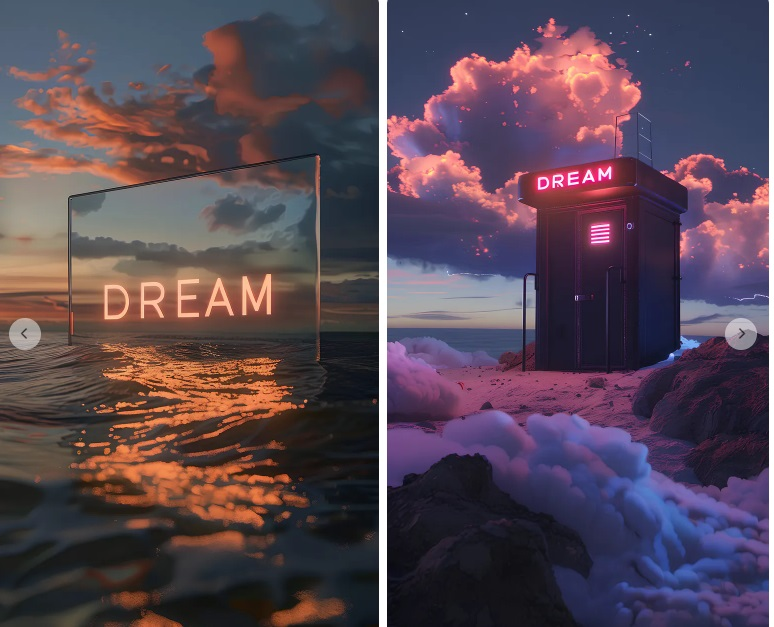
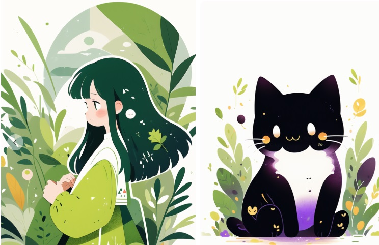
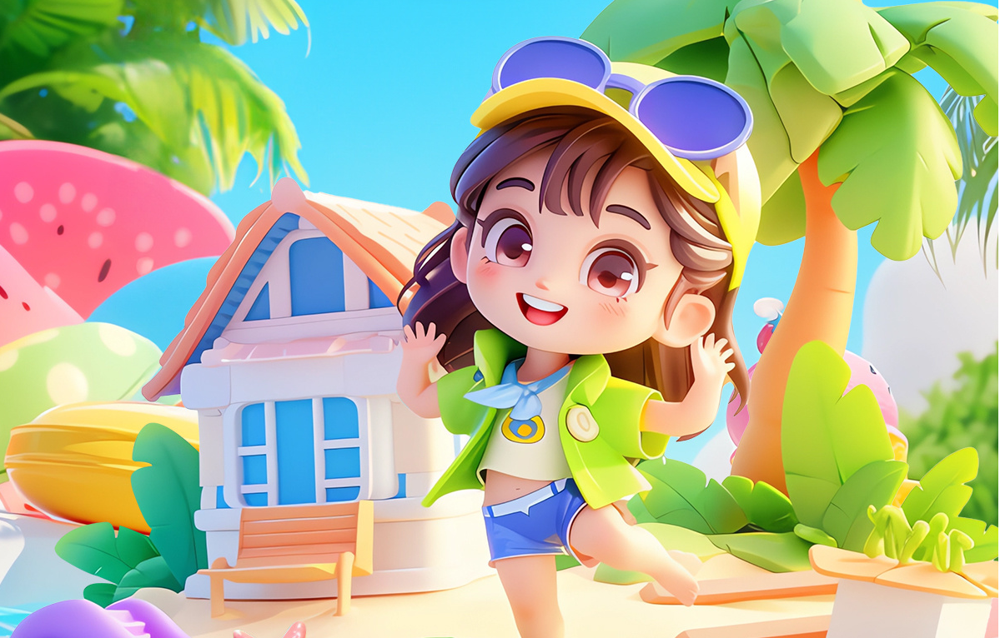
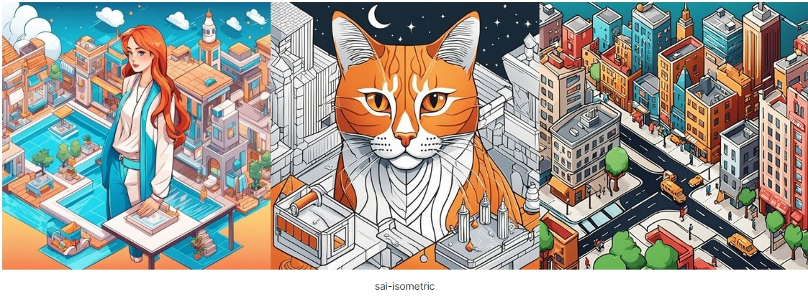
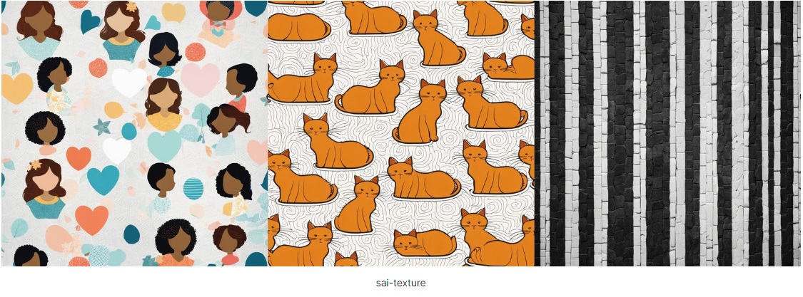
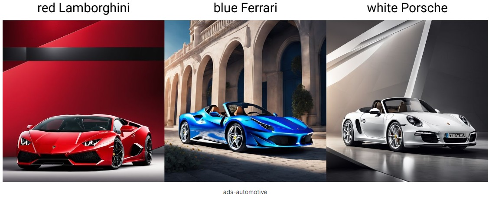
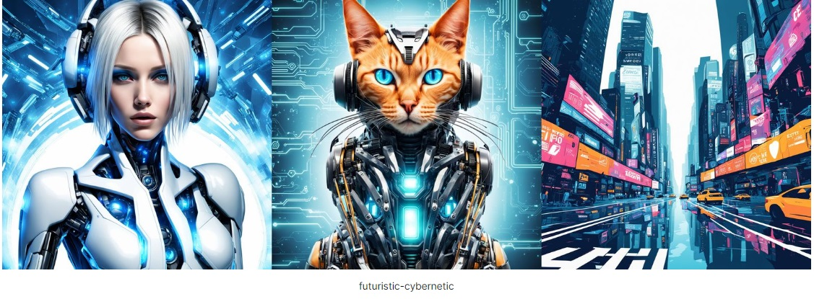
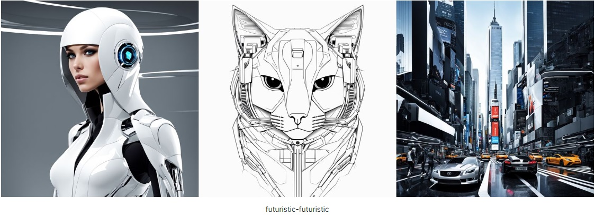

## 一、Checkpoint

#### **1. 奇幻骇客_白棱XL**


```markdown
•本模型是一个基于sd xl1.0的2.5d偏写实风格类模型
•推荐尺寸：768*1344，1024*1024，1024*1280等
•推荐步数：30起
•推荐采样：【Euler a】【DPM++ 3M SDE Exponential】【Restart】
•反词推荐：没有反词的图就是【无】(malformed hands, poorly drawn hands, mutated fingers:1.4),
•cfg scale：3.5起步
•放大推荐：使用图生图进行放大处理，采样和出图时一致，步数是出图的1.5-2倍，重绘幅度0.1-0.2
•注意：全身开ad修脸 推荐：【face_yolov8n_v2.pt】，大批量跑图建议开启ad，我的高清图基本都是Ultimate SD upscale放大处理，放大算法 4x-UltraSharp，4x_NMKD-Siax_200k
随便介绍下 2条路线：
栩栩真境XL偏真实类
奇幻骇客XL偏特效类
```
#### **2. UNIT3XL-基础单元-工作流兼容版-AiARTiST**


```markdown
常用配置：
Clip Skip 1 / CFG 1.5 / Steps 10 / 采样方法 (Sampler) Euler a / VAE 自动
默认：640 x 1280 ，高清放大 1.5倍，高清重绘幅度0.5，重绘方式 Latent

无HYPER加速推荐配置：
Clip Skip 2 / CFG 7 / Steps 30 / 采样方法 DPM++ 2M Karras / VAE 自动
默认：640 x 1280 ，高清放大 1.5倍，高清重绘幅度0.5，重绘方式 Latent

如果图片尺寸用于出版，可发送到「Tiled Diffusion」或「后期处理」扩大
图片后期处理高清化设置： 8x_NMKD-Superscale_150000_G 可叠加0.5的
4x-UltraSharp 或 R-ESRGAN 4x+ Anime6B
其他出图分辨率：：
Size: 1280x720 / 1536x768 / 960x1920 / 1920x960 / 2048x1024 / 1024x2048

LoRA用法 <lora:Hyper-SDXL-8steps-UNIT:1> 
LoRA权重可以适当微调，在0.5~1均可生效，权重降低后CFG可以适当开大
在LoRA权重为1的时候，CFG Scale 建议为1，权重为0.8时，CFG 1.5 类推
```
#### **3. AiARTiST 专用ACG Playground SDXL**


```markdown
常用配置：
Clip Skip 1 / CFG 1 / Steps 10 /Euler a / VAE 自动
默认：640 x 1280 ，高清放大 1.5倍，高清重绘幅度0.5，重绘方式 Latent
其他出图分辨率：：
Size: 1280x720 / 1536x768 / 960x1920 / 1920x960 / 2048x1024 / 1024x2048
推荐Prompts tag清单（加强元素风格描述）：
CinematicVJ,C4D,Surrealist,trend art,realistic,
CG animations,A human head,figure, sculpture,mannequin,fashion art,digital artwork,QRcode，a burst of vibrant colors,paint splashes,transparent bubbles,neon signs,astronaut,cyberpunk style,DJ mixer,space Explosion,robotic Buddha,monks,silver color,depth of field,gauze fluttering,reature limbs and trunk,many holes and patterns on body,starry sky,Science fiction movies,cityscape at night,huge billboard,traffic lights,bustling and lively,surrounded by water,vibrant, colorful grid-like structure,flowing wave, growing light,creating a gradient effect, digital abstract,Particle light,neon colors,abstract shapes,stacked together,three-dimensional geometric structure,deep purple color,geometric,DNA molecule,double helix structure,alternating wavy pattern,connected together等等
电影VJ，C4D，超现实主义，潮流艺术，写实，CG动画、人头、人物、雕塑、人体模型、时尚艺术、数字艺术品、QRcode，一阵鲜艳的色彩，油漆飞溅，透明气泡，霓虹灯，宇航员，赛博朋克风格、DJ混音器、太空爆炸、机器佛、僧侣、银色、景深、纱布飘动，肢体和躯干栩栩如生，身上有很多洞和图案，星空，科幻电影，夜晚的城市景观，巨大的广告牌，红绿灯，繁华热闹，被水包围，充满活力，多彩的网格状结构，流动的波浪，生长的光线，创建渐变效果，数字抽象，粒子光，霓虹灯颜色，抽象形状，堆叠在一起，三维几何结构，深紫色，几何，DNA分子，双螺旋结构，交替波浪图案，连接在一起
```
#### **4. Dream Tech XL | 筑梦工业XL-与光同尘**



```markdown
DPM++ 2M Karras,Steps:30,CFG:6
画风推荐提示词：
写实风格/摄影风格：Photography, realistic, portrait
2D动漫/动画风格：anime/cartoon
3D卡通风格：3D cartoon/3D render
虚幻引擎5风格：Unreal Engine 5 render
```
#### **5. DreamShaper XL**


```markdown
Turbo 版本CFG：2 ，Step：4-8； DPM++ SDE Karras （不是 2M）
```
#### **6. LEOSAM HelloWorld 新世界 | SDXL大模型**


```markdown
负面提示词
“bad hand,bad anatomy,worst quality,ai generated images,low quality,average quality”

832, 1248；896, 1152；1248, 832；1024, 1024；1360, 768；1152, 896；768, 1360；960, 1088；992, 1056；1088, 960；704, 1472；1056, 992；1472, 704；1632, 640；640, 1632；
美学质量描述词五个等级
worst quality \ low quality \ average quality \ best quality \ masterpiece
```
#### **7. helloFlatArt扁平画风**


```markdown
推荐设置
采样方法：Euler a, DPM++ 2M Karras, DPM++ 2M alt Karras;
采样步数：28;剪辑跳过：2放大算法：R-ESRGAN 4x+/R-ESRGAN 4x+ Anime6B;
重绘幅度：0.3-0.5;CFG比例：7;VAE ：vae-ft-mse-840000-ema-pruned.safetensors
```
#### **8. **


```markdown

```
#### **9. **


```markdown

```
#### **10. **


```markdown

```
#### **11. **


```markdown

```

## 二、Lora

#### **1. LYS 透明t&线框_XL**


```markdown
基本适用各种物体的设计及展示，人物也可以。使用时，提示词可使用
((transparent, light-painted, wireframe, contour light))
（（透明、光绘、线框、轮廓光））
```
#### **2. 白棱XL_冰和水-控制**


```markdown
简介：可动漫人物，可真人模型,可物品
加强冰和水的出现形态，冰和水可以切换按照权重控制
推荐权重：0.7-1
推荐尺寸：如1024*1024，888*1280等
推荐步数：20-50
推荐词：ice and water, ice, water等等
```
#### **3. 商业kvv1**


```markdown
应用领域：
游戏与娱乐产业、品牌形象设计、电商产品、运营活动
触发词：shangyekv\(style\)，权重0.6-0.7较为合适，结合controlnet可玩性更高
```
#### **4. 小猪佩奇｜夏日3D电商场景**


```markdown
版本触发关键词：
beach,3D rendering, isometric, blender, clean background, Redshift rendering, c4d, 8k,
出图推荐设置：
采样方法：Euler / Euler a;迭代步数：32+;尺寸默认：512x768;高清修复：R-ESRGAN_4x+;高清倍数：x2;高清采样：25+;重绘幅度：0.5+;最终尺寸：1024x1536;LORA权重：0.4～0.7

CN 的 CANY 权重适当加到1.2-1.4，可以先用 1.5 去试验一下，看是否有产出形状，在适当的往下调，可以在加一个 depth，如果 depth 出不来，用lineart 去辅助搭配
```
#### **5. 美妆分子气泡场景lora**


```markdown
单元0 SoftEdge (软边缘)或者Canny (硬边缘)（彩色图标）控制权重：0.8-1.1
单元1 Segmentation (语义分割)（黑白图标）控制权重：0.5-0.8
单元2 Tile (分块)（彩色图标） 控制权重：0.6-0.8  引导介入时机：0.1 引导终止时机：0.6
推荐参数：
底模：anything-v5-PrtRE.safetensors
触发词：bubble
DPM++ 2M Karras;Steps：20;
推荐lora权重：0.65-0.85 低于0.65 IP权重丢失，高于0.85容易污染场景;
重绘幅度：0.3~0.5;放大倍数：1.5-2;
图片后期处理高清化设置： 4x-UltraSharp 或 R-ESRGAN 4x+ Anime6B
```

#### **6. 光泽玻璃材质**


```markdown
大模型：revAnimated_v122；权重：0.9；建议的步骤数：20至40
高清修复模型推荐：R-ESRGAN 4x+；重绘幅度：0.5(单独主体图标)-0.7(场景)
```
#### **7. **MIRACLE-造梦空间 大师胶片电影风格模拟


```markdown
触发词：INJECTION (可不填写)
推荐lora权重：0.3~0.7，权重不同电影风格强弱变化，增加大师元素0.6就够了，0.5为中值，可以根据需要自行调节lora权重。（权重0.3只增加电影感,常用0.5）
采样步数：30~50；CFG:7~8；写实模型：DPM++ 2M Karras ，绘图模型：Euler a
推荐分辨率：640x1280；重绘幅度0.4-0.6
高清化：8x_NMKD-Superscale_150000_G 自带胶片底噪
大模型： LEOSAM HelloWorld 新世界,SDS_FILM/胶片摄影
叠加使用Lora:SDS_Film Grain_XL_SLIDER 还原底噪
```
#### **8. mw_bpch_扁平风格插画**



```markdown
触发词：bp_ch
lora权重：0.7~0.8，采样方法：Euler a，dpm++ 2m karras ，
高清修复：R-esrgan 4x+ 重绘幅度0.5左右
大模型：mw_Anime Painting
正向提示词示例：bp_ch, 1girl, solo, black hair, closed eyes, plant, shirt, computer, long hair, blush, laptop, earrings, jewelry, upper body, white shirt, leaf, profile, short sleeves, hand up, sitting, white background
负向提示词示例：easynegative,dark,bad hands,bad feet,worst quality,low quality,normal quality,bad artist,bad anatomy,
```
#### **9. 简白_夏日海滩电商场景**


```markdown
触发关键词：
jianbai E-commerce,jianbai summer beach,
大模型：电商场景MIX；放大算法：R-ESRGAN 4x+ 或者 ESRGAN_4x
DPM++ SDE Karra ；权重 0.8
正向：
jianbai E-commerce,jianbai summer beach,3D cartoon, colorful beach scene with lounge chair and swimming ring on the sand, in the style of Pixar, cute and playful character designs, side view, background is a blue sky and white clouds, rocks in the water, palm trees, colorful beach toys, bright color palette with high resolution and high details.
简白电子商务，简白夏季海滩，3D卡通，沙滩上躺椅和游泳圈的彩色海滩场景，皮克斯风格，可爱俏皮的人物设计，侧视图，背景是蓝天白云，岩石水中的棕榈树、色彩缤纷的沙滩玩具、高分辨率和高细节的明亮调色板。
```

#### **10. 电商模型-直出化妆品类海报场景kv**


```markdown
推荐麦橘V7，极氪白V6，烟上月，DgirlV5，
步数推荐30，512*768；高清修复10-20 步数 R-ESRGAN/4x；DPM++ 2M Karras；权重:0.6-0.8
提示词自己更改优化-可以出空白场景，也可以直接输入具体产品自动出产品海报
化妆品提示词：dianshang,no humans,curtains,<lora:dianshang2-000014:0.6>,cosmetics,white desktop,bottle,close-up,
风扇提示词推荐：dianshang,no humans,curtains,<lora:dianshang2-000014:0.6>,white desktop,close-up,bladeless fan,
加湿器提示词：dianshang,no humans,curtains,<lora:dianshang2-000014:0.6>,plant light and shadow,humidifier,mist,cosmetics,white desktop,
空白场景提示词：dianshang,no humans,indoors,curtains,<lora:dianshang2-000014:0.6>,white countertop,plant light and shadow,plant,
电饭煲提示词：dianshang,no humans,<lora:dianshang2-000014:0.6>,rice cooker,solid wood table,

```
#### **11. Sim简约插画-XL-lora**


```markdown
Steps: 20, Sampler: DPM++ 2M, CFG scale: 5-7
分辨率：832*1248（主要）、896*1152（其次）、768*1360（其次）
lora权重：测试下来0.2-1
```
#### **12.绿意盎然春色茶饮**


```markdown
推荐权重:0.5~0.8。
推荐模型：ReVAnimated_v122
可选关键词:A cup surrounded by greenery 一个绿色植物环绕的杯子, Moss Micro Landscape 苔藓微景观, greener 绿色
触发词：green；CFG Scale:7；DPM++ 3M SDE Karras；放大算法： 4x-UltraSharp
```
#### **13.粘土世界—风景版**


```markdown
权重推荐0.6-1
大模型推荐  ReVAnimated_v122；放大算法：4x-UltraSharp；迭代步数：30左右；DPM++ SDE Karras
VAE：840000-ema-pruned.safetensors；CN：tile
反向
ng_deepnegative_v1_75t,badhandv4 (worst quality:2),(low quality:2),(normal quality:2),lowres,bad anatomy,bad hands,normal quality,((monochrome)),((grayscale)),
```
#### **14. **Alice_v1 爱丽丝


```markdown
-创意概述：提示词可以用各种颜色的花，如：黄色的花，橙色的花，白色的花，蓝色的花，还有鸟、建筑、帽子花等
-生成建议：真实底模权重:0.5或以下；二次元底模使用full body生成全身图。
重绘幅度建议0.4-0.45
```
#### **15.**MW_button card drawer


```markdown
触发词：mw_an, button；权重：0.7~0.9，
步数：20 建议采样方法：Euler a
高清修复：r-esrgan 4x+ 重绘：0.5
推荐模型： MW_Anime Painting 2D
```
#### **16. 踏山听海**


```markdown
Clip 1；权重：0.8左右，0.6以下，可以展现全景微观世界
正面：masterpiece, best quality, ultra high res, mini_world, the mini world composed of ancient architecture and a mountain & river and bridge, vivid color, <lora: Mountain Listening to Sea[min world]: 0.8>, c4d, potted plant_style,
杰作，精品，超高解析，迷你世界，古建筑与山水桥组成的迷你世界，色彩鲜艳，lora: Mountain Listening to Sea[min world]：0.8>，c4d，盆栽_风格 ,
负面：(worst quality, low quality, NSFW:2), ng_deepnegative_v1_75t, EasyNegative,
（最差质量、低质量、NSFW:2）、ng_deepnegative_v1_75t、EasyNegative、
```
#### **17. **国风山水


```markdown
权重: 0.7~0.8；触发词: jijian；CFG Scale: 7；DPM++ 3M SDE Karras；放大算法: 4x-UltraSharp
正向
Lushan, (Masterpiece, High Quality, Superior Quality, Beauty and Aesthetics): 1.2), Lushan Waterfall, Embroidery, Golden Water Flow + Ink Blue Mountains, Minimalist Mountain Shape Combines of Minimalist Lines, next to colorful floral designs, delicate watercolor, animated gifs, organic and flowing forms, french countryside, joyful figurative art, light emerald and amber, mountain, green plants, milky transparent water, product poster, moss micro-landscape, green, simple, clean light color background, ray tracing, foreground occlusion, natural light, jungle, lushan Optional keywords: jijian, blue sky, close-up, cloud, cloudy sky, day, foot fog, mountain , mountainous, horizon onsen outdoors, sky snow, solo steam water Optional keywords: jijian bird building city cloud cloudy sky fog horizon & nbsp; mountain mountainous horizon no humans outdoors scenery sky sunset tree very long hair water 
庐山，（杰作，高品质，精品，美感和美学）：1.2），庐山瀑布，刺绣，金水流+水墨蓝山，极简线条的极简山形组合，旁边色彩缤纷的花卉图案，细腻的水彩，动画gif，有机和流动的形式，法国乡村，欢乐的形象艺术，浅翡翠和琥珀，山，绿色植物，乳白色透明水，产品海报，苔藓微景观，绿色，简单，干净的浅色背景，光线追踪，前景遮挡、自然光、丛林、庐山可选关键词：极间、蓝天、特写、云彩、阴天、白天、脚雾、山地、山区、地平线温泉户外、天空雪、独奏蒸汽水可选关键词：极间鸟楼城云 阴天 雾 地平线山山地平线无人户外风景天空日落树很长的头发水
反向
text, 
```
#### **18. **ColoringBookXL_着色书


```markdown
触发词：ColoringBookAF
```
#### **19. 文彩风流_ColorfulText·炫彩LOGO排字设计_v1.0 **


```markdown
权重0.8~1.5，触发词“logo”,可视情况加入“text”、“chinese text”、“english text”等。
如果你想生成logo，请额外加入“white backgrownd,simple background”并适当提高权重以控制背景为白背景。
如果你想生成banner设计，则无需额外加入“white backgrownd,simple background”（除非你还是想要白背景）。
如果需要华丽的效果，可以尝试加入“glowing text”以及一些其他描述特效的关键词。


masterpiece,best quality,highres,ultra-detailed,<lora:Colorful_Text_Logo_Banner_XL-000016:1.5>,logo,dark fantasy,no humans,english text" Your LOGO Here",((white background)),((simple background)),gorgeous,gold,gem,, masterpiece,best quality,highres,ultra-detailed,
Negative prompt: lowres,bad anatomy,text,error,missing fingers,extra digit,fewer digits,cropped,worst quality,low quality,normal quality,jpeg artifacts,signature,watermark,username,blurry,, lowres,bad anatomy,bad hands,text,error,missing fingers,extra digit,fewer digits,cropped,worst quality,low quality,normal quality,jpeg artifacts,signature,watermark,username,blurry,negativeXL_D,
Steps: 20, Size: 1280x512, Seed: 1500140027, Sampler: Euler a, CFG scale: 7
```
#### **20. **东方美学_国风卷轴


```markdown
大模型推荐：revAnimated_v122.
DMP2M++karras，CFG 7，高清修复0.4以下,R-ESRGAN_4x+Anime6B，推荐分辨率720*960，
```
#### **21. **国风插画-山川绘影


```markdown
大模型搭配推荐：revAnimated_v12;LoRA权重：0.4-1 不设限

提示词推荐
Masterpiece, best quality, traditional Chinese landscape painting, Gongbi painting, green, gold, East Asian architecture, mountains, water, trees, moon, birds, blue sky, white clouds, river, no people, Chinese painting brushe, flat illustration, artistic composition, blank space, many details, ultra high definition,32k
```
#### **22. **


```markdown

```
#### **23. **


```markdown

```

## 三、案例

#### **1. 抖音(透明玻璃花升级版)**


```
prompt:
masterpiece, best quality, glass texture, flowers, plant, many flowers, surrounded by growing plants, (transparent), best quality, (Pixar-style:1.4), (At Night:0.8), Ultra-detailed aesthetic, beautiful composition, rich bright colors, volumetric soft light, reflection in the water, water ripple. Inspired by Alice in Wonderland, unreal Engine, octane render, 3D rendering,
杰作，最佳品质，玻璃质感，花卉，植物，许多花朵，周围环绕着生长的植物，（透明），最佳品质，（皮克斯风格：1.4），（夜间：0.8），超细致的美感，美丽的构图，色彩丰富鲜艳，体积柔和的光线，水中倒影，水波纹。灵感来自爱丽丝梦游仙境，虚幻引擎，辛烷渲染，3D渲染

negative_prompt:
((spots), (low quality, worst quality:1.4), EasyNegative, EasyNegativeV2, nsfw,

Sampler: Euler a
Base Model: ReVAnimated_v1.22
ControlNet: lineart
LoRA1: Messy glass tentacle_1.0, Weight 0.8
LoRA2: 3D rendering style_3DMM_V11, Weight: 0.4
LoRA3: glasssculpture, Weight: 0.3 (Download v2.0)
```

#### **2. 抖音-二次元**


```
正向关键词
(masterpiece:1.2), best quality, (the blue sky surrounded by clouds:1.3), small flower, Forest, floral, sunny, plant, stream, illustration, lake, day, Children's illustrations, scenery, watercolor painting, outdoors, plant, highres, extremely detailed wallpaper, 8k, insane details, intricate details, hyperdetailed, hyper quality, high detail, ultra detailed, look up, look from the bottom up, graffiti,
（杰作：1.2），极品，（白云环绕的蓝天：1.3），小花，森林，花卉，阳光，植物，溪流，插画，湖泊，白天，儿童插画，风景，水彩画，户外，植物, 高分辨率, 极其详细的壁纸, 8k, 疯狂的细节, 复杂的细节, 超详细, 超品质, 高细节, 超详细, 向上看, 从下往上看, 涂鸦,

反向关键词
((simple background)), lowres, bad anatomy, bad hands, text, error, extra digit, fewer digits, cropped, worst quality, low quality, normal quality, jpeg artifacts, signature, watermark, username, blurry BadDream UnrealisticDream,

采样：DPM++2 M SDE Karras
Base Model: 安妮ani~二次元私模_v1.0
ControlNet Weight: 1,
LoRA: CJ Cartoon|儿童绘本卡通插画_v2.0
```

#### **3. 快手-幻彩世界**


```
正向关键词
(the blue sky surrounded by clouds:1.3), Illustrative style, an image of a bioluminescent celestial mushroom paradise forest, flowers, fantasy, illustration, animation, stylized, (fractal art:1.3), colorful, thistles and thorns, masterpiece, highest quality, cloud, in spring, on the ground, vegetation, road, miniature photography, warm tone, mushroom house group, car, highway, house, aurora,
（被云包围的蓝天：1.3），插画风格，生物发光天蘑菇天堂森林的图像，花朵，幻想，插图，动画，风格化，（分形艺术：1.3），色彩缤纷，蓟和荆棘，杰作，最高质量、云、春天、地面、植被、道路、微型摄影、暖色调、蘑菇屋群、汽车、高速公路、房子、极光、

反向关键词：
Realistic, EasyNegative, (worst quality, low quality:1.4), (depth of field, blur:1.2), (greyscale, monochrome:1.1), 3D face, cropped, lowres, text, (nsfw:1.3), (worst quality:2), (low quality:2), (normal quality:2), lowres, normal quality, (grayscale), skin spots, acnes, skin blemishes, age spot, (ugly:1.331), (duplicate:1.331), (morbid:1.21), (mutilated:1.21), (tranny:1.331), mutated hands, (poor draw hands:1.5), blur, (bad anatomy:1.21), (bad proportions:1.331), bs, extra disfigured (1.331), (missing arms:1.331), (extra legs:1.331), (fused fingers:1.61051), (too many fingers:1.61051), (unclear eyes:1.331), lowers, bad hands, missing fingers, extra digit, bad hands, missing fingers, ((extra arms and legs))), freckles, (white border:2), nsfw,

采样：DPM++2 M karras
Base Model: AWPainting_v1.3
ControlNet: Same as above invert+grcode monster		Weight: 1.2-1.4
LoRA: Iridescentpainting I幻彩插画_v1.0	Weight 0.6
LoRA2: CJ Cartoon|儿童绘本卡通插画v2.0	Weight 0.2
```

#### **4. 抖音-造梦无界**


```
正向关键词
(masterpiece:1.2), best quality, sunny, (the blue sky surrounded by clouds:1.3), (building:1.3), Science and technology, modern city, city of the future, day, scenery, outdoors, plant, highres, original, extremely detailed wallpaper, 8k, insane details, intricate details, hyperdetailed, hyper quality, high detail, ultra detailed, look up, look from the bottom up, Cities of the future, skyscrapers,
（杰作：1.2）、最佳品质、阳光明媚、（白云环绕的蓝天：1.3）、（建筑：1.3）、科技、现代城市、未来城市、白天、风景、户外、植物、高清、原创，极其详细的壁纸，8k，疯狂的细节，复杂的细节，超详细，超质量，高细节，超详细，抬头，从下往上看，未来的城市，摩天大楼，

反向关键词：
(worst quality:2), (low quality:2), (normal quality:2), lowres, bad anatomy, bad hands, normal quality, (monochrome), (grayscale),

采样：DPM++2 M SDE Karra
Model: chilloutmix_NiPrunedFp32Fix
ControlNet invert Model: control_v1p_sd15_grcode_monster 1.6,
LoRA1: Future City v1 Weight 0.8 
LoRA2: Iit Weight 0.35 (Brighten the picture lora, download from the cloud)
LoRA3: New Sci-Fi Neo Sci-Fi_v1.0 Weight 0.5
```

#### **5. 快手-夏日气球**


```
正向：
(top view:1.2), (inflatable balloon material:1.2), transparent plastic, outdoors, day, water, tree, blue sky, no humans, ocean, beach, sand, palm tree, swimming pool, beachball, masterpiece, best quality, studio lighting, Realistic rendering details, c4d, blender, octane render, 8k, no one,
（顶视图：1.2），（充气气球材料：1.2），透明塑料，户外，白天，水，树，蓝天，没有人类，海洋，海滩，沙滩，棕榈树，游泳池，沙滩球，杰作，最佳品质、工作室灯光、真实渲染细节、c4d、搅拌机、辛烷渲染、8k、没有人、

反向：
((nsfw)), sketches, (worst quality:2), (low quality:2), (normal quality:2), lowers, facing away, looking away, text, error, extra digit, fewer digits, cropped, jpeg artifacts, signature, watermark, username, blurry, skin spots, acnes, skin blemishes, bad anatomy, fat, bad feet, cropped, (poorly drawn hands:1.3), (poorly drawn face:1.3), mutation, deformed, tilted head, bad anatomy, bad hands, extra fingers, fewer digits, extra limbs, extra arms, extra legs, malformed limbs, fused fingers, too many fingers, long neck, cross-eyed, mutated hands, bad body, bad proportions, gross proportions, text, error, missing fingers, missing arms, missing legs, extra digit, extra arms, extra leg, extra foot, missing fingers, (nipple:1.3), perspective outfit, complex background, (people:1.3), (girl:1.2), (man:1.2), (woman:1.2),

采样：DPM++2 M Karras
Base Model: ReVAnimated_v1.22,
controlnet: lineart Weight: 1
IP-adapter (Because the padding image has characters, the output image may have characters that need to be filled in with PS style painting and retouching)
LoRA1: Creative | Inflate effect Weight 0.6
LoRA 2: shangyekvv Weight 0.6
```

#### **6. 超级符号机甲风**


```
正向：
(gray background:1.4), machinery, extreme detail, future, science and technology, concept artist, fantasy art, miniature, (best quality), (masterpiece),
（灰色背景：1.4）、机械、极致细节、未来、科技、概念艺术家、奇幻艺术、微型、（最佳品质）、（杰作）、

反向：
nsfw, (worst quality, bad quality:1.3),

采样：DPM++2 M SDE Karras,
Base Model：ReVAnimated_v1.22
LoRA: 光环风格机甲, 权重:0.4
LoRA2: NijiMecha-机甲风, 权重:0.7
```

#### **7. 夏日图标**


```
正向：
Masterpiece, top view, (conceptual art formed by colored liquid splashing in huge transparent bubbles, plump, round edges, smooth texture, water droplets, 3D art:1.4), solo, (placed on pure white background:1.3), pure color, light and shadow, natural light, high quality, high detail, Sony FE GM, UltraHD,
杰作，顶视图，（彩色液体溅在巨大透明气泡中形成的概念艺术，丰满，圆边，光滑纹理，水滴，3D艺术：1.4），独奏，（放置在纯白色背景上：1.3），纯色，光影、自然光、高画质、高细节、Sony FE GM、UltraHD、

反向：
nsfw, (worst quality, bad quality:1.3),

采样：DPM++2 M SDE Karras
Base Model：XXMix9 realistic_v4.0_v4.0,
ControlNet（图标最好处理成黑白的）: invert + control_v11f1p_sd15_depth, 权重：1-1.2
ControlNet1（彩色图标）: t2 iadapter, 权重1
ControlNet2（彩色图标）: tile, 权重0.8
LoRA: 各种飞溅水果系列_v1.0, 权重0.8
LoRA2: 美妆分子气泡场景lora, 权重0.8
LoRA3: 上古神话_水神共工氏, 权重0.4
```

#### **8. 机甲图标**


```
正向：
yellow (change to your color keyword), hjymechatype, mecha, no humans, science fiction, vehicle focus, shadow, wheel, spacecraft, gradient background, gradient, machinery, robot, white background, ground vehicle, thrusters, blue led lighting, shining, metal, pip wire on surface, line shape led lighting, chrome,
黄色（更改为您的颜色关键字）、hjymechatype、mecha、没有人类、科幻小说、车辆焦点、阴影、轮、航天器、渐变背景、渐变、机械、机器人、白色背景、地面车辆、推进器、蓝色 LED 照明、闪亮，金属，表面点线，线形LED照明，镀铬，

反向：
ng_deepnegative_v1_75t, easynegative, nsfw

步数：30,
采样方法：Euler a,
Base Model：麒麟-revAnimated v122
LoRA1: 好机友科技机械文字, 权重：0.5,
LoRA2: 好机友科技机甲风格文字, 权重：0.5
Controlnet canny weight：1.35
Controlnet：t2iadapter_color, weight:1.0
Controlnet 2：lineart, weight:1.0
```


```
正向提示词：
(white_background:1.2),mecha,machine,miniature,(metal:1.1),(The color palette includes shades of Red,silver gray and yellow:1.1),(concept machinery artist:1.1),(simple background:1.1),(solid background:1.1),((best quality)),((masterpiece)),8k,no humans,[lora:Mechanicaldog:0.75](lora:Mechanicaldog:0.75)
 
Model: ReVAnimated_v122_V122
Lora: Mechanicaldog.safetensors
 
✨ControlNet参数(根据不同图标微调参数)：
Model:control_v11p_sd15_canny [d14c016b]
Weight:1.2
Guidance Start:0
Guidance End:0.94

```

#### **9. SDXL抖音夏日**


```
正向：
Transparent, glass, Summer, petals, big trees, lake, (Morandi color extension object in transparent container:1.3), clear frosted glass outside, (3D render of abstract shapes and objects floating in the air:1.1), semitransparent, soft pastel colors, (highly detailed:1.2), hyperrealistic, an octane render, the unreal engine, (high resolution:1.2), excellent composition, cinematic atmosphere, dynamic dramatic colorful light, precise coherent, aesthetic, very inspirational, stunning, highly detail, intricate, beautiful, surreal summer, Super scene, an artwork scene of mountains, trees, buildings, and grass, in the style of luminous 3d objects, cartoon-characters, selective focus, vivid birdlife, realistic lighting, modeling plants, materpiece, best quality,
透明，玻璃，夏天，花瓣，大树，湖泊，（透明容器中的莫兰迪颜色扩展对象：1.3），外部透明磨砂玻璃，（抽象形状和漂浮在空中的物体的3D渲染：1.1），半透明，柔和的粉彩颜色，（高度详细：1.2），超现实，辛烷渲染，虚幻引擎，（高分辨率：1.2），出色的构图，电影氛围，动态戏剧性彩色光，精确连贯，美观，非常鼓舞人心，令人惊叹，高度细节，错综复杂，美丽，超现实的夏天，超级场景，山，树，建筑物和草的艺术场景，采用发光3D对象的风格，卡通人物，选择性焦点，生动的鸟类，逼真的灯光，植物建模，作品，最佳质量

反向：
nsfw, (worst quality, bad quality:1.3), nsfw

步数：40，
采样：DPM++3M SDE Karras
Model: LEOSAM HelloWorld新世界ISDXL大模型v6.0.safetensors
LoRA1: 小猪佩奇I3D夏日风景XL, 权重0.6
LoRA2: 电商-超现实主义v2, 权重0.6
Controlnet: invert（白底黑线反色）, model:sai_xl_depth_256lora, weight:1.3
放大算法R-ESRGAN4x+	重回幅度0.4
```

#### **10. 游戏头像框**


```markdown
正向提示词
masterpiece,genshin impact,best quality,(touxiangkuang:1.5),(8k, Premium, Premium:1.2),perfect flower,clear outline,delicate,(Avatar frame:1.3),a drawing of a wreath with flowers and butterflies on it,blue and pink color scheme,(rose:1.5),trans rights,ribbon,rose crown,pink and blue colors,flower frame,purple ribbons,pastel simple art,star guardian inspired,pink and blue colour,satin ribbons,stylized flowers,ribbons,blue and pink colors,flower tiara,soft cute colors,pink and blue,round design,sticker design,sticker concept design,blue and pink,flat pastel colors,rpg game item,magic spell icon,wide ribbons,pink and blue palette,rosette,unused design,soft aesthetic,a purple and white circular with a star in the middle,fantasy game spell icon,fantasy game spell symbol,world of warcraft spell icon,epic legends game icon,diablo 4 queen,symmetrical portrait rpg avatar,plain purple background,fantasy shield,centered elven,stylized border,ornate borders + concept art,better known as amouranth,white border frame,fantasy gauntlet of warrior,lightning mage spell icon,twitch emote,quest marker,clean borders , photorealistic,night time raid,skill ability art,kingdom of elves,discord profile picture,star guardian inspired,omega,guildwar artwork,3 d icon for mobile game,league of legends champion,emote,xenon,mmorpg,arc,character icon,
杰作，原神，最佳品质，（头象狂：1.5），（8k，高级，高级：1.2），完美花朵，轮廓清晰，精致，（头像框：1.3），画有花朵和蝴蝶的花环，蓝色和粉色配色方案，（玫瑰：1.5），反式权利，丝带，玫瑰王冠，粉色和蓝色，花框，紫色丝带，柔和的简单艺术，星之守护者的灵感，粉色和蓝色，缎带，风格化花朵，丝带，蓝色和粉红色的颜色，花头饰，柔和可爱的颜色，粉红色和蓝色，圆形设计，贴纸设计，贴纸概念设计，蓝色和粉红色，平面柔和的颜色，rpg 游戏项目，魔法咒语图标，宽丝带，粉红色和蓝色调色板,玫瑰花结,未使用的设计,柔和的美感,紫色和白色的圆形,中间有一颗星星,幻想游戏咒语图标,幻想游戏咒语符号,魔兽世界咒语图标,史诗传奇游戏图标,暗黑破坏神 4 女王,对称肖像rpg 头像，纯紫色背景，幻想盾牌，中心精灵，风格化边框，华丽边框 + 概念艺术，更广为人知的 amoranth，白色边框框架，幻想战士的手套，闪电法师法术图标，抽搐表情，任务标记，干净的边框，逼真，夜间突袭，技能能力艺术，精灵王国，不和谐个人资料图片，星之守护者启发，欧米茄，公会战争艺术品，手机游戏的3D图标，英雄联盟冠军，表情，氙气，MMORPG，弧线，角色图标，

负向提示词
paintings,sketches,nsfw,(worst quality:2),(low quality:2),(normal quality:2),lowres,normal quality,((monochrome)),((grayscale)),skin spots,acnes,skin blemishes,age spot,manboobs,backlight,glasses,panty,anime,cartoon,drawing,illustration,boring,long neck,out of frame,extra fingers,mutated hands,monochrome,((poorly drawn hands)),((poorly drawn face)),(((mutation))),(((deformed))),((ugly)),blurry,((bad anatomy)),(((bad proportions))),((extra limbs)),cloned face,glitchy,bokeh,(((long neck))),((flat chested)),red eyes,extra heads,close up,text,watermarks,logo,Six fingers,fingers.,nsfw,

采样方法Sampler：DPM++ 2M
迭代步数Steps：30
提示词引导系数CFG：7
模型Model：游戏头像框，游戏ICON, helloWonderland儿童插画
随机种子Seed：2059388304
```


```markdown
正向提示词Prompt
masterpiece,best quality,((Circle: 1.2)), (Official Art, Aesthetics: 1.2), (8kPremium: 1.2),(gold: 1.2),tk,oc render,3D render,(love herat),(flash), Color scheme purple,Round metal frame,bright, crown,(wing), purple wings, wide wings, gemstone, pattern, graphic texture, thick style, quality, masterpiece style, metallic, absolute symmetry,glint,sparkle,pendant, crown, sparkling, crystal, black background,

负向提示词Negative prompt
EasyNegativeV2,nsfw

采样方法Sampler：Euler a
迭代步数Steps：24
提示词引导系数CFG：7
模型Model：游戏头像框，游戏ICON, AWPainting
随机种子Seed：3284450114
```

#### 11. 春季踏青主题海报


```markdown
Prompt 1:
(outdoor sunny spring day), (lush green meadow with colorful flowers), (cherry blossom trees in full bloom), (soft sunlight filtering through the trees), (gentle breeze causing leaves and flowers to sway), (bright blue sky with fluffy white clouds), (a charming little picnic setup with a checkered blanket and basket), (vivid pastel color palette), (bokeh effect in the background), (vibrant, joyful atmosphere), (smooth, detailed textures), (cinematic wide-angle shot), (soft, diffused lighting), (3D chibi style), (dreamy and whimsical aesthetic), (perfectly balanced composition)
（室外阳光明媚的春日）、（郁郁葱葱的草地，开满五颜六色的花朵）、（盛开的樱花树）、（柔和的阳光透过树丛）、（微风吹动树叶和花朵摇曳）、（明亮的蓝天蓬松的白云）、（带有方格毯子和篮子的迷人小野餐布置）、（生动柔和的调色板）、（背景中的散景效果）、（充满活力、欢乐的气氛）、（平滑、细致的纹理）、（电影效果）广角镜头）、（柔和的漫射照明）、（3D赤壁风格）、（梦幻而异想天开的美感）、（完美平衡的构图）

Prompt 1:
A perfectly balanced, dreamy springtime scene with a cinematic wide-angle shot, capturing a lush green meadow filled with vibrant flowers and cherry blossom trees in full bloom. Soft sunlight filters through the leaves, casting a gentle glow on the scene. A slight breeze makes the flowers and leaves sway, creating a whimsical atmosphere. A charming picnic setup with a checkered blanket and basket sits in the foreground, all in a vivid pastel color palette. The background features a bright blue sky with fluffy white clouds and a subtle bokeh effect, with smooth, detailed textures and a joyful, vibrant aesthetic.
电影般的广角镜头完美平衡、梦幻般的春天场景，捕捉到了郁郁葱葱的绿色草地上开满了生机勃勃的鲜花和盛开的樱花树。柔和的阳光透过树叶的缝隙，在景色上投射出柔和的光芒。微风徐徐，花叶摇曳，营造出一种异想天开的氛围。前景是一个迷人的野餐设施，配有格子毯子和篮子，全部采用生动柔和的调色板。背景以明亮的蓝天、蓬松的白云和微妙的散景效果为特色，具有平滑、细致的纹理和愉悦、充满活力的美感。

prompt 2:
Chibi anime girl, pink hair, round glasses, t-shirt, skirt, barefoot, spring meadow, cherry blossoms, sunlight, lens flare, bokeh, pastel colors, soft focus, dreamy atmosphere, poster composition, hyperdetailed, soft lighting, vibrant, joyful, serene, artistic masterpiece
赤壁动漫女孩，粉红色的头发，圆眼镜，T恤，裙子，赤脚，春天的草地，樱花，阳光，镜头光晕，散景，柔和的色彩，软焦点，梦幻般的气氛，海报构图，超详细，柔和的灯光，充满活力，欢乐、宁静、艺术杰作

prompt 2:
spring scene featuring the chibi anime girl with pink hair and round glasses. She's walking barefoot through a lush meadow dotted with cherry blossoms. The atmosphere is dreamy and joyful, with soft sunlight filtering through the trees. Use pastel colors and soft focus to enhance the peaceful mood. Include bokeh effects and lens flares for a magical touch. Style the image as a highly detailed, vibrant poster composition capturing the essence of a perfect spring day and creating an artistic masterpiece.
春天的场景，以粉红色头发和圆眼镜的赤壁动漫女孩为特色。她赤脚走在开满樱花的郁郁葱葱的草地上。柔和的阳光透过树林洒落，气氛梦幻而欢乐。使用柔和的色彩和柔和的焦点来增强平静的情绪。包括散景效果和镜头光晕，带来神奇的触感。将图像设计为高度详细、充满活力的海报构图，捕捉完美春日的精髓，创造出艺术杰作。


负面Prompt:
(low resolution), (blurry details), (oversaturated colors), (harsh lighting), (poor composition), (monochrome palette), (dull, lifeless atmosphere), (grainy textures), (distorted proportions), (unbalanced scene), (unrealistic shadows), (pixelation), (washed-out colors), (dark and gloomy tones), (noisy background), (flat and uninteresting lighting), (lack of depth), (motion blur), (poorly defined edges), (unappealing aesthetic)
```

#### **12. IP**


```markdown
chibi,Pixar\(style\),Cartoon\(style\),simple background,C4D, octane rendering, blind_box, studio lighting,kawaii cartoon style, exaggerated proportions, vibrant colors,highly glossy 3D rendering, smooth texture, high detail
chibi、皮克斯\(风格\)、卡通\(风格\)、简单背景、C4D、辛烷渲染、blind_box、工作室灯光、卡哇伊卡通风格，夸张的比例，鲜艳的色彩、高光泽 3D 渲染、平滑纹理、高细节

little_girl,solo,loli,full_shot,cute,looking at viewer,appearance soft, round, and very shiny, high detail  textures,smooth_hair,parted bangs, small tuft tied on top,round face,
小女孩，独奏，萝莉，全景，可爱，看着观众，外观柔软，圆润，非常有光泽，高细节纹理，光滑的头发，分开的刘海，小簇扎在上面，圆脸，

short light brown-pink hair, large purple eyes, large round pink glasses, gradient pink-to-white short-sleeve shirt, yellow shorts, white stripes,
浅棕色粉色短发，紫色的大眼睛，粉红色的大圆眼镜、 粉白渐变色短袖衬衫，黄色短裤，白色条纹、

one arm raised, fist clenched, other arm bent at chest, one leg lifted, jumping pose,
full of curiosity,big smile, eyes closed in a crescent shape, happy and excited expression,soft smile, innocent expression,smiling,
一只手举起，握紧拳头，另一只手弯曲放在胸前，一条腿抬起，摆出跳跃的姿势、
充满好奇、灿烂的笑容，眼睛闭成月牙形，开心兴奋的表情，柔和的笑容，天真的表情、

one arm raised, the other arm relaxed, one leg extended forward, tiptoe pose, presenting a light and lively dance pose.
一只手臂抬起，另一只手臂放松，一条腿向前伸直，踮起脚尖的姿势,呈现出轻盈活泼的舞蹈姿势。

surprised expression, big round eyes, slightly open mouth
惊讶的表情，圆圆的大眼睛，微张的嘴

standing on a circular stage, surrounded by floating bubbles, sparkling lights,magical and dreamlike atmosphere.
站在圆形舞台上，周围环绕着漂浮的气泡，灯光闪烁,梦幻般的神奇氛围。

metallic silver or black stage, deep blue or purple gradient background with glowing effects,bubbles, sparkles, spotlight effects,complete with glowing effects.
金属银或黑色舞台，带有发光效果的深蓝或紫色渐变背景,气泡、火花、聚光灯,发光效果
```

#### **13. 星空海**


```markdown
正向关键词：
a boat floating in the ocean,Night,Sparkling on the sea xbeautiful,fantasy scene,top view,Ultra Wide Angle,Panorama,
漂浮在海洋中的小船,夜晚,波光粼粼的海面,美丽,奇幻场景,顶视图,超广角,全景,

大模型: 万享XL进阶版V80
Lora 1: Muertu XL丨增强黑夜晚上星空场景效果,
Controlnet : invert +control_v1p_sdxl_qrcode_monster
```

#### **14. 瑞幸logo 水晶效果**


```markdown
提示词：
Crystal texture,(blue frosted glass material:1.4),(Snowflakes are flying:1.4),(Snow:1.2),blue crystal,water flow,blue frosted glass material,crystal butterfly,blue sky,grass,river,water surface,scene 3d,color streamers,color transparent streamers,(pink flowers:0.1),fantasy,3D art,3D scenes,font art,enhanced contrast between text and background,C4D,OC rendering exquisite pictures,masterpieces,high-definition details,dreamy pictures,medium shots,simple pictures,large color blocks,HD,4K,high saturation,high purity,
水晶质感，（蓝色磨砂玻璃材质：1.4），（雪花飞舞：1.4），（雪花：1.2），蓝色水晶，水流，蓝色磨砂玻璃材质，水晶蝴蝶，蓝天，草地，河流，水面，场景3D,彩色飘带,彩色透明飘带,(粉色花朵:0.1),奇幻,3D美术,3D场景,字体艺术,文字与背景增强对比度,C4D,OC渲染精美图片,杰作,高清细节,梦幻图片,中景,简约图片,大色块,高清,4K,高饱和度,高纯度,
大模型：ReVAnimated_v122
Lora1：3D电商模型；Lora2：梦中花境；Lora3：梦幻3D场景；Lora4：电商场景MAX；Lora5：李魚丸的水晶闪闪
```

#### **15.**玻璃质感


```markdown
正向
(colored transparent glass:1.2),rich colors,summer colors,color conflicts,distant view,lake,watersurface,reflection,masterpiece,highest quality,commercial photography,8k,flower,cloud,fantasy,bokeh,
（彩色透明玻璃：1.2），色彩丰富，夏日色彩，色彩冲突，远景，湖泊，水面，倒影，杰作，最高品质，商业摄影，8k，花卉，云彩，幻想，背景虚化，

反向：nfsw,(worst quality,bad quality:1.3),采样：DPM  2 M Karras
大模型：realisticVisionV50
ControlNet 1:ip-adapter_sd15_plus 权重:1
ControlNet 2:lineart_standard 权重:1.3
ControlNet 3:depth_midas 权重:1
LoRA,1:glasssculpture 权重0.8
LoRA,2:明胶GelatinTech-20 权重0.6
```

#### **16.白露插画**


```markdown
正向：
Illustration style,garden,yard full of flowers,water,dew,leaves,(drops hanging on leaves :1.4),(dew :1.2),two young people,sitting on the grass,drinking hot drinks,steaming cups,in the distance there are many hills,surrounded by bamboo forests,super detail,bright colors,
插画风格，花园，开满鲜花的院子，水，露水，树叶，（树叶上挂着的水滴：1.4），（露水：1.2），两个年轻人，坐在草地上，喝着热饮，热气腾腾的杯子，在远处有很多山丘，周围都是竹林，超级细节，鲜艳的色彩

大模型：动漫插画children_v2.0.safetensors
Lora：白泽MARS-治愈 0.80
Lora：光影艺术插画 权重：0.30
Lora：万物调节 | 细节权重：0.25
Lora：小清新治愈画 权重：0.30
```

#### **17.**涂鸦Icon


```markdown
(glass:1.1),glass texture,Unique graffiti style letters and words,full of personality graffiti,(creative design:1.3),vivid colors,detailed patterns,3D icon,best quality,masterpiece,(white background:1.1),
（玻璃：1.1），玻璃质感，独特的涂鸦风格字母和文字，充满个性的涂鸦，（创意设计：1.3），鲜艳的色彩，细致的图案，3D图标，最佳品质，杰作，（白底：1.1），
```

#### **18.**SD XL大模型 | 梦幻海底


```markdown
大模型：Dream Anime XL | 筑梦动漫XL
lora:Sim简约插画-XL-lora
((underwater world)),(beautiful detailed water),((coral)),dynamic angle,floating,(detailed light),no humans,flower,(underwater forest),(bloom)coral,scenery,air bubble,submerged,schools of fish,colorful corals,swaying sea grass,deep blue sea,mysterious atmosphere,soft lighting,realistic details,best quality,masterpiece,
((海底世界)),(美丽细致的水),((珊瑚)),动态角度,漂浮,(细致的光),没有人类,花朵,(水下森林),(绽放)珊瑚,风景,气泡,淹没，鱼群，七彩珊瑚，摇曳的海草，深蓝色的大海，神秘的气氛，柔和的灯光，逼真的细节，最好的品质，杰作，
```

#### **19.**封神


```markdown
Gold, bronze ware,dragon_print,dragon scale,atmosphere,ultra-highdefinition,ultra-detailed, Chinese historical relics, cgrendering.ocrendering,strongtexure, ultra high definition, masterpiece,IvoryGoldAI
黄金,青铜器,龙纹,龙鳞,大气,超高清,超细致,中国历史文物,cgrendering.ocrendering,strongtexture,超高清,杰作,IvoryGoldAI

大模型：Realistic Vision V4.
Lora：科技感IvoryGoldAI, 
DPM++ SDE Karras
迭代步数Steps：44
```

#### **20.**窗外的赛博麻雀


```markdown
正向：
Envision a palm-sized robotic sparrow mascot designed for companionship,(intricate details),hdr,(intricate details, hyperdetailed:1.2),ice, water, ice and water, 
fluorescence transparent metal armor.bright light, clay material, precision mechanical parts.holographic,translucent,
设想一个手掌大小的机器人麻雀吉祥物，专为陪伴而设计，（复杂的细节），hdr，（复杂的细节，超详细：1.2），冰，水，冰和水，
荧光透明金属装甲。强光，粘土材料，精密机械零件。全息，半透明，

反向：
marker_(medium),faux_traditional_media,traditional_media,millipen_(medium),nib_pen_(medium),ballpoint_pen_(medium),(long neck:2),(sagging breasts:1.2),lowres,nsfw,nsfw

Model：PAseer-SDXL-RealisticFairyland (3D/2.5D),
Lora：SDXL Detail 细节调节器,  niji-3d icon 炫彩风SDXL
迭代步数Steps：45；  CFG：9.5
```

#### **21.**夏至


```markdown
正向
Outdoor,blue sky,white clouds,(transparent glass material:1.4),(no one),roads,rivers,(lotus leaves:1.2),pink lotus flowers,strong contrast,depth of field,masterpieces,high-definition details,wallpaper,3D art,C4D,OC rendering,surrealism,
户外，蓝天，白云，（透明玻璃材质：1.4），（无人），道路，河流，（荷叶：1.2），粉红荷花，强烈反差，景深，杰作，高清细节，壁纸，3D艺术，C4D，OC渲染，超现实主义

反向
(worst quality:2),(no people),(low quality:2),(normal quality:2),lowres,bad anatomy,bad hands,text,error,missing fingers,extra digit,finder digits,cropped,jpeg artifacts,signature,watermark,username,blur,nsfw,nsfw,

模型Model：ReVAnimated_v122, 
lora：3D电商模型, 【LIB首发】透明机械体, 梦中花境：0.2, 创意｜透明五彩花卉：0.3
Steps：30
```

#### **22.**夏日清凉季


```markdown
Transparent, glass，Summer, swimming pool, petals, big trees，(white_background),a pattern of english letters,(Morandi color extension object in transparent container:1.3),clear frosted glass outside,((isolated on a white background with no shadows or reflections)),(3D render of abstract shapes and objects floating in the air:1.1),semitransparent,soft pastel colors,(highly detailed:1.2),hyperrealistic,an octane render,the unreal engine,(high resolution:1.2), excellent composition, cinematic atmosp
透明，玻璃，夏天，游泳池，花瓣，大树，（白色_背景），英文字母图案，（透明容器中的莫兰迪色延伸物体：1.3），外面透明磨砂玻璃，（（隔离在白色背景上，没有阴影或反射）），（抽象形状和漂浮在空中的物体的 3D 渲染：1.1），半透明，柔和的色彩，（高度详细：1.2），超现实，辛烷渲染，虚幻引擎，（高分辨率：1.2） ），优秀的构图，电影氛围

大模型：SDXL 1.0.safetensors
lora：sdxl海报
```

#### **23.**贵族


```markdown
正向
Exquisite jewelry design, complex pattern texture, diamonds, gemstones, rose gold, studded with blue gemstones and red crystals, sparkling, background with flowers and gemstones, (rose flower: 1.3), green leaves, exquisite vintage pattern , retro texture details, (vines: 1.4), (bright flowers), font surrounded by flowers, diamonds, crystals, sunlit, outdoor, water surface, reflection, gemstone fragments, ray tracing, blue sky, dreamy scene, light Colorful background, surrealism, masterpiece, high-definition picture, ultra-detail,
精致的珠宝设计，复杂的图案纹理，钻石，宝石，玫瑰金，镶满蓝色宝石和红色水晶，闪闪发光，背景有鲜花和宝石，（玫瑰花：1.3），绿叶，精致的复古图案，复古纹理细节，（藤蔓：1.4），（鲜艳的花朵），字体包围花朵，钻石，水晶，阳光照射，户外，水面，倒影，宝石碎片，光线追踪，蓝天，梦幻场景，光彩色背景，超现实主义，杰作，高高清图片，超细节，
反向
blouse,frame, grid, (worst quality, low quality:2), monochrome, zombie,overexposure, watermark,text,infant,bad anatomy,bad hand,extra hands,extra fingers,too many fingers,fused fingers,loli,bad arm,distorted arm,extra arms,fused arms,extra legs,missing leg,disembodied leg,extra nipples, detached arm, liquid hand,inverted hand,disembodied limb, loli, oversized head,extra body,completely nude, extra navel,easynegative,(hair between eyes),sketch, duplicate, ugly, huge eyes, text, logo, worst face, (bad and mutated hands:1.3), (blurry:2.0), horror, geometry, bad_prompt, (bad hands), (missing fingers), multiple limbs, bad anatomy, (interlocked fingers:1.2), Ugly Fingers, (extra digit and hands and fingers and legs and arms:1.4), ((2girl)), (deformed fingers:1.2), (long fingers:1.2),(bad-artist-anime), bad-artist, bad hand, extra legs ,(ng_deepnegative_v1_75t),nsfw

模型：麦橘；lora：Alice_v1 爱丽丝；Steps：30；DPM++ 2M SDE Karras
```
#### **24.**梦幻透明超级符号


```markdown
(transparent qlassmaterial:1.3),flower,grass,outdoor,floral,green,bluesky,(cherry blossom:1.2),white clouds,runningwater,spring weather,aesthetic,3D art,C4D.OC rendering,masterpiece,high definition detail, (masterpiece:1.2),exquisite,high resolution,perfectilumination,(Extreme detail CG:1.2).best quality.32K,
（透明玻璃材质：1.3）、花、草、户外、花卉、绿色、蓝天、（樱花：1.2）、白云、流水、春天的天气、唯美、3D艺术、C4D.OC渲染、杰作、高清细节、 (杰作:1.2),精致,高分辨率,完美照明,(极致细节CG:1.2).最佳品质.32K,
```

#### **25.**机械表


```markdown
正向
((transparent, light-painted, wireframe, contour light)),3D, mechanical watch, complex gear structure, simple background, showcase
反向
(worst quality:2),(low quality:2),(normal quality:2),lowres,normal quality,((monochrome)),((grayscale)),skin spots,acnes,skin blemishes,age spot,(ugly:1.331),(duplicate:1.331),(morbid:1.21),(mutilated:1.21),(tranny:1.331),mutated hands,(poorly drawn hands:1.5),blurry,(bad anatomy:1.21),(bad proportions:1.331),extra limbs,(disfigured:1.331),(missing arms:1.331),(extra legs:1.331),(fused fingers:1.61051),(too many fingers:1.61051),(unclear eyes:1.331),lowers,bad hands,missing fingers,extra digit,bad hands,missing fingers,(((extra arms and legs))),verybadimagenegative_v1.3,badhandv4,EasyNegative,nsfw,nsfw
（（透明，光绘，线框，轮廓光）），3D，机械表，复杂的齿轮结构，简单的背景，展示

Model：奇幻骇客_白棱XL;LYS_transparent&wireframe_XL;DPM++ SDE Karras
```
#### **26.**LIBLIB梦幻海报


```markdown
正向
Dream, glowing neon word "LIBLIB" is clearly labelled in the image, surrounded by red roses in a pond inside a dark forest, highly detailed, ultra-high resolutions, 32K UHD, best quality, masterpiece, <lora:Dream XL:1>
梦想，发光的霓虹灯字“LIBLIB”在图像中清晰地标记，周围是黑暗森林内池塘中的红玫瑰，高度详细，超高分辨率，32K UHD，最佳质量，杰作，<lora:Dream XL:1 >
反向
Bad quality, worst quality, normal quality, low-res, sketch, poor design, deformed, disfigured, soft, bad composition, simple design, boring, watermark, error, cropped, blurry

模型Model：Dream Tech XL | 筑梦工业XL；DPM++ 2M Karras；CFG：6；Steps：30
```
#### **27.**华为科技风满满


```markdown
正向
A spaceship,NCK manufacturer,a DT touring class spaceship with glowing LED lights on it. landing on an island,rendered in the style of a 3D rendering with a white background,photographed professionally with professional lighting and color grading to appear hyper realistic,cinematic shots,blue and white,Water surface reflection,In the distance is the deep starry sky. Astronaut,
一艘宇宙飞船，NCK 制造商，一艘 DT 旅行级宇宙飞船，上面有发光的 LED 灯。登陆岛屿，白色背景3D渲染风格，专业拍摄，专业灯光和调色，显得超写实，电影镜头，蓝白色，水面倒影，远处是深邃的星空。宇航员，
反向
deformed ship,deformed aircraft,asymmetric ship,bad quality,normal quality,worst quality,anime,boring,bad composition,drawing,cartoon,simple composition,poor composition,poor design,soft,disconnected parts,bad ship,asymmetrical wings,asymmetrical ship,no wings,missing wings,out of frame,two ships,ships duo,ships fleet,,nsfw

模型Model：Dream Tech XL | 筑梦工业XL； 筑梦工业 | 环宿星港-飞船XL； 3D全息艺术_SDXL(载具篇)；Steps：35；CFG：6.5
```
#### **28.**金典字体


```markdown
正向
cows,(masterpiece:1.2), best quality, masterpiece, highres, original, extremely detailed wallpaper, perfect lighting,(extremely detailed CG:1.2), drawing, paintbrush,, masterpiece, best quality, 8k, insane details, intricate details, hyperdetailed, hyper quality, high detail, ultra detailed, <lora:shangyekvv1-000012:0.6>
 牛，（杰作：1.2），最佳质量，杰作，高分辨率，原创，极其详细的壁纸，完美的照明，（极其详细的CG：1.2），绘画，画笔，杰作，最佳质量，8k，疯狂的细节，复杂的细节，超详细、超品质、高细节、超详细、<劳拉：shangyekvv1-000012：0.6>
 反向
 (((simple background))),lowres,bad anatomy,bad hands,text,error,extra digit,fewer digits,cropped,worst quality,low quality,normal quality,jpeg artifacts,signature,watermark,username,blurry BadDream UnrealisticDream, realisticvision-negative-embedding
 
Model：revAnimated_v122, 商业kvv1；Steps：30；DPM++ 2M SDE Karras
```
#### **29.小米logo**


```markdown
正向
masterpiece,best quality,outdoor,landscape,building,tree,flower,water,mountain,plant,grass,boli,DDicon,shangyekv\(style\),huwai,
杰作，最佳品质，户外，景观，建筑，树，花卉，水，山，植物，草，波里，DDicon，shangyekv \（风格\），huwai，
反向
nsfw

Model：revAnimated_v122,；科技感DDicon_lora：0.4, 商业kvv1：0.4, 电商|微观与产品：0.5, 创意|透明五彩花卉：0.4, 简白_春意盎然，满屏都是花花（电商风格）：0.6, 光泽玻璃材质：0.6

语义分割图具体步骤（在PS里新建一个画板，尺寸跟生图的时候尺寸一样，用颜色定义画面材质，我的主体定义为建筑，先在PS里生成3D形状，填色，每个颜色新建一个图层，用白色描边）

```
#### **30.SD超级符号海报**


```markdown
正向
(Masterpiece:1.2),(View from above:1.4),(Grass:1.3),(Sea: 1.3) (Swimming Pool:1.2),waves,beach,blue sea,water surface,(Flowers:1.2),small flowers,Swimming pool,green plants,flowers,green theme,C4D,OC rendering,3D art,high-definition details,spring atmosphere,
（杰作：1.2）、（俯视：1.4）、（草：1.3）、（海：1.3）（游泳池：1.2）、海浪、沙滩、碧海、水面、（花朵：1.2）、小花,游泳池,绿植,花卉,绿色主题,C4D,OC渲染,3D艺术,高清细节,春天气息,
反向
lowres,bad anatomy,bad hands,text,error,missing fingers,extra digit,fewer digits,cropped,worst quality,low quality,normal quality,jpeg artifacts,signature,watermark,username,blurry,nsfw,,nsfw
Model：ReVAnimated_v122, 3D电商模型, 【梦幻】3D电商草地, 小猪佩奇｜夏日3D电商场景
CFG：7.5；steps：30；DPM++ 2M SDE Karras
```
#### **31.气泡Icon**


```markdown
正向
of glass,crystal clear,(pure white background:1.2),boli,Blisters,ice,Transparent water droplets,no human,best quality,UHD,8K,Composed of transparent water drops,gestural movement,surrealist fantasy style,organic fluid,light painting,nature theme,studio lighting,perfect lighting,outdoors,nature,golden ratio composition,realistic masterpiece,award winning photography,8k.,
玻璃，晶莹剔透，（纯白色背景：1.2），波利，水泡，冰，透明水滴，没有人类，最佳品质，UHD，8K，由透明水滴组成，手势运动，超现实主义幻想风格，有机流体，光画,自然主题,工作室照明,完美照明,户外,自然,黄金比例构图,写实杰作,获奖摄影,8k。,
反向
(nsfw)EasyNegative,draw by bad-artist,sketch by bad-artist-anime,(bad_prompt:0.8),(artist name,signature,watermark:1.4),(ugly:1.2),(worst quality,poor details:1.4),bad-hands-5,badhandv4,blur,nsfw,nsfw,

Model：ReVAnimated_v122, Gelatin Tech – World Morph, 美妆分子气泡场景lora, abel万物冻结（冰）
```
#### **32.**谷雨字研


```markdown
正向
Outdoor,(blue sky surrounded by white clouds:1.3),(white clouds),depth of field,cherry blossoms scattered all over the mountains,small wildflowers,pink flowers,yellow flowers,grasslands,distant mountains,waterfalls,(cherry blossom trees),cherry blossoms falling,grasslands,roads,small grass,many cherry blossoms,rapeseed flowers,masterpieces,high-definition details,spring atmosphere,green plants,flowers,light and shadow,ultra wide angle lens,
室外，（蓝天白云：1.3），（白云），景深，漫山遍野的樱花，小野花，粉红花，黄花，草原，远山，瀑布，（樱花树） ）,樱花飘落,草原,道路,小草,很多樱花,油菜花,杰作,高清细节,春天气息,绿植,花卉,光影,超广角镜头,

反向
NSFW,nude,naked,porn,(worst quality, low quality:1.4),deformed iris,deformed pupils,(deformed,distorteddisfigured:1.3)cropped,out of frame,
poorlydrawn,badanatomy,wronganatomy,extralimb,missinglimb,floatinglimbs,disgusting.amputation,blurry,jpegartifacts,watermark,watermarked,text,Signature,EasyNegative,BadArtist,BadPrompt,BadImages,poor anatomical structure,low quality,text errors,extra numbers,fewer numbers,jpeg artifacts,signatures,watermarks,username,blurring,cropped,nsfw,

模型Model：revAnimated_v122；
lora：科技感IvoryGoldAI,3D电商模型；绿意盎然春色茶饮；【新中式】山水1.0；踏青｜春季清新自然环境背景；花之恋-汉服写真 十二花神系列-樱花
Steps：30；CFG：7
```
#### **33.**谷雨 2


```markdown
正向
bird, scenery, tree, outdoors, mountain, no humans, building, water,<lora:spring:0.8>, (((masterpiece))),(((best quality))),((ultra-detailed)),
鸟、风景、树、户外、山、无人、建筑、水、<lora:spring:0.8>, (((杰作))),(((最佳质量))),((超详细)),

反向
Lotus,people,person,cat,NSFW,nude,naked,porn,(worst quality, low quality:1.4),deformed iris,deformed pupils,(deformed,distorteddisfigured:1.3)cropped,out of frame,
poorlydrawn,badanatomy,wronganatomy,extralimb,missinglimb,floatinglimbs,disgusting.amputation,blurry,jpegartifacts,watermark,watermarked,text,Signature,EasyNegative,BadArtist,BadPrompt,BadImages,poor anatomical structure,low quality,text errors,extra numbers,fewer numbers,jpeg artifacts,signatures,watermarks,username,blurring,cropped,nsfw,

Model：revAnimated_v122；科技感IvoryGoldAI, Mid - Biochemical, 3D电商模型, 绿意盎然春色茶饮, 创意｜透明五彩花卉
```
#### **34.24节气惊蛰**


```markdown
正向
The Chinese solar term startles insects, and in the busy spring of farming, all things in the world revive and thrive. In the sky, there is a beautiful rainbow, wood, green rice fields, many small animals, (water droplets: 1.2), green grasslands, ponds, on the ground, butterflies, ladybugs, plants, water, flowers, leaves, lakes, no one, the background is the earth, masterpiece, the best quality, wide-angle lens
节气惊虫，春耕农忙，万物复苏，欣欣向荣。天空中，有美丽的彩虹，树林，绿色的稻田，很多小动物，（水滴：1.2），绿色的草原，池塘，地上，蝴蝶，瓢虫，植物，水，花，树叶，湖泊，没有人，背景是地球，杰作，最佳画质，广角镜头
反向
extra fingers,fewer fingers,lowres,bad anatomy,bad hands,text,error,missing fingers,extra digit,fewer digits,cropped,worst quality,low quality,normal quality,jpeg artifacts,signature,watermark,username,blurry,wrong legs,nsfw,Hide arms,wrong Human body structure,Extra breasts,(((Hide hands))),(((extra legs))),(((wrong legs))),Finger connection,pointy ears,lowres,bad anatomy,bad hands,text,error,missing fingers,extra digit,fewer digits,cropped,worst quality,low quality,normal quality,jpeg artifacts,signature,watermark,username,blurry,lowres,bad anatomy,bad hands,text,error,missing fingers,extra digit,fewer digits,cropped,worst quality,low quality,normal quality,jpeg artifacts,signature,watermark,username,blurry,nsfw,

Model：全网首发｜儿童插画绘本, 儿童插画绘本Minimalism, 小清新治愈画风插画
```
#### **35.**国风山海


```markdown
正向
A book with glowing characters floating in space, two people reading the words from behind, in the style of fantasy, simple background, book cover design, the book title is written on top of the cover, in the style of illustration, art station trend, bright colors, red and gold tones, orange glow, golden light effect, starry sky background, book illustration, in the style of a movie poster, book shape, book texture.
一本书，发光的人物漂浮在太空中，两个人从后面读字，幻想风格，简单的背景，书籍封面设计，书名写在封面上，插画风格，艺术站潮流，明亮的色彩，红色和金色色调，橙色发光，金色光效，星空背景，书籍插图，电影海报风格，书籍形状，书籍纹理。
反向
Blur, low quality, noise, text, disordered book,nsfw

Euler a
```

#### **36.**24节气夏至


```markdown
正向
(white transparent material:1.2),The scene features undulating peaks and rolling hills,mountain,winding paths leading to secluded places,bamboo,with green willows,tall pines,fishing villages,huts,thatched cottages,water mills and long bridges,lakes,flower,outdoors,sky,day,cloud,water,tree,blue sky,no humans,white flower,nature,scenery,reflection,rock,mountain,field,river,lake,beautiful scenery,
反向
nsfw,ng_deepnegative_v1_75t,badhandv4,(worst quality:2),(low quality:2),(normal quality:2),lowres,watermark,monochrome,,nsfw

Model：儿童插画绘本Minimalism, Lib独家 l 扁平禅意插画, 【梦幻】3D电商草地
```
#### **37.**大暑-节气


```markdown
正向
blue-green color scheme,(white background,Simple background,top view,bird's-eye view:1.3),(Floating clouds:1.7),picture scroll,The scene where friends came to visit,the mountains in the distance were undulating,the green trees in the valley were vigorous,several pavilions were located here,and one person was standing outside the door waiting to knock,at the foot of the mountain,the water was gurgling and several people were busy. This picture of the rock and chapped,with many moss spots,is full of spirit and elegant.,guohuashanshui,
反向
(worst quality:2),(low quality:2),(normal quality:2),lowres,watermark,EasyNegative,bad-artist,bad-artist-anime,nsfw,ng_deepnegative_v1_75t,(badhandv4:1.2),EasyNegative,(worst quality:2),lowres,bad anatomy,bad hands,text,error,extra digit,fewer digits,cropped,worst quality,low quality,normal quality,jpeg artifacts,signature,watermark,username,blurry BadDream UnrealisticDream,nsfw,
```
#### **38.**运营黏土小元素


```markdown
A 3D icon for aircraft,Q-version,made of clay material,rendered in 3D,smooth and glossy,3D clay world,bright color,simple back- ground,--s 180--niji 6​
一个飞机的3D图标，Q版，粘土材料制成，3D渲染，光滑光滑，3D粘土世界，色彩鲜艳，背景简单，-s 180-niji 6
```
#### **39.**发现春天


```markdown
metro on the tracks, surrounded by flowers,on top green grass, in the style of cute cartoonish designs, dreamlike visuals, soft sculptures, webcam, bright colors, bold shapes, coastal landscapes, capturing moments
```
#### **40.**运营风格



```markdown
(3D cartoon \(style\)), highly saturated colors, tropical beach setting, palm trees, playful oversized objects, vibrant fruits, smooth and soft textures, warm daylight, sunny atmosphere, plastic sheen, cheerful and whimsical, bright and even lighting, wide-angle lens, slightly low camera perspective, (cinematic composition), smooth shading, vibrant color palette, [anime chibi style influences], [fantasy\(environment\)], [toy-like CGI rendering], [kawaii_culture_aesthetic]

（3D卡通风格），高度饱和的色彩，热带海滩设置，棕榈树，好玩的超大物体，充满活力的水果，光滑柔软的纹理，温暖的日光，阳光明媚的气氛，塑料光泽，欢快而异想天开，明亮而均匀的灯光，广角透镜，略低的相机视角，（电影构图），平滑的阴影，充满活力的调色板，[动漫赤壁风格的影响]，[幻想环境]，[玩具般的CGI渲染]，[卡哇伊文化美学]
```
#### **41.**透明玻璃图标


```markdown
blue|light white icon,white background, studio lighting,Blue-violet, icon, many details, octane render, transparent glass texture, frosted glass, transparent technology sense, industrial design,  sunshine, flat, minimal, quasi-object, axisymmetric, blender, C4D, best quality, 4k, DDicon, Arylide blue, 
蓝色|浅白色图标，白色背景，工作室灯光，蓝紫色，图标，诸多细节，辛烷渲染，透明玻璃质感，磨砂玻璃，透明科技感，工业设计，阳光，扁平，极简，准物体，轴对称，搅拌机、C4D、最佳质量、4k、DDicon、Arylide 蓝色、

lowres,bad anatomy,((bad hands)),(worst quality:2),(low quality:2),(normal quality:2),paintings,sketches,lowres,bad anatomy,bad hands,text,error,missing fingers,nsfw,nsfw,
```
#### **42.金属徽章**


```
1、作品定位
badge,--图案徽章

2、客观描述
rabbit head,--兔头

3、艺术风格
Line drawing,vector illustration---线条画，矢量插画
```

#### **43.**3D等轴风格图标


```markdown
1、作品定位
Application icon,ui icon,Laser effect,--应用图标，用户界面图标，激光效应
designed by Dieter rams,--由迪特・拉姆斯设计

2、客观描述
A delivery box containing a Pikachu doll,--装着一只皮卡丘公仔的送货箱

3、艺术风格
Gradient translucent glass molten body,--渐变半透明玻璃熔体，
minimalistic,glowing,white background,--极简主义，发光，白色背景，
industrial design,studio lighting,--工业设计，演播室照明
Isometric Ul interface with 3D elements,clean shadows,--具有3D元素的等轴测U川界面，干净的阴影
Caustic,High detail,C4d,oc render,4k,--干净的阴影焦散高细节C4D，OC渲染，4k
```
#### **44.**扁平化插画


```markdown
客观描述
1、谁(who)：		一位戴着眼镜的女科学家
2、哪里(where)：	在实验室里
3、做什么(what)：	正在做实验
4、怎么做(how)：		用一个试管

风格细节
1、扁平插画：Flat illustration
2、使用场景：Ul illustration,GUl
3、简约风格：minimalism，--极简
4、背景颜色：white background，--白色背景
5、整体色调：Brighe clour scheme，--明亮色调
```
#### **45.角色不同动作**


```markdown
1、作品定位
Expression sheet character design sheetcharacter turnaround sheet
不同表情，角色表，不同动作

2、画面描述
She is a lovely little girl,she has long curly hair,wears a blue skirt,she is very lively,
她是一个可爱的小女孩，她有一头长长的卷发，穿着一条蓝色的裙子，她很活泼

3、增强画面
Children's picture books,children's stories,high saturation colors
儿童绘本，儿童故事，高饱和度色彩
```
#### **46.**


```markdown

```
#### **47.**


```markdown

```
#### **48.**


```markdown

```
#### **49.**


```markdown

```
#### **50.**


```markdown

```


## 三、SDXL风格图

#### **1.电影默认**

#### **2.SAI 3D 模型**

#### **3.赛模拟膜**

#### **4.彩动漫**

#### **5.SAI 电影**

#### **6.SAI 漫画书**

#### **7.Sai-Craft 粘土**

#### **8.SAI 数字艺术**

#### **9.SAI 增强**

#### **10.SAI-Fantasy 艺术**

#### **11.SAI-等距**

#### **12.SAI-线**

#### **13.SAI-低边形**

#### **14.SAI-霓虹朋克**

#### **15.SAI-彩纸**

#### **16.SAI-摄影**

#### **17.SAI-像素艺术**

#### **18.SAI-纹理**

#### **19.广告**


**配合电影主题即会生成电影海报一样的图片。**


#### **20.广告-汽车**


**配合汽车品牌及颜色会生成该款汽车相关的图片。**


#### **21.广告-企业**


**配合主题生成相关的企业品牌广告/商标。**


#### **22.广告-时尚社论**


**加入人物及地点即可生成时装杂志般的图片。**


#### **23.广告-美食摄影**


**以食物为主题即可生成相关图片。**


#### **24.广告-奢侈品**


**以物件为主题轻易生成金光奢华风格的图片。**


#### **25.广告-房地产**


**以建筑或地点为主题可以生成地产广告般的图片。**


#### **26.广告零售**


**以商品为主题即可生成不同包装设计的商品。**


#### **27.艺术风格-抽象**

#### **28.艺术风格-抽象表现主义**

#### **29.Artstyle-装饰艺术**

#### **30.艺术风格-新艺术运动**

#### **31.艺术风格建构主义**

#### **32.艺术风格表现主义**

#### **33.ArtStyle-涂鸦**

#### **34.艺术风格-超现实主义**

#### **35.艺术风格-印象派**

#### **36.艺术风格-点彩画**

#### **37.艺术风格-波普艺术**

#### **38.艺术风格-迷幻**

#### **39.艺术风格-文艺复兴**

#### **40.艺术风格-蒸汽朋克**

#### **41.艺术风格-超现实主义**

#### **42.艺术风格-排版**

#### **43.艺术风格-水彩**

#### **44. 未来生物-科幻半机械化**

#### **45.未来主义生物-赛博朋克**

#### **46.未来主义-控制论**

#### **47.未来主义-机器人**

#### **48.未来主义-赛博朋克城市景观**

#### **49. 未来主义-未来派**

#### **50.未来主义-复古赛博朋克**

#### **51.未来主义-复古未来主义**

#### **52.未来主义-科幻小说**

#### **53.未来主义-蒸汽波**

#### **54.游戏-泡泡**

#### **55.游戏赛-博朋克游戏**

#### **56.游戏-格斗游戏**

#### **57.游戏-GTA**

#### **58.游戏-马里奥**

#### **60.游戏-我的世界**

#### **61.游戏-口袋妖怪**


## 四、提示词

#### **0. 通用型**

##### **起手式**

```markdown
((masterpiece,best-quality,16K,HDR,extremely-detailed)), Colorful, sharp focus, cinematic lighting, soft shadows, rich contrast, aesthetically_pleasing, art-quality, 
((大師級作品,最佳画质,16K,高清,极致细节))，色彩缤纷，锐利聚焦，电影感光照，柔和阴影，光影层次丰富，美观，艺术品级

(worst quality,normal quality, low quality:1.4), blurry, pixelated, overexposed,  washed out colors, dull colors, harsh shadows, poor lighting, over-saturated, desaturated, noise, grainy, artifacting, unnatural colors, flat lighting, distorted perspective, poorly balanced composition, low contrast, muddy textures, over-sharpened, jagged edges, cluttered, poorly lit, excessive glare, chromatic aberration,cropped,out of frame,jpeg artifacts,ugly,watermark,text,Signature,logo, banner, extra digits, username, error,duplicate, horror,mutation, disgusting,
（最差质量，正常质量，低质量：1.4），模糊，像素化，过曝，欠曝，颜色暗淡，阴影生硬，光照差，过度饱和，去饱和，噪点，颗粒感，压缩失真，颜色不自然，平淡光照，透视变形，构图不平衡，低对比度，纹理模糊，过度锐化，锯齿边缘，杂乱，光照不足，眩光过多，色差,裁剪，框架外，jpeg 伪影，丑陋，水印，文本，签名，徽标，横幅，额外数字，用户名、错误、重复、恐怖、突变、恶心、

```

##### **1.真实/摄影**

```markdown
((masterpiece,best-quality)),(Photorealistic, 16K, HDR, cinematic lighting:1.2), volumetric_lighting, octane render, unreal engine, ray_tracing, tilt-shift\(composition\), depth-of-field, sharp_focus, fine_details, radiant_light, detailed_environment, realistic_materials,  cinematic\(style\), hyperrealistic,
大師級作品,最佳画质,真实感、16K、HDR、全局照明、电影級的光照、辛烷渲染、虚幻引擎、光线跟踪、移轴、景深、锐焦、精细细节、辐射光、详细环境、逼真材质、电影风格、超写实

场景: 
studio_lighting, golden_hour, blue_hour, night_photography, macro_photography
工作室灯光、黄金时段、蓝色时段、夜间摄影、微距摄影

材质: 
glass, metal, fabric, skin, water
玻璃、金属、织物、皮肤、水

镜头:
wide angle, telephoto, fisheye
广角、长焦、鱼眼

氛围:
dramatic, moody, serene, nostalgic
戏剧性的，喜怒无常的，宁静的，怀旧的

艺术风格:
realism, hyperrealism, cinematography
现实主义，超现实主义，电影摄影
```

##### **2.动漫**

```markdown
((masterpiece,best-quality,8K, HDR)),Anime, manga, cel_shading, vibrant_colors, expressive, dynamic pose, cartoon, illustration, concept art, anime background, anime_lighting, anime_aesthetic,smooth lines, triadic_color scheme, beautiful_lighting, radiant_light, detailed_environment,
大師級作品,最佳画质,8K,高清,动漫，漫画，赛璐璐阴影，鲜艳的色彩，表现力，动态姿势，卡通，插图，概念艺术，动漫背景，动漫灯光，动漫美学，流畅的线条，三元配色方案，美丽的灯光，辐射光，详细的环境

风格: 
chibi, mecha, shoujo, shounen, magical_girl
chibi、机甲、少女、少年、魔法少女

元素:
kawaii, cute, adorable, cool, edgy
卡哇伊、可爱、可爱、酷、前卫

场景:
school, city, fantasy_world, futuristic
学校、城市、幻想世界、未来

情绪:
happy, sad, angry, determined
快乐、悲伤、愤怒、坚定
```

##### 3.2.5D

```markdown
((masterpiece,best-quality,8K, HDR)),2.5D\(style\), intricate, elegant, colorful, surrealism, tilt shift, coherent, beautifully lit, volumetric lighting, dynamic, fine details, digital painting, semi-realistic, anime-inspired, soft lighting, mixed_media, painterly, atmospheric perspective, pastel colors,
大師級作品,最佳画质,8K,高清,2.5D风格，错综复杂，优雅，色彩缤纷，超现实主义，倾斜移位，连贯，美丽的灯光，体积照明，动态，精细细节，数字绘画，半写实，动漫风格，柔和的灯光，混合媒体，绘画，大气透视，柔和的色彩

风格
ukiyo-e, art_nouveau, stained_glass
浮世绘，新艺术，彩色玻璃

材质
paper, canvas, watercolor
纸，帆布，水彩

背景
blurred_background, vignette,atmospheric_background
模糊的背景，晕影,大气的背景

情绪
dreamy, nostalgic, ethereal
梦幻，怀旧，空灵
```
##### 4.海报

```markdown
((masterpiece,8K, HDR)),(High-quality commercial poster:1.2), photorealistic elements, global illumination, dynamic, vivid, surrealism, clean composition, modern, graphic design, bold colors, typography, advertisement, product photography, high contrast, flat design, geometric_shapes, retro, futuristic\(style\), cyberpunk\(style\),
大師級作品,8K,高清,高品质商业海报，逼真元素，全局照明，动态，生动，超现实主义，构图干净，现代，平面设计，大胆色彩，排版，广告，产品摄影，高对比度，平面设计，几何形状，复古，未来主义，赛博朋克

风格:
brutalism, constructivism, deconstructivism
野蛮主义，建构主义，解构主义

元素:
grid, pattern, texture, logo
网格、图案、纹理、徽标

色彩: 
complementary_colors, analogous_colors
互补色，类似色
```
##### 5.矢量插画

```markdown
((masterpiece,best-quality,8K, HDR)),(Vector illustration:1.2), smooth lines, vibrant colors, coherent, airbrush, intricate, clean_design\(style\), simplified shapes, vector art, graphic_design, flat_design, bold_colors, minimalist, art deco, retro, futuristic\(style\),
大師級作品,最佳画质,8K,高清,矢量插图，线条流畅，色彩鲜艳，连贯，喷枪，复杂，干净的设计，简化的形状，矢量艺术，平面设计，平面设计，大胆的色彩，简约，装饰艺术，复古，未来主义


风格: 
isotype, pictogram, infographic
同种型、象形图、信息图

主题:
nature, animals, food, travel
自然、动物、美食、旅行

元素:
icon, symbol, logo
图标、符号、徽标

色彩:
monochromatic, limited palette
单色，有限的调色板
```

##### **6.抽卡**

```markdown
Historical illustration, rich in detail, vibrant colors, Renaissance style, intricate patterns, historical figures, historical events, classical art,
历史插图，细节丰富，色彩鲜艳，文艺复兴风格，复杂图案，历史人物，历史事件，古典艺术。

Minimalist art, clean lines, simple shapes, geometric patterns, monochromatic palette, modern design, contemporary art, abstract minimalism,
极简主义艺术，简洁线条，简单形状，几何图案，单色调，现代设计，当代艺术，抽象极简主义。

Hyper-realistic art, photorealistic quality, intricate details, lifelike textures, realistic lighting, realistic materials, realistic environments,
超现实主义艺术，照片般逼真，细节精细，栩栩如生的纹理，真实的照明，真实的材料，真实的场景。

Iconic album cover, vintage style, pop art, rock and roll, album artwork, retro design, psychedelic art, album cover design,
标志性的专辑封面，复古风格，流行艺术，摇滚乐，专辑封面艺术，复古设计，迷幻艺术，专辑封面设计。

Surreal landscape, dreamlike atmosphere, distorted reality, unexpected elements, bizarre scenery, fantastical landscapes, surreal art,
超现实主义风景，梦幻般的气氛，扭曲的现实，意想不到的元素，奇异的场景，奇幻的风景，超现实主义艺术。

Cyberpunk city, neon lights, futuristic architecture, urban sprawl, technological advancements, gritty atmosphere, cyberpunk aesthetic,
赛博朋克城市，霓虹灯，未来主义建筑，城市蔓延，技术进步，粗犷的气氛，赛博朋克美学。

Fantasy world, magical creatures, enchanted forests, mythical lands, epic landscapes, fantasy art, fantasy adventure,
奇幻世界，魔法生物，魔法森林，神话之地，史诗般的风景，奇幻艺术，奇幻冒险。

Steampunk inventions, Victorian-era technology, gears and cogs, brass and copper, steam-powered machines, steampunk aesthetic,
蒸汽朋克发明，维多利亚时代的技术，齿轮和齿轮，黄铜和铜，蒸汽驱动的机器，蒸汽朋克美学。

Abstract art, non-representational art, expressive brushstrokes, bold colors, abstract shapes, abstract patterns, abstract expressionism,
抽象艺术，非具象艺术，富有表现力的笔触，大胆的色彩，抽象的形状，抽象的图案，抽象表现主义。

Photorealistic portrait, realistic facial features, detailed expressions, natural lighting, lifelike skin textures, portrait photography,
照片般逼真的肖像，逼真的面部特征，细致的表情，自然光照，栩栩如生的皮肤纹理，肖像摄影。

Concept art, imaginative ideas, visual storytelling, futuristic designs, character design, environment design, concept artwork,
概念艺术，富有想象力的想法，视觉故事，未来主义设计，角色设计，环境设计，概念艺术作品。

Futuristic architecture, modern design, advanced technology, sleek lines, innovative structures, futuristic cityscape,
未来主义建筑，现代设计，先进技术，简洁线条，创新结构，未来城市。

Space exploration, astronauts, spacecraft, planets, galaxies, cosmic landscapes, space travel, sci-fi art,
太空探索，宇航员，宇宙飞船，行星，星系，宇宙景观，太空旅行，科幻艺术。

Underwater scenes, marine life, coral reefs, ocean depths, underwater exploration, aquatic environments, underwater photography,
水下场景，海洋生物，珊瑚礁，海底深处，水下探索，水生环境，水下摄影。

Gothic horror, dark and gloomy atmosphere, haunted castles, spooky creatures, macabre themes, horror art, gothic architecture,
哥特式恐怖，黑暗而阴郁的气氛，闹鬼的城堡，可怕的生物，可怕的主题，恐怖艺术，哥特式建筑。

Mythical creatures, dragons, unicorns, griffins, centaurs, mythological beasts, fantasy creatures, mythical mythology,
神话生物，龙，独角兽，狮鹫，半人马，神话野兽，奇幻生物，神话神话。

Renaissance revival, Renaissance art, historical figures, religious themes, classical architecture, Renaissance architecture, Renaissance period,
文艺复兴复兴，文艺复兴艺术，历史人物，宗教主题，古典建筑，文艺复兴建筑，文艺复兴时期。

Post-apocalyptic visions, ruined cities, desolate landscapes, survival themes, dystopian future, post-apocalyptic art, wasteland,
后世界末日愿景、废墟城市、荒凉景观、生存主题、反乌托邦未来、后世界末日艺术、荒地、

Dream sequences, surreal imagery, subconscious mind, dreamlike atmosphere, abstract concepts, dream interpretation, dream world,
梦境序列，超现实主义图像，潜意识，梦幻般的气氛，抽象概念，梦境解释，梦境世界。

Vintage poster, retro design, vibrant colors, bold typography, vintage aesthetic, poster art, vintage advertising,
复古海报，复古设计，鲜艳的色彩，大胆的排版，复古美学，海报艺术，复古广告。

Wildlife photography, animals in their natural habitat, close-up shots, wildlife conservation, nature photography, animal portraits,
野生动物摄影，动物在自然栖息地，特写镜头，野生动物保护，自然摄影，动物肖像。

Urban street art, graffiti, murals, street art culture, urban landscapes, street art artists, colorful street art,
城市街头艺术，涂鸦，壁画，街头艺术文化，城市景观，街头艺术艺术家，色彩缤纷的街头艺术。

Magical realism, realistic elements with magical elements, surrealism, dreamlike atmosphere, fantastical elements, magical realism art,
魔幻现实主义，现实元素与魔法元素，超现实主义，梦幻般的气氛，奇幻元素，魔幻现实主义艺术。

Dystopian societies, futuristic dystopia, post-apocalyptic world, dystopian art, dystopian future, dark and gritty atmosphere,
反乌托邦社会，未来主义反乌托邦，后启示录世界，反乌托邦艺术，反乌托邦未来，黑暗而粗犷的气氛。

Futuristic vehicles, flying cars, space ships, futuristic transportation, futuristic technology, sci-fi vehicles,
未来主义车辆，飞行汽车，宇宙飞船，未来主义交通，未来主义技术，科幻车辆。

Celestial bodies, planets, stars, galaxies, nebulae, cosmic landscapes, space exploration, astronomical photography,
天体，行星，恒星，星系，星云，宇宙景观，太空探索，天文摄影。

Ancient civilizations, historical ruins, ancient artifacts, ancient cultures, ancient history, archaeological sites,
古代文明，历史遗迹，古代文物，古代文化，古代历史，考古遗址。

Neon noir, dark and gritty atmosphere, neon lights, urban landscapes, crime noir, film noir style, noir aesthetic,
霓虹黑，黑暗而粗犷的气氛，霓虹灯，城市景观，犯罪黑，电影黑风格，黑美学。

Botanical gardens, plants, flowers, botanical illustrations, nature photography, botanical art, garden photography,
植物园，植物，花朵，植物插图，自然摄影，植物艺术，花园摄影。

Art Nouveau, decorative arts, flowing lines, organic shapes, ornate designs, Art Nouveau style, Art Nouveau architecture,
新艺术运动，装饰艺术，流畅的线条，有机形状，华丽的设计，新艺术风格，新艺术建筑。

High fashion, fashion photography, fashion models, designer clothes, haute couture, fashion trends, fashion industry,
高级时装，时装摄影，时装模特，设计师服装，高级定制，时尚趋势，时尚行业。

Geometric patterns, abstract patterns, shapes and forms, geometric art, pattern design, geometric designs, abstract geometry,
几何图案，抽象图案，形状和形式，几何艺术，图案设计，几何设计，抽象几何。

Culinary delights, food photography, delicious food, food art, food styling, gourmet food, culinary inspiration,
烹饪美食、食品摄影、美味佳肴、食品艺术、食品造型、美食、烹饪灵感、

Fairy tales, magical creatures, enchanted forests, fairytale illustrations, children's book illustrations, fairytale characters,
童话故事，魔法生物，魔法森林，童话插图，儿童图书插图，童话人物。

Warped perspectives, distorted reality, surrealism, optical illusions, perspective tricks, mind-bending art,
扭曲的视角，扭曲的现实，超现实主义，光学幻觉，透视技巧，令人难以置信的艺术。

Digital glitch, glitch art, pixelated images, digital artifacts, abstract glitch, glitch aesthetic, digital distortion,
数字故障、故障艺术、像素化图像、数字伪影、抽象故障、故障美学、数字失真、

Steampunk gadgets, Victorian-era technology, gears and cogs, brass and copper, steampunk aesthetic, steampunk inventions,
蒸汽朋克小玩意、维多利亚时代的技术、齿轮和齿轮、黄铜和铜、蒸汽朋克美学、蒸汽朋克发明、

Psychedelic experiences, psychedelic art, trippy visuals, colorful ,patterns, mind-altering experiences, psychedelic culture,
迷幻体验，迷幻艺术，迷幻视觉，彩色图案，改变思维的体验，迷幻文化。

Arctic wilderness, polar landscapes, arctic animals, icebergs, snow-covered mountains, arctic photography, arctic exploration,
北极荒野，极地景观，北极动物，冰山，雪覆盖的山脉，北极摄影，北极探险。

Epic desert landscape, towering sand dunes, oasis, ancient ruins, abandoned city, cinematic lighting, concept art,Barren desert, sandstorm, lone traveler, camel, nomad camp, mystical aura, digital painting,
史诗般的沙漠景观，高耸的沙丘，绿洲，古代遗迹，废弃城市，电影照明，概念艺术,贫瘠的沙漠，沙尘暴，孤独的旅行者，骆驼，游牧营地，神秘的光环，数字绘画

Medieval castle, towering stone walls, drawbridge, moat, knights, battlements, 
中世纪城堡，高耸的石墙，吊桥，护城河，骑士，城垛，奇幻艺术

Samurai warrior, katana, armor, feudal Japan, cherry blossoms, battle scene, cinematic lighting,Bushido, honor, loyalty, Japanese garden, pagoda, traditional art,
武士战士，武士刀，盔甲，日本战国时代，樱花，战斗场景，电影照明,武士道，荣誉，忠诚，日本花园，宝塔，传统艺术

Victorian era, steampunk, ornate, lace, tea party, ballroom, vintage aesthetic,Gothic romance, gas lamps, carriage, opulent, high society, digital painting,
维多利亚时代，蒸汽朋克，华丽，蕾丝，茶会，舞厅，复古美学,哥特式浪漫，煤气灯，马车，奢华，上流社会，数字绘画

Cyberpunk, biomechanical, neon lights, futuristic city, android, cyborg, concept ar,Transhumanism, artificial intelligence, augmented reality, digital art,
赛博朋克，生物机械，霓虹灯，未来城市，机器人，半人半机械人，概念艺术,超人主义，人工智能，增强现实，数字艺术

Tribal art, totem pole, mask, ritual, jungle, ancient civilization, concept art,Shaman, spiritual, mystical, nature, primitive, digital painting,
部落艺术，图腾柱，面具，仪式，丛林，古代文明，概念艺术,萨满，精神上的，神秘的，自然的，原始的，数字绘画

Arctic, snow, icebergs, polar bear, expedition, explorer, cinematic lighting,Frozen landscape, wilderness, survival, aurora borealis, concept art,
北极，雪，冰山，北极熊，探险，探险家，电影照明,冰冻景观，荒野，生存，北极光，概念艺术

Deep sea, ocean, creature, abyss, submarine, underwater city, concept art,Kraken, leviathan, underwater world, mysterious, dark, digital painting,
深海，海洋，生物，深渊，潜艇，水下城市，概念艺术,克拉肯，利维坦，水下世界，神秘的，黑暗的，数字绘画

Ancient ruins, temple, civilization, jungle, exploration, artifact, concept art,Lost city, forgotten, mysterious, historical, archaeological, digital painting,
古代遗迹，寺庙，文明，丛林，探索，文物，概念艺术,失落的城市，被遗忘的，神秘的，历史的，考古的，数字绘画
```

#### **1. 质量**

```markdown
masterpiece：大師級作品
best quality：最佳画质
high resolution：高分辨率
8K 比 4K：8K分辨率
HDR：高清
```


#### **2. 光源**

```markdown
cinematic lighting：電影級的光影
bloom：令原本的光源更亮了，看頭頂及肩膊有變亮的效果
soft lighting：比較柔和的光源，面部有光，背部也有一點
hard lighting：直接打在人物上的光，見到面部輪廓會比較突出
backlight：就是背光，樣子明顯變暗了，肩膊及頭髮有背後來的光源
god rays：另一種背光，由較高的位置射燈式射下來，見到頭頂部份特別亮
volumetic lighting：就像柔光版的背光，整體較暗，有點生化危機的感覺
sun light：比較自然的陽光，連背景的樹都會見到陽光照射
studio light：左右都有光源打在面上，立體感很強，就像廣告照
bioluminescent light：本體在發光，就像螢火蟲一樣的夜光
```


补：权重的影响


#### **3.  影子**

```markdown
detailed shadows（详细的阴影）：就是加多点精细的影子，鼻子及衣服也有些光影出现
intricate shadow（错综复杂的影子）：因为是树林所以就加点错综复杂的树影，看起来更真实
raytracing（光线追踪）：见到下巴位置有些衣服反射的光线
```

#### **4. 细节**


#### **5. 镜头距离**

```markdown
extreme close-up：超近镜
close-up：近镜
medium close-up：中近镜
medium shot：中景镜
long shot：远镜
establishing shot：场景镜
point-of-view：主观视角
cowboy shot：西部牛仔常用的镜头，见到上半身以及大腿（为了见到拔枪）
medium full shot：中风全景镜
full shot：全景镜
upper body ：上半身
full body：全身
```

> 由近至远可用的镜头- `extreme close-up` > `close-up` > `medium close-up` > `upper body` > `medium shot` > `medium full shot` > `full body` 


#### **6. 镜头角度**


```markdown
front view 正面
bilaterally symmetrical 左右对称
side view 侧面
back view 后面
from above 从上拍摄
from below 从下拍摄
from behind 后拍
wide angle view 广角镜
fisheyes view 鱼眼镜
macro view 微距
```


```markdown
overhead shot 俯视
top down 由上向下
bird's eye view 鸟瞰
high angle 高角度
slightly above 微高角度
straight on 水平拍摄
hero view 英雄视角
low view 低视角
worm's eye view 仰视
selfie 自拍
```


#### **7. 艺术风格**

```markdown
Rule of Thirds,Fantasy,Digital Painting,Illustration,Anthropomorphic,Storybook Illustration,Picturesque,Digital Art,Etch A Sketch,Animation,Clip Art,Stock Art,Street Art,Kawaii,Line Art,Digital lllustration,Fantasy Realism,Chibi,Anime,Cartoon,Pixel Art
三分法; 幻想; 数字绘画; 插图; 拟人化; 故事书插图; 画风; 数码艺术; 蚀刻素描; 动画; 剪贴艺术; 库存艺术; 街头艺术; 可爱; 线条艺术; 数码插画; 奇幻现实主义; Chibi; 动画; 卡通; 像素艺术
```


#### **8. 显示分辨率**
```markdown
Glare,Lens Flare,Vignette,Film Grain,Stop Motion, Megapixels,20 Megapixels,10 Megapixels,2 Megapixels,Megapixel,16k,2k,4k,8k,X-Ray,CRT,Cinemascope,E-Ink,ASTSILE,Hologram,VHS,Movie Screen,Projector,Plasma TV
强光,镜头光晕,小插图,胶片颗粒,定格动画,22兆像素,20兆像素,10兆像素,2百万像素,百万像素,16k,2k,4k,8k,X射线,显像管,宽银幕电影,电子墨水,全息图,录像带,电影屏幕,投影仪,等离子电视
```


#### **8. 设计说明**
```markdown
Sprite Sheet,High Quality,Composition,Ultra-detailed,Ornate,Cozy,Insanely Detailed,Hyperdetailed,Intricate Detail,Flat,Minimalist,High Definition,Intricate,Logo,Detailed Design,Complex Design,Basic Design,
精灵表,高质量,作品,超详细,华丽,舒适,极其详细,超详细,错综复杂的细节,平坦的,极简主义者,高清,错综复杂,图标,标识,详细设计,复杂的设计,基本设计,
```


10.
